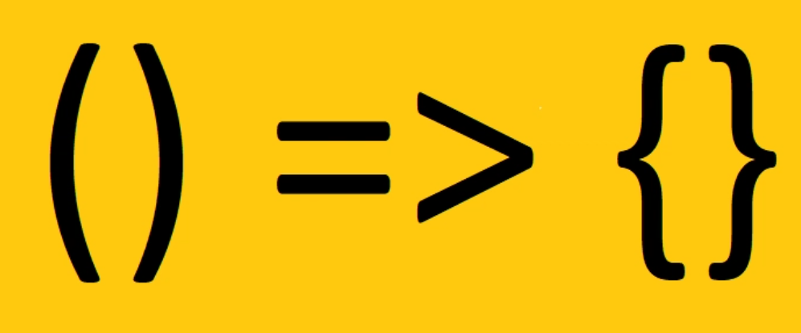
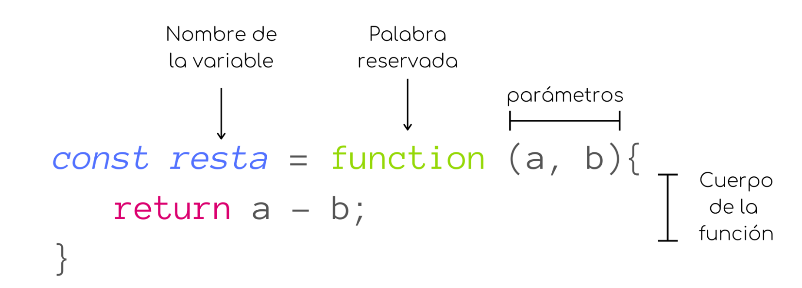
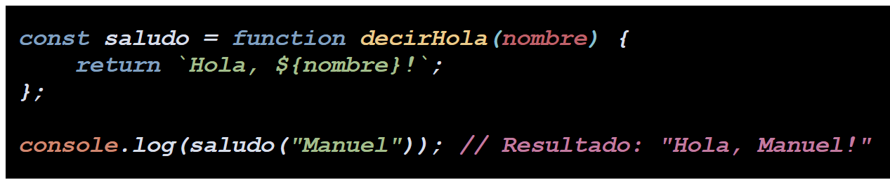
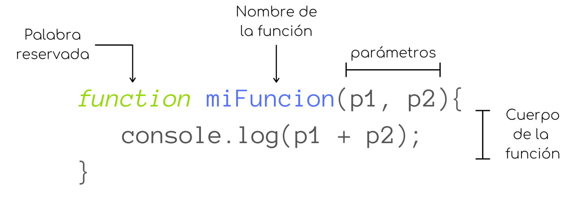
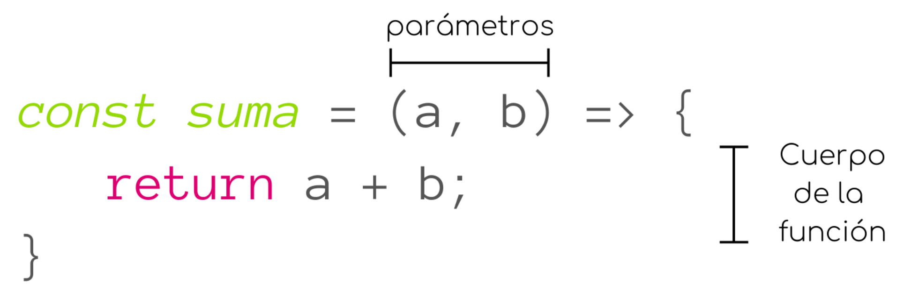

# 3 ¿Qué es una función de flecha?

<div data-full-width="true"><figure><figcaption></figcaption></figure></div>

Una **función flecha** (o _**arrow function**_) es una forma concisa de definir funciones anónimas, introducida en ES6 (EcmaScript **2015**).

Las funciones flecha **son de las funciones más cruciales para aprender en Javascript** ya que están por todos los lados. Su **sintaxis** es completamente **diferente** a cualquier otra declaración de variable.

### Ejemplos FUNCIÓN DECLARADA vs FUNCIÓN FLECHA

1. **SIN PARÁMETROS**

```javascript

// a) sin parámetros, función declarada 
function hello1() {
    return 'Hello!';
}
console.log('sin parámetros, función declarada ' + hola1());


// b) sin parámetros, función FLECHA
const hello2 = () => {
    return 'Hello!';
}
console.log('sin parámetros, función FLECHA ' + hola2());


// c) sin parámetros, función FLECHA EN UNA SOLA LÍNEA
const hello3 = () => 'Hello!';
console.log('sin parámetros, funcíon FLECHA EN UNA SOLA LÍNEA  ' + hello3());
```

\


1. **CON 1 PARÁMETRO**

```javascript

// a) un parámetro, función declarada
function hello4(x){
    return 'un parámetro, función declarada ' + 'Hello, ' + x;
}
console.log(hello4('milburn'));


// b) un parámetro, función FLECHA
const hello5 = x => {
   return  'un parámetro, función FLECHA ' + 'Hello, ' + x;
}
console.log(hello5('milburn'));

// c) un parámetro, función FECHA EN UNA SOLA LÍNEA 
const hello6 = x => 'Hello, ' + x;
console.log('un parámetro, función FECHA EN UNA SOLA LÍNEA ' + hello6('milburn'));
```

\


2. **CON 2 PARÁMETROS:**

```javascript
// a) dos parámetros, función declarada
function hello7(x,y){
    return 'Hello, ' + x + ' ' + y; 
    
}
console.log('dos parámetros, función declarada ' + hello7('milburn', 'gomes'));


// b) dos parámetros, función FLECHA
const hello8 = (x,y) =>{
    return 'dos parámetros, función FLECHA ' + 'Hello, ' + x + ' ' + y;
}
console.log(hello8('milburn', 'gomes'));


// c) dos parámetros, función FLECHA EN UNA SOLA LÍNEA
const hello9 = (x,y) =>  "Hello, " + x + " " + y;
console.log('dos parámetros, función FLECHA EN UNA SOLA LÍNEA ' + hello9('milburn', 'gomes'));
```

\


#### DOS CARACTERÍSTICAS PRINCIPALES: SU SINTAXIS Y SU MANEJO DEL `this`:

### 1) Sintaxis concisa

**COMPAREMOS** LA SINTAXIS de los 3 tipos de función diferentes:\


i.a ) **EXPRESIÓN de Función Anónima**

<figure><figcaption></figcaption></figure>

i.b ) **EXPRESIÓN de Función Nombrada**

<figure><figcaption></figcaption></figure>

(El nombre `decirHola` es útil para identificar la función en los errores, pero no se usa para llamar a la función.)


ii ) **DECLARACIÓN de función tradicional o regular**\
\


<figure><figcaption></figcaption></figure>

iii ) **Función FLECHA**:\


<figure><figcaption></figcaption></figure>

En realidad, **si comparamos una función regular con una flecha**, en lugar de tener que escribir "_**function**_" cada vez que queremos declarar una función, eliminar esa palabra y utilizar **=>** justo delante de las llaves **{ }** para para declarar una función de flecha.

### 2) Particular manejo de `this`

La palabra clave **`this`** tiene un comportamiento diferente en las **funciones flecha**. A diferencia de las funciones tradicionales, las funciones flecha **no tienen su propio `this`**, sino que heredan el **`this`** del contexto donde se definieron . El valor de **`this`** dentro de una función flecha es el mismo que **el de su entorno léxico (el contexto donde fue definida).**

**a) EJEMPLO - `this` en DECLARACIÓN DE FUNCIÓN:**

* En el **contexto de llamada**, **`this`** en una **función regular** se determina **en el momento de la llamada**, **según cómo se invoque la función.**
* Si una **función regular se llama directamente** o se pasa como **callback sin un contexto** específico, **`this`** dentro de esa función se referirá al **objeto global**
* De hecho, el principal problema al acceder a **`this`** dentro de una declaración de función en JavaScript es que **su valor depende del contexto de llamada de la función, no de dónde se declara**. Esto puede llevar a **comportamientos inesperados si la función se pasa como callback o se usa en diferentes contextos,** ya que **`this`** podría referirse a algo distinto a lo que se esperaba.

En el siguiente caso, no podríamos acceder al , **`this`** de la función `MiObjeto()` que necesitamos:

```javascript
function MiObjeto() {
  this.valor = 10;
  this.obtenerValor = function() {
    console.log(this.valor); // this se refiere a MiObjeto
  };
}

const obj = new MiObjeto();
obj.obtenerValor(); // Salida: 10

const miFuncion = obj.obtenerValor;
miFuncion(); // Salida: undefined!!!!

```

\
\


**b) EJEMPLO - `this` EN FUNCIÓN FLECHA:**

El problema anterior quedaría resuelto con una función flecha de la siguiente manera:

```javascript
this.valor = 20;
this.obtenerValorFlecha = () => {
  console.log(this.valor); // this se refiere al objeto que la contiene
};

obj.obtenerValorFlecha(); // Salida: 10
```

\


#### 3) EN RESUMEN

**1. VENTAJAS DE LAS FUNCIONES FLECHA**

* **Contexto Léxico:** A diferencia de las funciones regulares, las funciones flecha **no tienen su propio enlace a `this`.** En cambio, `this` dentro de una función flecha **se refiere al contexto léxico**, es decir, al valor de `this` **en el ámbito donde la función flecha fue definida. Esto evita errores comunes** relacionados con el contexto de `this` al usar funciones de _**callback**_ dentro de **métodos de objetos o en otros contextos donde `this` podría cambiar dinámicamente.**
* **Mayor concisión:** Son ideales para funciones **cortas** y funciones que se pasan como **argumentos a otras funciones**.

\


**2. LIMITACIONES DE LAS FUNCIONES FLECHA**

* **No pueden usarse como constructores** (no se pueden llamar con **`new`**).
* **No tienen su propio objeto `arguments`** con la lista de argumentos pasados a la función, ya que solo acceden a los argumentos del ámbito léxico que las rodea.
* Su **`this`** se determina en el momento de la creación de la función, y se **hereda del contexto léxico circundante, en lugar de ser definido dinámicamente.**\
  \


**3. USO RECOMENDADO**

Son útiles **cuando se quiere mantener el `this` del contexto envolvente**, como en _**callbacks**_ o **métodos de objetos** donde **no** se requiere que **`this` apunte al objeto que llama a la función.**

\
