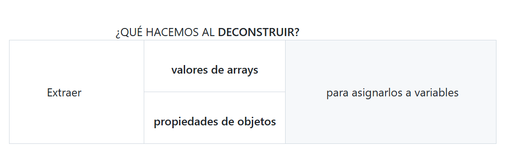

# 4 ¿Qué es la deconstrucción de variables?

En JavaScript, **deconstrucción** (_"desconstructing"_) y **desestructuración** (_"destructuring"_) son términos que se refieren a la misma característica del lenguaje, introducida en ECMAScript 6 (**ES6**). Ambos términos se utilizan indistintamente para describir la **sintaxis que permite intercambiar valores de variables de manera más concisa.**

<figure><figcaption></figcaption></figure>

**VENTAJAS**:

* el código **más legible**
* **evita** la necesidad de **acceder repetidamente** a los elementos de la estructura original.
* **Código más limpio y legible:** Evita la necesidad de **acceder a las propiedades del objeto usando la notación de punto** (`variable.atributo`).
* **Extracción selectiva:** Permite extraer **solo las propiedades necesarias**, ignorando las demás.
*   **Asignación múltiple:** Se pueden asignar **múltiples variables en una sola línea**.

    \


**NOTA**:

* La destructuración **no cambia la variable en sí misma.** Crea nuevas variables y asigna valores extraidos de la estructura de datos original. **La variable original queda intacta**.\


#### 1. INTERCAMBIO DE VALORES DE VARIABLE:

Un ejemplo básico para el intercambio de turnos en un juego sería hacer uso de la desestructuración **para intercambiar los valores de las variables que representan los jugadores actuales**.

```javascript
let jugador1 = "X";
let jugador2 = "O";

// Intercambio de turnos usando desestructuración
[jugador1, jugador2] = [jugador2, jugador1];

console.log(jugador1); // Output: O
console.log(jugador2); // Output: X
```

En este ejemplo, la línea `[jugador1, jugador2] = [jugador2, jugador1];` realiza la magia:

&#x20; 1\. **Se crea un array** con los valores actuales de `jugador2` y `jugador1`.   2. Luego, la desestructuración **asigna el primer valor** (**anteriormente el de `jugador2`**) a **`jugador1`** y el segundo valor (anteriormente el de `jugador1`) a `jugador2`, logrando así el intercambio.

**VENTAJA**

Nos **evita** la tediosa tarea de cambiar, **uno por uno**, el valor de cada uno de los jugadores `jugadorx.nombre`

**APLICACIÓN**

Una de los procesos más comunes que te encuentras cuando estás implementando, es **la capacidad de intercambiar los valores de las variables**. Esto es lo que se hace en procesos de tipo "_**quicksort**_" u "ordenamiento rápido" (_algoritmo de ordenación que funciona bajo el principio de "divide y vencerás"_) u otros algoritmos más avanzados. **Sin la deconstruccion de variables**, sería este procedimiento se convertiría en todo **un reto**! Por suerte, en **las versiones modernas de JavaScript** podemos hacer esto de manera **más eficiente en una sola línea de código.**

\


#### 2. DECONSTRUCCIÓN DE ARRAYS:

La desestructuración de arrays o arreglos permite extraer elementos específicos de un array, y asignarlos a variables, utilizando **la posición de los elementos dentro del array.**

En el siguiente ejemplo, **las dos comas extras (,) sustituyen** cada una de ellas a un elemento del array **en ese orden**:\


**Arrays - EJEMPLO 1**

```javascript
const numeros = [1, 2, 3, 4, 5];// Desconstrucción de un array
const [primero, segundo, , , quinto] = numeros;

console.log(primero); // Output: 1
console.log(segundo); // Output: 2
console.log(quinto);  // Output: 5
```

\


En esencia, la **desconstrucción** facilita la extracción de datos de estructuras complejas como **arreglos y objetos** y su asignación a variables separadas, y poder hacer por ejemplo **comparaciones, reordenaciones, etc.** En lugar de acceder mediante índices, atributo por atributo, podemos acceder simultáneamente a todos estas propiedades o valores.

En el EJEMPLO 1, habría resultado **mucho más largo y tedioso** el hacer algo como:

```javascript
const numeros = [1, 2, 3, 4, 5];  // Sin desconstrucción del array

const itemPrimero = numeros[0]; 
console.log(itemPrimero);       // Output: 1

const itemSegundo = numeros[1];
console.log(itemSegundo);       // Output: 2

const itemQuinto = numeros[4];
console.log(itemQuinto);        // Output: 5

```

... y luego, además, nos tocaría realizar la demás codificación para utilizar esas variables, etc.\


#### 3. DECONSTRUCCIÓN DE OBJETOS:

La desestructuración de objetos permite extraer **propiedades específicas de un objeto y asignarlas a variables**, bien mediantes **nombres iguales** a las propiedades, o con nombres distintos usando un **alias**.\


**Objetos - EJEMPLO 1:**

```javascript
const persona = {  nombre: 'Sammy',  edad: 45,  ciudad: 'Madrid'};// Desconstrucción con nombres de variables iguales a las propiedades
const { nombre, edad, ciudad } = persona; 

console.log(nombre); // Output: Sammy
console.log(edad);   // Output: 30
console.log(ciudad); // Output: Madrid

// Desconstrucción con alias
const { nombre: nombrePersona, edad: edadPersona } = persona;
console.log(nombrePersona); // Output: Sammy
console.log(edadPersona);   // Output: 45
```

\


**Objetos - EJEMPLO 2:**

```javascript
const jugador = {
  nombre: "Messi",
  posicion: "Delantero",
  dorsal: 10
};

// Desconstrucción del objeto jugador
const { nombre, posicion, dorsal } = jugador;

console.log(nombre);   // Imprime: Messi
console.log(posicion); // Imprime: Delantero
console.log(dorsal);   // Imprime: 10
```

\


<div align="left"><figure><figcaption></figcaption></figure></div>

**OJO!!** Lo hemos mencionado, pero recalcamos que **los nombres que ponemos para la extracción o deconstrucción deben coincidir exactamente con los nombres de las claves del objeto.** En general, si ponemos otros nombres a los argumentos sí funcionaría, **pero no en deconstrucción**. En este último para poder **mapear a los atributos de la variable** `jugador`, **al deconstruir** debemos pasar **estos mismos nombres con exactitud**, es decir, `nombre`, `posición`y `dorsal`.

\
\


#### 4. DESCONSTRUCCIÓN CON PARÁMETROS DE FUNCIONES:

La desestructuración también se puede utilizar **al pasar argumentos a funciones.**

\


**Parámetros de funciones - EJEMPLO 1:**

```javascript
function mostrarInfo({ nombre, edad }) {
  console.log(`Nombre: ${nombre}, Edad: ${edad}`);
}

const persona2 = { nombre: 'Ana', edad: 25 };
mostrarInfo(persona2);   // Output: Nombre: Ana, Edad: 25
```

\


**Parámetros de funciones - EJEMPLO 2:**

```javascript
function mostrarNumeros([primero, segundo]) {
    console.log(`
    Primer número: ${primero}, 
    Segundo número: ${segundo}
    `);}
    mostrarNumeros([10, 20]); // Output: Primer número: 10, Segundo número: 20
```

**NOTA**: Debemos llamar a la función siempre teniendo en cuenta **el tipo de datos que contiene**. En el Ejemplo 2, vemos que la función `mostrarNumeros()` contiene **un parámetro conteniendo un array:** `[primero, segundo]`, y por tanto, cuando la invoquemos debemos utilizar **la misma sintaxis con corchetes \[].**\


#### 5. VALORES POR DEFECTO:

Muchas veces **no conocemos los valores que obtendremos, sea como resultado de una petición API** o datos de formularios o de cualquier otra fuente con los que tratemos con **objetos**. A menudo sólo tenemos trozos de lo que necesitamos.

Por ello, necesitaremos poner unos **valores por defecto** para esos objetos.\


**SINTAXIS deconstrucción con parámetros de funciones:**

La **sintaxis** muy parecida a cómo utilizamos los argumentos por defecto en los tipos de valores de variable normales **cuando simplemente pasas un único elemento como argumento**. Pero ahora debemos integrar eso en un objeto.

La deconstrucción permite establecer valores por defecto para las variables, **en el eventual caso de que la propiedad o elemento del array no exista.**\


**EJEMPLOS**

a) EL VALOR QUE PASAMOS AL DECONSTRUIR **ES UTILIZADO**-No existía valor declarado

```javascript
const usuario = { nombre: 'Sammy' };
const { nombre, edad = 45 } = usuario;

console.log(nombre); // Output: Sammy
console.log(edad);   // Output: 45
```

En este caso **la variable `usuario` no contiene** el par clave:valor correspondiente a la clave de **`edad`**, por lo que al deconstruir, podemos añadir el nombre de la edad a la variable y por tanto nuestro nuevo dato **es utilizado por defecto**.

\


b) EL VALOR QUE PASAMOS AL DECONSTRUIR **ES IGNORADO**- Existía valor declarado

```javascript
const usuario = { nombre: 'Sammy', edad: 10};
const { nombre, edad = 45 } = usuario;

console.log(nombre); // Output: Sammy
console.log(edad);   // Output: 10
```

En este caso **la variable `usuario` ya contiene** el valor de **`edad`**, con lo que **ignora por completo la clave que pasamos al deconstruir**, ya que sólo lo utilizará realmente en caso de no existir en la variable.

\


#### 6. APLICACIONES

* Aplicaciones que nos encontramos a diario en la que utilizamos la deconstrucción de arrays y objetos en JavaScript es **al conectarse con una API externa**.
* La **API** devuelve típicamente **estructuras tipo array y objetos** (con todo tipo de claves y valores diferentes).

**En versiones antiguas de JavaScript** tenías que

* **crear** algún tipo de función que sacara cada uno de esos valores,
* **iterar** sobre las claves,
* **almacerlas** en variables, y
* **pasarlas en la función** que estés creando.

Pero en **versiones modernas de JavaScript**, lo que realmente se puede utilizar es la **deconstrucción** del objeto.

Una vez hemos identificado el **nombre del objeto u array** a deconstruir, nos **facilita enormemente la extracción de estos datos específicos de estructuras complejas**, así como su asignación a variables individuales, que de otro modo sería tan **tedioso** trabajar con los tipos de datos que una **API** devuelve.\
\
\
