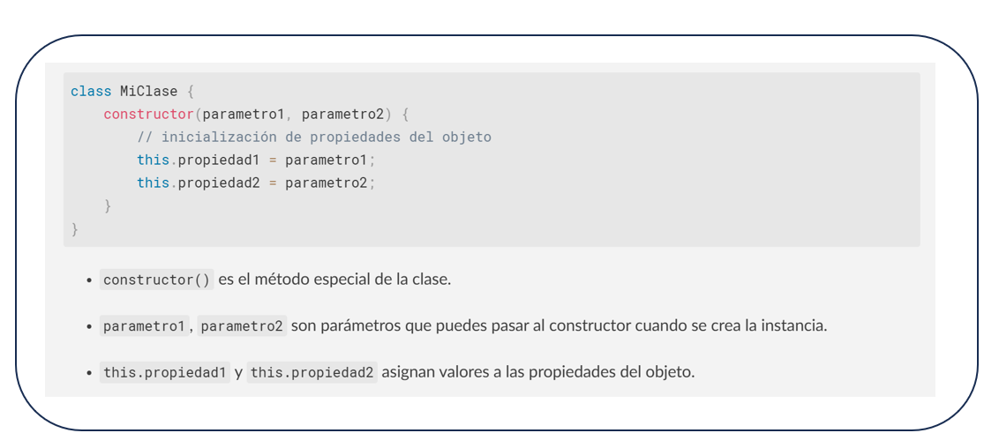
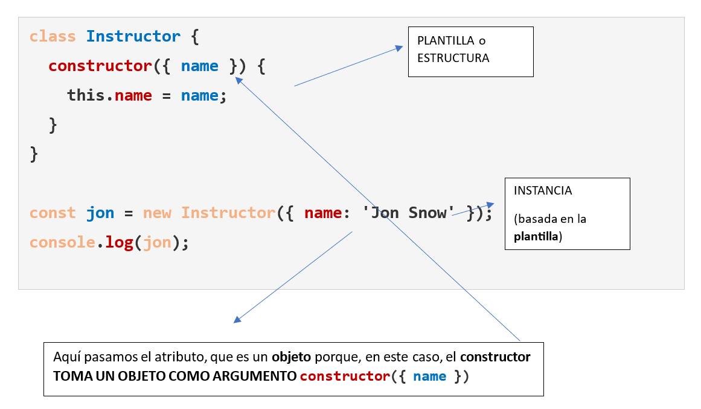
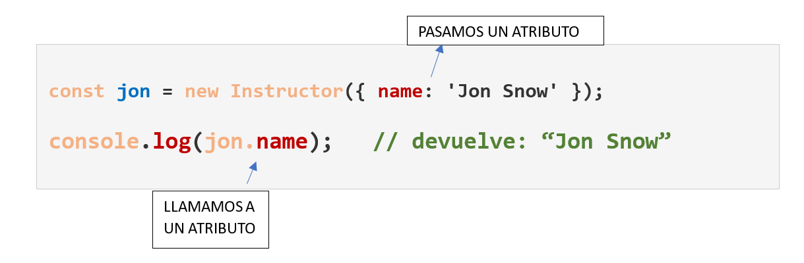
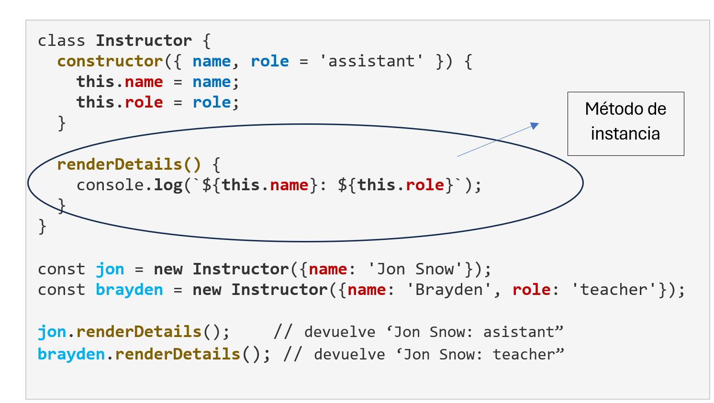
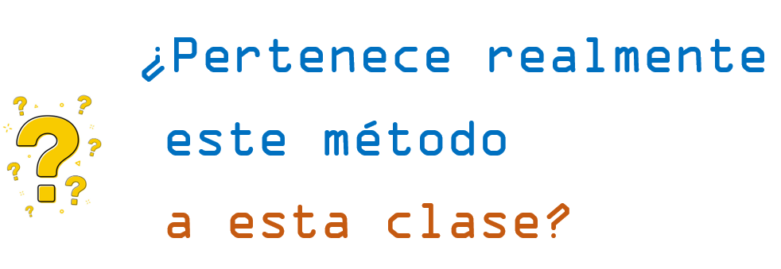
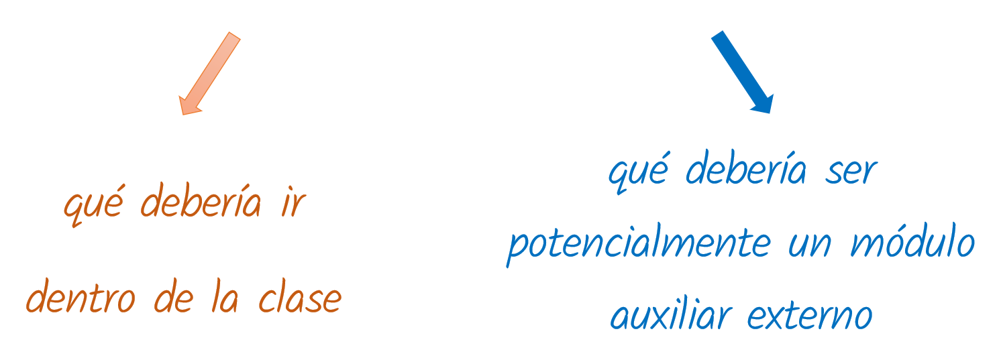
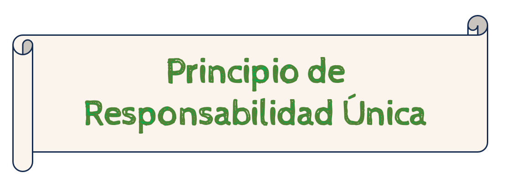

# 6 ¿Qué es la programación orientada a objetos?

### 1. INTRODUCCIÓN

* **Durante años**, las versiones antiguas de **JavaScript no incluían** los componentes de programación orientada a objetos, como **clases e instanciación**, lo cual estuvo bien durante un tiempo.
* Sin embargo, las versiones más modernas de JavaScript sí han implementado **clases**.
* En **programación orientada a objetos (POO) en JavaScript,** se organiza el código alrededor de **objetos**, los cuales son **instancias de clases**.

**OBJETOS**: contienen: - datos (**propiedades**) - funciones (**métodos**) que operan sobre estos datos

JavaScript, aunque basado en **prototipos**, permite un estilo de programación orientado a objetos mediante el uso de **clases** (introducidas en ES6) y **objetos**

Comencemos con **una analogía**. Crear un **plano de una casa**:

* cuantas plantas tiene

<div align="left"><figure><figcaption></figcaption></figure> <figure><figcaption></figcaption></figure></div>

* tabiques, para cada dormitorio
* ubicaciones de puertas
* ubicación de las ventanas
* donde van los enchufes de luz...

Nos hacemos una idea. **Esto NO es una casa**. Es la **estructura**.

Esta **estructura** la podemos asociar con lo que, en Javascript, corresponde a una **clase**.\
**UNA CLASE:**

* **Una clase** es simplemente una lista de definiciones que indican exactamente cómo debería comportarse.
* **Una clase** numerará **atributos** para **describir** lo que se supone que debe hacer la clase y su **comportamiento**.\


**EJEMPLO: Imaginemos la clase `Usuario`:**

* CLASE: Cada vez que **un nuevo usuario** accede un sitio web y se registra, el programa **revisará la clase `Usuario` y verá esa esa estructura**. Es lo mismo que decir que "es importante ver **cómo debería comportarse ese usuario**", para pasar luego al siguiente paso.
* INSTANCIACIÓN: Es un término complejo. Significa que tomamos ese plano y **creamos con él un objeto real**.

_En nuestro ejemplo:_

* tenemos una **clase `Usuario`**
* con un **nombre** de usuario
* y algunas **funciones**,
  * indicar **qué queremos que haga** el usuario después de iniciar sesión,
  * **qué página** queremos ver
  * **qué tipo de atributos** queremos que estén disponibles para el usuario, **como obtener su apellido o algo similar**, que su aplicación necesita. (**datos**)

\


_El programa haría lo siguiente:_

1. **examinar** el plano, en este caso, la estructura
2. **crear e instanciar un objeto con ella**, que será el objeto con el que trabajarán. Este es el momento en el que deja de ser un simple plano para convertirse **en algo terminado**, en ese **objeto real**. Hemos creado un "ejemplar" de algo, basado en la estructura anterior.
3. Luego puedo **hacer otro objeto** con otro nombre y **basarlo en la misma plantilla** o estructura. Serían dos objetos distintos que tienen una misma estructura.

\


#### CONSTRUCTOR de una clase

**Durante muchos años** JavasScript **no tenía** técnicas de OOP ( Object-Oriented Programming ) o de **programación orientada a objetos**. Había que crear procedimientos alternativos para conseguir lo que se necesitaba, y una de ellas era la utilización **funciones a modo de clases.**

**Un constructor** es una función especial (**palabra clave reservada para las clases**) que:

* se utiliza para **crear e inicializar objetos**.
* se encarga de **definir las propiedades iniciales de un objeto** al momento de su creación. Estas **propiedades**:
  * Son **variables** que se definen dentro de la función constructora **para almacenar datos sobre el objeto**.
  * Se **acceden y modifican** utilizando la palabra clave **`this` seguida del nombre de la propiedad**.
* Un constructor **se invoca con** la palabra clave **`new`**.\


**SINTAXIS BÁSICA DEL CONTRUCTOR**

<figure><figcaption></figcaption></figure>


**ALGUNOS CONCEPTOS CLAVE DEL CONSTRUCTOR**

* Cada vez que se crea una clase, el nombre de **constructor** es una **palabra clave reservada para las clases**, específicamente utilizada dentro de ellas.
* **No siempre están** en todas las clases, pero muy habitualmente sí
* Tareas: **fijar** valores, **llamar** a otras funciones, etc.
* El constructor **define el método** que se ejecuta **al crear** una nueva **instancia** de la clase.
* Una **clase** en sí **no ejecuta nada** (son como hemos dicho un conjunto de reglas y pautas para la ejecución)
* Es **la instancia**, la que **ejecuta todos los procesos** que queramos cada vez que **creemos un nuevo objeto** (lo haremos con la palabra clave **`new`** ). .\


**EJEMPLO DE CLASE Y DE INSTANCIA:**

* Haremos uso de la **deconstrucción** (anteriormente explicada), y pasaremos un nombre, o sea, `name`, **como objeto**

\


<figure><figcaption></figcaption></figure>


* El hecho de crear una **instancia** nos dirige automáticamente **al `constructor`.**
* En **`constructor ({ name })`**, aquí **`name`** mapeará a lo que se pase cuando creemos un nuevo Instructor: **`new Instructor`**). - A continuación queremos hacer algo con este **`name`**:
* **Añadimos `name` a la clase** para que forme parte de ella, y la forma de que esto funcione es a través de la palabra clave **`this`**.
* Al acceder a **`name`** mediante **`this.name` estamos añadiendo el atributo `name`** a **`this.name`**.
*   Los **colores** aquí muestran perfectamente que son cosas diferentes:

    * los dos **`name` en color azul** hacen referencia al **mismo elemento dentro del objeto**, pero el siguiente **`name` en color rojo** en `this.name` hace referencia **a una instancia de la clase `Instructor`,** precisamente la instancia que hemos creado asignándola a la variable `jon`.
    * En esta instancia en específico, le decimos que **almacene cualquier `name`** (`this.name = name`) **que sea pasado como parámetro con este objeto.**


<div align="left"><figure><figcaption></figcaption></figure></div>

**OJO!!** Cuando quiera que el **constructor** tome un **objeto** como argumento, entonces **al instanciar también tenemos que poner un objeto como argumento!!**\
\


**ACCEDIENDO A LA CLAVE DE LA INSTANCIA:**

La variable `jon` se llama **instancia de la clase Instructor**. En cuanto al tipo de dato, es **un objeto**. De hecho si hacemos:

```javascript
console.log(jon); 
// imprime: Object { name: "Jon Snow"}
```

Y precisamente por ello, podemos acceder al atributo **`name`** mediante la nomenclatura con punto o **dot notation** de los objetos:

<figure><figcaption></figcaption></figure>


**OTRO EJEMPLO:**

```javascript
class Coche {
    constructor(marca, modelo, año) {
        this.marca = marca;
        this.modelo = modelo;
        this.año = año;
    }
}

const miCoche = new Coche('Toyota', 'Corolla', 2020);
console.log(miCoche);
```

En este ejemplo:

* La **clase** `Coche` tiene un **constructor** que toma **tres parámetros**: `marca`, `modelo` y `año`.
* Cuando se crea la **instancia** `miCoche`, se pasan los **valores** `'Toyota'`, `'Corolla'` y `2020` **al constructor**.
* El **constructor asigna estos valores a las propiedades del objeto**, usando `this.marca`, `this.modelo` y `this.año`.\


### 2. MÉTODOS DE INSTANCIA

* Durante mucho tiempo en JS se ha venido creando **funciones tradicionales en vez de los métodos de instancia**, que son métodos que operan de forma específica sobre la **“instancia” de una clase**.
* Sin embargo, lo más común en los últimos años es :
  * poder **acceder y modificar los atributos de la instancia en la que se están invocando**,
  * poder **llamar a otros métodos dentro de la instancia**.

**Los métodos dentro de una clase** son funciones que están **asociadas a esa clase** y se utilizan para **definir el comportamiento** de los objetos creados a partir de ella.

* Se **definen dentro del cuerpo de la clase,**
* Con **la misma sintaxis que las funciones, pero sin la palabra clave** _**function**_ para métodos públicos.
* Los métodos pueden **acceder a las propiedades de la instancia** actual utilizando **`this`**.

\


#### EJEMPLO 1 - Métodos de Instancia


<figure><figcaption></figcaption></figure>


* En el **`console.log`** del método de la instancia **`renderDetails()`** necesitamos poner el **`this`** en **`this.name`** para poder acceder al valor de **`name`** del argumento.
* Cuando instanciamos y pasamos los valores entre llaves `new Instructor({name: "Jon Snow"}`; nos dirige **al contructor.**
* En la **instancia de método`renderDetails()` no tenemos acceso este argumento**: sólo lo tiene **el constructor**, así que la única manera de acceder es añadir la palabra clave **`this`** **a los atributos** creados **dentro de los constructores**.\


<div align="left"><figure><figcaption></figcaption></figure></div>

**OJO!!** No debemos olvidar que PRIMERO debemos INSTANCIAR LA CLASE para convertir la variable a OBJETO. **Nunca podríamos llamar al método de la instancia sin instanciar la clase primero**. De hecho, nos daría **error**.\
\


#### EJEMPLO 2 - Métodos de Instancia

```javascript
class Coche {
    constructor(marca, modelo, año = 2019) {
        this.marca = marca;
        this.modelo = modelo;
        this.año = año;
    }
}

const miCoche = new Coche('Toyota', 'Corolla', 2020);
console.log(miCoche);  // Coche { marca: 'Toyota', modelo: 'Corolla', 'año': 2020 }
```

* La **clase** `Coche` tiene un constructor que toma **tres parámetros**: `marca`, `modelo` y `año`.
* Cuando se crea la **instancia** `miCoche`, se pasan los valores `'Toyota'`, `'Corolla'` y `2020` al constructor.
* El **constructor asigna estos valores a las propiedades** del objeto, usando `this.marca`, `this.modelo` y `this.año`.
* **Ignora la propiedad** `año` que el constructor contiene **por defecto**. Ésta, **(`'año': 2019`)** , solo **se habría imprimido** si al pasar los parámentros en la instancia **no hubiera incluido el valor para `'año'`**, es decir que con: `const miCoche = new Coche('Toyota', 'Corolla');` **imprimiría** `//Coche { marca: 'Toyota', modelo: 'Corolla', 'año': 2019 }`\
  \


### 3. MÉTODOS ESTÁTICOS

* En JavaScript, los métodos estáticos son aquellos que pertenecen **a la clase en sí misma, no a instancias individuales de la clase.**
* Esto significa que **se pueden invocar directamente desde la clase,** **sin** necesidad de **crear un objeto** de esa clase.

\


**SINTAXIS**

```javascript
class MiClase {
  static miMetodoEstatico() {
    console.log("Este es un método estático.");
  }
}
```

**ACCESO AL MÉTODO ESTÁTICO**

```javascript
miClase.miMetodoEstatico();
```

\


**EJEMPLO 1 - Creamos un producto genérico para una empresa**

```javascript
    class Producto {
      constructor(nombre, precio) {
        this.nombre = nombre;
        this.precio = precio;
      }

      static crearProductoPredeterminado() {
        return new Producto("Producto Genérico", 0);
      }
    }

    const productoPredeterminado = Producto.crearProductoPredeterminado();
    console.log(productoPredeterminado); 
    
    // Devuelve: Producto { nombre: 'Producto Genérico', precio: 0 }
```

* Como vemos, ha podido acceder tanto al `nombre` como al `precio`, ya que los métodos estáticos **pueden acceder y manipular propiedades estáticas de la clase.**
* Se acceden a ellos **a través del nombre de la clase** (aquí `Producto`).\


**EJEMPLO 2 : Cliente entra y dice "Hola" (método de instancia) se despide y dice "Adiós" (método estático)**

```javascript
class Cliente {
  static despedirse() {
    return "Adiós";
  }

  entrar() {
    return "Hola";
  }
}

console.log(Cliente.despedirse());  // (1) Método estático (no requiere instancia): 'Adiós'
Cliente.entrar();                   // (2) Uncaught TypeError: Cliente.entrar is not a function

const cliente1 = new Cliente();     // (3) Creamos una instancia

cliente1.despedirse();              // (4) Uncaught TypeError: cliente1.despedirse is not a function
console.log(cliente1.entrar());     // (5) Método no estático (requiere instancia): 'Hola'
```

(1) Como vemos, el método **estático** `despedirse()` se ejecuta sin problemas accediendo a él con el **nombre de la clase** delante.\
(2) El método `entrar()` no es estático - **Necesita un instancia** para acceder a él. Nos da error.\
(3) Creamos la instancia.\
(4) El método `despedirse()` es **estático**, la forma de acceder a él es a través de la **clase**, **no de una instancia**.\
(5) El método `entrar()` no es estático, ya hemos **creado la instancia y esta vez no nos da error**.

\


**CUÁNDO UTILIZAR LOS MÉTODOS ESTÁTICOS**

El método estático es útil cuando : **-** se necesita crear instancias de una clase con cierta lógica de inicialización o **configuración específica**

* **se prefiere evitar el uso de `new`** por simplicidad o por otras razones de diseño. Es decir, pueden usarse **para crear instancias de la clase de forma personalizada**
* **cuando no necesitemos acceder a propiedades de instancia**: tiene que ver más **con la estructura** y menos con la instancia. Si un método no necesita acceder a datos específicos de un objeto, es **más eficiente** declararlo **como estático.**
* cuando necesitemos **funciones de utilidad:**
  * a) **funciones auxiliares** (_**helper modules**_). Los métodos "helper" o auxiliares son funciones diseñadas para realizar tareas **específicas y reutilizables, simplificando el código y mejorando la legibilidad**. Estos métodos a menudo se encapsulan en un módulo o clase para **su fácil acceso y mantenimiento**
  * b) propósito general que **no están ligadas a un objeto en particular**, por ejemplo:
    * como métodos para **manipular arrays**
    * realizar **cálculos matemáticos**
* **Como funciones de fábrica**.- es una función que **devuelve un objeto** nuevo cada vez que se llama:
  * cuando un **método estático** se utiliza para ello, **para crear objetos**, y se convierte en una **función fábrica**
  * **no requieren el uso de `new`,** lo que permite **crear objetos de manera más flexible**.

\


<div align="left"><figure><figcaption></figcaption></figure></div>

**OJO!!** Cuando estemos creando una aplicación y estemos pensando en utilizar un método estático, primero deberíamos preguntarnos en profundidad:

<figure><figcaption></figcaption></figure>

\
\
Ya que hay LÍNEA MUY FINA entre:

<figure><figcaption></figcaption></figure>

\
\
y en la PROGRAMACIÓN ORIENTADA A OBJETOS existe algo llamado:

<figure><figcaption></figcaption></figure>

\
El **Principio de Responsabilidad Única** (PRU) en JavaScript significa que **cada clase** (función, etc.) debería **tener solo una tarea o responsabilidad** claramente definida, y **no intentar abarcar múltiples tareas** no relacionadas.

\
