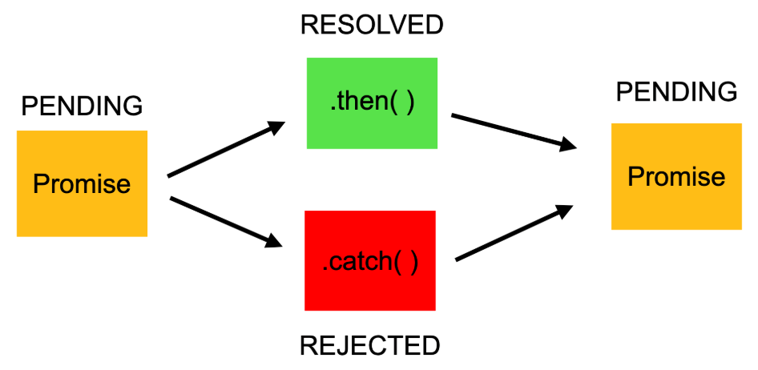
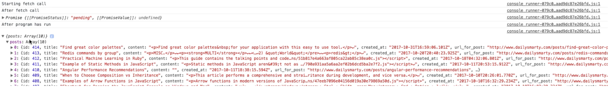
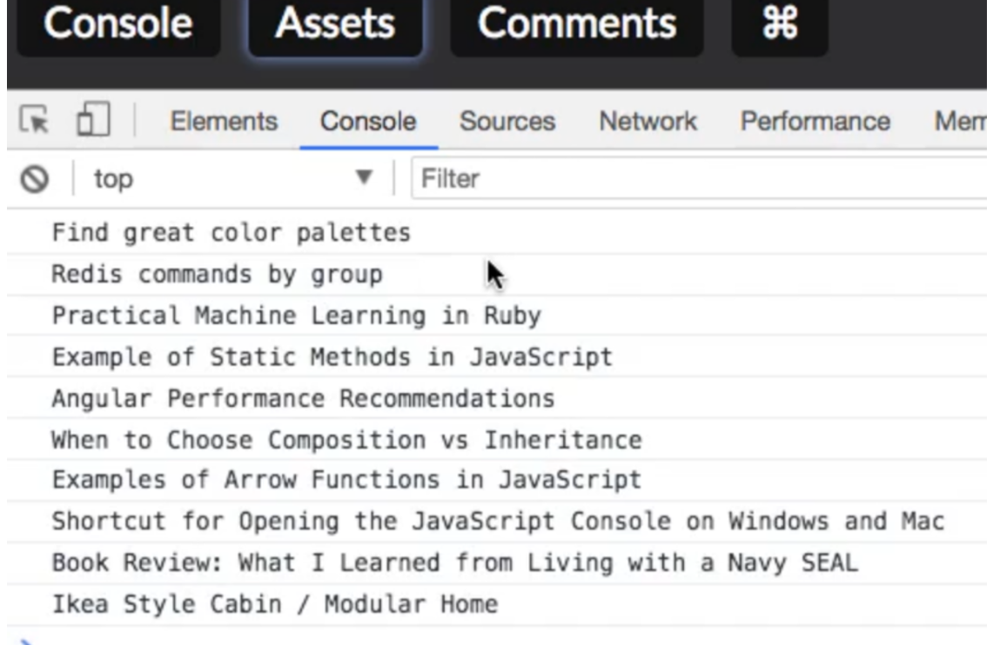
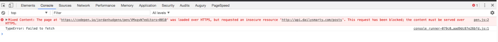

# 7. ¿Qué es una promesa en JS?

* Para entender el concepto de **Promesa** o **Promise** en líneas generales, una de las formas más comunes de trabajar con **Promises** o **Promesas** es cuando te comunicas con **APIs**.
* Por ejemplo me conecto a una **API de&#x20;**_**Twitter**_, para poder obtener todas las **publicaciones**. Así que llamo a una **URL (un endpoint**) y las recibo.

\
&#x20;Y qué pasaría en mi aplicación SI TWITTER SE CAE? Si un usuario va a la página, pero solo podría ver algo que es parte de la memoria intermedia (bufer) como unos puntos suspensivas "………………… "&#x20;

<div align="right"><figure><figcaption></figcaption></figure></div>

o algo así: sin duda, UNA EXPERIENCIA NO AGRADABLE PARA CUALQUIER USUARIO.\
\
\
&#x20;Lo que una PROMESA nos permite es:

<div align="left"><figure><figcaption></figcaption></figure></div>

&#x20;llamar a TWITTER, mostrar nuestra página, y CUANDO LAS PUBLICACIONES FINALMENTE LLEGUEN DE LA API, QUE LAS MUESTRE.\


* Una **promesa** ejecuta realmente una tarea que **no queremos que ocurra en tiempo real**; podemos desarrollar cualquier funcionalidad nueva en la que sea conveniente **que no se procese inmediatamente**, como una **consulta** a una base de datos o **API** externa.
* Esto es algo que tiene muy positivo JavaScript: **su capacidad para trabajar de forma asíncrona.** Esto significa que puedes hacer tareas como ésta de llamar servicios externos y usar APIs, y poder tomar y en realidad, **elegir qué elementos** de tu página o en tu aplicación **se cargarán directamente, y cuáles pueden tardar más tiempo**.
  * Efectivamente, algo muy a favor de **Javascript** es que **trabaja directamente con la experiencia del usuario**. No sería deseable que el usuario se quede esperando durante un tiempo hasta que finalmente los datos se carguen.
* **La naturaleza de JavaScript es la comunicación con servicios externos**, como bases de datos, **APIs backend** ( &#x6C;_&#x61;s **APIs backend** se ejecutan en el servidor y gestionan la aplicación y la interacción con la base de datos; en esencia, son el motor que impulsa la funcionalidad visible en el frontend_ ) o cualquier otro servicio fuera de la aplicación, **como las diferentes plataformas** de JavaScript _**React, Angular y Vue**_; JavaScript **recibe los datos como resultado de esta comunicación con dichos servicios externos.**
*   La utilización de herramientas como las **promesas** son el pilar central de **podamos confiar** en que el proceso se desarrollará **tan fluidamente como sea posible**.

    \


**CONVENCIÓN COMÚN:**

Los argumentos de la función `Promise()` son `resolve` y `reject`. Antes era `success` y `failure`, pero ahora lo más extendido son los primeros.\
Una **promesa** o bien:

* funciona y **resuelve** ese código. Por ejemplo, algún tipo de respuesta con **éxito** -si nos comunicamos con una API, nos devolverá los datos de esa API y podremos manejarlos; o
* **no funciona** y por lo tanto devuelve algún tipo de **error**.

\


**PROCESO DE CODIFICACIÓN DE LAS PROMESAS:**

* En general, con las **funciones, clases**, etc **no dedicamos** mucho **tiempo** pensando en las **eventualidades** negativas de que ocurriera **errores**.
* Sin embargo una **promesa** te obliga a crear un sistema entero dividido prácticamente **50/50** :
  * **50%** del tiempo lo dedicamos a codificar sobre situaciones en las que el proceso **se resuelve con éxito,**
  * y el otro **50%** lo pasamos creando los tipos de proceso que ocurrirán **si se produce un error.**

\


**SINTAXIS básica de una promesa.**

```javascript
const promesa = new Promise((resolve, reject) => {  

// Aquí se realiza la operación asíncrona :
// Si la operación es exitosa, se llama a resolve(valor) 
// Si ocurre un error, se llama a reject(error)  

});
```

\


*   **`new Promise((resolve, reject) => { ... })`:**

    Crea una **nueva instancia de promesa**. El constructor `new`toma una función con dos parámetros: `resolve` y `reject`.\
    \


**BUENA PRÁCTICA**

Una buena práctica es añadir la palabra **"Promise"** **al nombre de la variable**, para identificar el propósito en futuros accesos al programa. Al ser así de **descriptivo**, facilitará cualquier interpretación y/o modificación del mismo: por ejemplo **`postsPromise = fetch("https:// aaa.bbbbbbb.com/posts")`** si tratamos de obtener las publicaciones o "_**posts**_" de una página web (p.ej. _Twitter_).\
\


#### Proceso básico promesa 

<figure><figcaption></figcaption></figure>

**EXPLICACIÓN:**

* **`resolve(valor)`:**
  * Esta función se usa para indicar que la operación asíncrona ha terminado **con éxito.**
  * `valor` **es el resultado de la operación, que se pasará al siguiente bloque `then()`** en la cadena de promesas.
  * Si `valor` es otra promesa, se "aplanará" (pondrá en una sola capa todas las promesas anidadas) y su resultado se usará como el resultado de esta promesa.
    * **`then()`:** se usa para **encadenar funciones a una promesa, permitiendo manejar el resultado exitoso** de una operación asíncrona. Cuando la promesa se resuelve, la función `then()` se ejecuta con el valor de la promesa, y **si devuelve otra promesa, el encadenamiento continúa con esa nueva promesa**.
* **`reject(error)`:**
  * Esta función se usa para indicar que la operación asíncrona **ha fallado.**
  * **`error`** es una **descripción del error**, que puede ser cualquier tipo de valor, aunque **se recomienda usar un objeto `Error` para facilitar la depuración**.
  * El error se pasará al bloque `catch()` o al siguiente `then()` con un segundo argumento (el manejador de rechazo) en la cadena de promesas.
    * El método **`catch()`** se usa para **manejar errores o casos de rechazo en una promesa**. Se ejecuta cuando la promesa asociada es rechazada, permitiendo ejecutar código específico para **manejar el error**, **como mostrar un mensaje o realizar alguna acción correctiva.**

\


#### Secuencia del proceso de creación de una promesa, a través de un EJEMPLO:

```javascript
let sleepyGreeting = new Promise((resolve, reject) => {
  setTimeout(() => {
    resolve('Hello....')                // ponemos ….porque es “sleepy” 
  }, 2000);			     // 2 seg (2000milseg). Después de ese tiempo retorna el Hello.

  setTimeout(() => {
    reject(Error('Too sleepy...'))   //Error()con mayúscula, ya que es un módulo de JS
  }, 2000);
});

sleepyGreeting
  .then(data => {
    console.log(data);
  })
  .catch(err => {
    console.error(err);
  });
```

\


1. Creamos una **variable** que llamamos `sleepyGreeting`,
2. **Asignamos a la variable** la creación de una **nueva promesa** new Promise().
3. **Promise()**, toma **como argumento una función**. Como primer argumento (aquí no ponemos los opcionales) toma **una función**, por ello se llama **callback**.
4. **Esta función callback** (que en este caso sera función flecha) **tiene dos argumentos**:`resolve` y `reject`, mencionada convención común, que es particular de los métodos correspondientes de `resolve()` y `reject()`.
5. Creamos **dos métodos de `setTimeout()`**, con el fin de poner **temporizadores**. Generalmente, **cuando trabajas con promesas**, tu expectativa es que aquello que quieres obtener, **no lo obtengas de forma inmediata**. **Puede tardar bien milisegundos o unos segundos.** Este temporizador nos permite controlar esto, e incluso **imitar lo que obtendríamos si llamamos a una API** o algo parecido. Esta función toma dos argumentos:\
   \- _una función_ a ejecutar   **`resolve(valor)`** y **`reject(mensaje)`** - _retraso o "delay"_:    **el tiempo de espera en milisegundos** (2 segundos en este caso).
6. Finalmente, **llamamos a la función.** Por CONVENCIÓN COMÚN, lo hacemos con la **sintaxis** de:
   * [x] **Varias líneas**
   *   [x] **Indentación** antes de poner los métodos **`then()` y `catch()`**

       \


#### Llamada a la función: métodos `then()` y `catch()` del EJEMPLO anterior :

1.  `data` es convención común para referirse a los datos recibidos; para el almacenamiento de los datos.\
    Significa que cuando llamamos a la función (`sleepyGreeting()`) y obtengamos la respuesta: **"entonces** (en inglés, "then"), **haz esto, esto y esto"** (todo lo que ponga despues del `then()`) .

    En nuestro caso, sería nuestro string **“Hello……”.**. En otros ejemplos, correspondería a las **peticiones de publicación JSON, o tweets, o lo que quiera que haga cuando estemos llamando.**\

2. **`catch(err => { console.error(err); })`** es un método que se utiliza para manejar errores asíncronos, específicamente en el **contexto de promesas**. En otras palabras, es una forma de **asegurar que si una operación asíncrona falla, el error se capture y se muestre en la consola**, permitiendo a los desarrolladores responder adecuadamente. Analicemos cada parte:
   *   **`.catch()`:**

       Este es el método que se usa para **capturar errores**. Se aplica a una **promesa** y se ejecuta **cuando la promesa es rechazada (reject)**, es decir, cuando ocurre un error durante la operación asíncrona.
   *   **`err => { ... }`:**

       Esta es una **función flecha** (arrow function) que actúa como el **manejador de errores.**

       * **`err`:** Es el parámetro de la función, que **representa el objeto de error** que se ha producido. Este objeto contiene **información sobre el error, como su tipo y mensaje**.
       * **`{ console.error(err); }`:** Dentro de la función, **`console.error(err)`** se utiliza para **registrar el error en la consola del navegador** o del entorno donde se ejecuta el código. Esto ayuda a los desarrolladores a **identificar y depurar problemas.**

\


### Método `fetch()` para solicitudes de red

El método `fetch()` :

* comienza el proceso de **capturar un recurso de un servidor**.
* se utiliza para realizar solicitudes de red y obtener recursos de forma **asíncrona**, **como datos JSON, archivos, imágenes, etc.**
* esta forma moderna y flexible de **realizar peticiones HTTP y** obtener respuestas del servidor tiene una **sintaxis limpia y fácil de usar.**

**SINTAXIS:**

```js
fetch('<Tu URL>', {})
  .then(response => {
    // Manejamos la respuesta de la petición aqui
  })
  .catch(error => {
    // Si hay un error en la petición, lo manejamos aqui 
  })
```

* Acepta **dos parámetros:**
  1. **La URL a la que enviar la petición** (este es un parámetro obligatorio).
  2. **Las opciones a configurar en la petición.** Aquí se puede configurar el método de solicitud aquí (este es un **parámetro opcional**).
* **`fetch()` devuelve una promesa** que se resuelve al objeto `Response`, el cual contiene información sobre la respuesta, como el estado, encabezados y el cuerpo de la respuesta. Es decir, representa la respuesta a la solicitud realizada. Y dado que se trata de una **promesa**, necesitamos agregar los métodos **`.then()` y `.catch()`.**
* CONVENCIÓN COMÚN : la respuesta con los datos se suele representar, por convención común sobre todo con dos denominaciones:
  * `response`
  * `data`
* Si la solicitud devuelve un error, se ejecutará **el método `catch()`**: éste se puede omitir en Fetch API.\
  **Se usa solo** cuando `fetch()` no puede realizar una solicitud a la API, como por ejemplo **si no hay conexión de red o no se encuentra la URL**.
* Se pueden utilizar métodos como **`json()`, `text()`,** etc., para extraer los datos de **la respuesta en diferentes formato**.

\


**EJEMPLO 1 - `fetch()` - Convirtiendo a datos&#x20;**_**json**_**&#x20;y listando todos los recursos**

```js
const postsPromise = fetch('https://jsonplaceholder.typicode.com/posts')

postsPromise
  .then(data => data.json())     
  .then(data => console.log(data));   // este "data" ya está convertido a json
```

Y esta impresión será algo similar a esto:

<figure><figcaption></figcaption></figure>

No se visualiza bien, pero como son datos **JSON**, y vemos un objeto, un **array** llamado `posts` conteniendo muchos datos, lógicamente en forma de pares **clave:valor**. Vemos muchas **claves repetidas** como: `title`, `content`, `created_at` , con sus respectivos valores.\


**EJEMPLO 2 - `fetch()` - Utilizando el bucle `forEach()`**

```js

const postsPromise_2 = fetch('https://jsonplaceholder.typicode.com/posts')

postsPromise_2
  .then(data => data.json())
  .then(data => {             
      data.posts.forEach((item) => {    //(1*)
         console.log(item.title);       //(2*)
      });
   })
  .catch(error => {
    // Manejar errores en la solicitud
    console.error('Error:', error);
   });
```

(1\*) Iteramos sobre el objeto que nos interesa, que en este caso es `posts`, a través del bucle `forEach()` (que está tomando como argumento una función flecha).

(2\*) En esa iteración solo nos interesa uno de las claves: `title`, por lo que extraerá todos los valores para cada una de estas claves `title`repetidas. Se visualizaría algo así:


<figure><figcaption></figcaption></figure>


En este caso **no ha dado error**, por eso **no ha tenido que ejecutar el `catch()`**, pero hay muchas veces que puede hacerlo.

* Por ejemplo, muy típico es no tener en cuenta la "s" final de la url `https: //.......` ; o bien una API con _https_ o _http_ que esté utilizando un **sistema completamente seguro**.

Y es que, efectivamente, si intentamos capturar este tipo de URL o **endpoint API** y son sitios web no seguros, hay mucha probabilidad de que estemos trayendo diversos **elementos a tu propia aplicación que no son seguros**. Por ello, **JavaScript lo bloqueará** y nos imprimirá este **error** al ejecutar la función `catch()` .


<figure><figcaption></figcaption></figure>

### Agrupar promesas

En JavaScript, cuando tenemos **promesas** que son muy **parecidas**, las podemos agrupar y gestionar **para tratarlas igual**. Se pueden utilizar dos métodos: `Promise.all()`, y `Promise.allSettled()` . Esto se ve mucho en **páginas web** y **aplicaciones de móvil**.\
\


#### 1. El método `Promise.all()`

\


**SINTAXIS**

```js
Promise.all(iterable)
```

\


**PROCESO**

1. Es un método que toma como **entrada un iterable de promesas** que toma y **devuelve una sola promesa**.
2. Esta promesa se cumple **cuando se cumplen todas las promesas** de esa entrada (incluso cuando se pase un iterable vacío).
3. Se **rechazará en el momento en el que se rechace cualquiera de las promesas** del iterable de entrada, **devolviendo** la razón de este **primer rechazo**.

\


**EJEMPLO `Promise.all()`**

```js
const promesa1 = new Promise((resolve) => setTimeout(() => resolve(1), 100));
const promesa2 = new Promise((resolve) => setTimeout(() => resolve(2), 200));
const promesa3 = new Promise((resolve) => setTimeout(() => resolve(3), 300));

Promise.all([promesa1, promesa2, promesa3])  
	.then((resultados) => { 
		console.log(resultados); // [1, 2, 3]
	})  
	.catch((error) => {
	    console.error(error);
	});
```

* En este ejemplo, `Promise.all()` espera a que **las tres** promesas **se resuelvan**.
* Una vez que todas se resuelven, el método **`then()` se ejecuta**, **pasando un array con los resultados de cada promesa** en el mismo orden en que fueron pasadas a `Promise.all()`.
* **Si alguna** de las promesas **se rechazara, el `catch()` se ejecutaría,** mostrando el error.

\
\
2\. El método `Promise.allSettled()`


**SINTAXIS**

```js
Promise.allSettled(iterable)
```

\


**PROCESO**

* Esta es una alternativa para trabajar con promesas agrupadas.
* Se comporta de manera similar a `Promise.all()`, pero a diferencia de este, **no se detiene ante el primer rechazo**.
*   En vez de ello, **espera a** que **todas** las promesas del array se resuelvan o rechacen, **devolviendo un array de objetos que indican el estado de cada promesa (resuelta o rechazada)** y su valor o razón de rechazo.

    \


**EJEMPLO `Promise.allSettled()`**

```js
const promesa1 = new Promise((resolve) => setTimeout(() => resolve(1), 100));
const promesa2 = new Promise((_, reject) => setTimeout(() => reject(new Error('Error')), 200));
const promesa3 = new Promise((resolve) => setTimeout(() => resolve(3), 300));


Promise.allSettled([promesa1, promesa2, promesa3])
  .then((resultados) => {
      console.log(resultados);
    /*
    [
      { status: 'fulfilled', value: 1 },
      { status: 'rejected', reason: Error: Error },
      { status: 'fulfilled', value: 3 }
    ]
    */  });
```

* En este ejemplo, `Promise.allSettled()` devuelve un array con los resultados de cada promesa, **incluso aunque una de ellas se haya rechazado.**
*   Esto permite **gestionar de forma más flexible** los casos en los que algunas promesas pueden fallar **sin detener el proceso completo**.

    \


\
\
