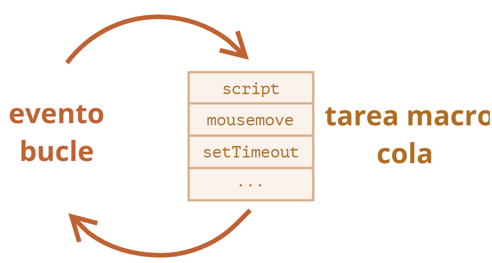
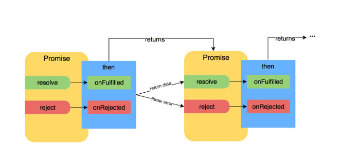
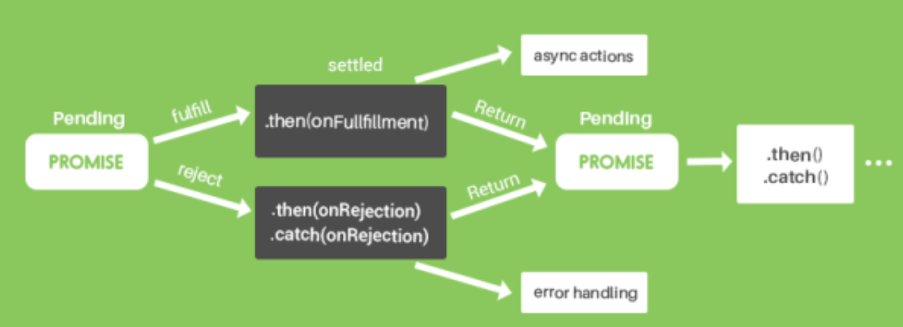
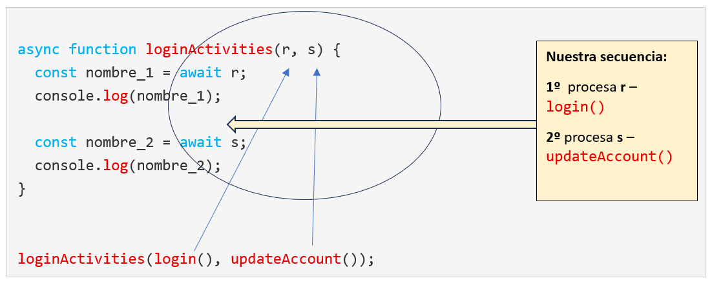
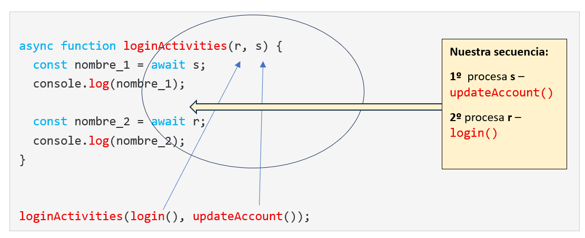
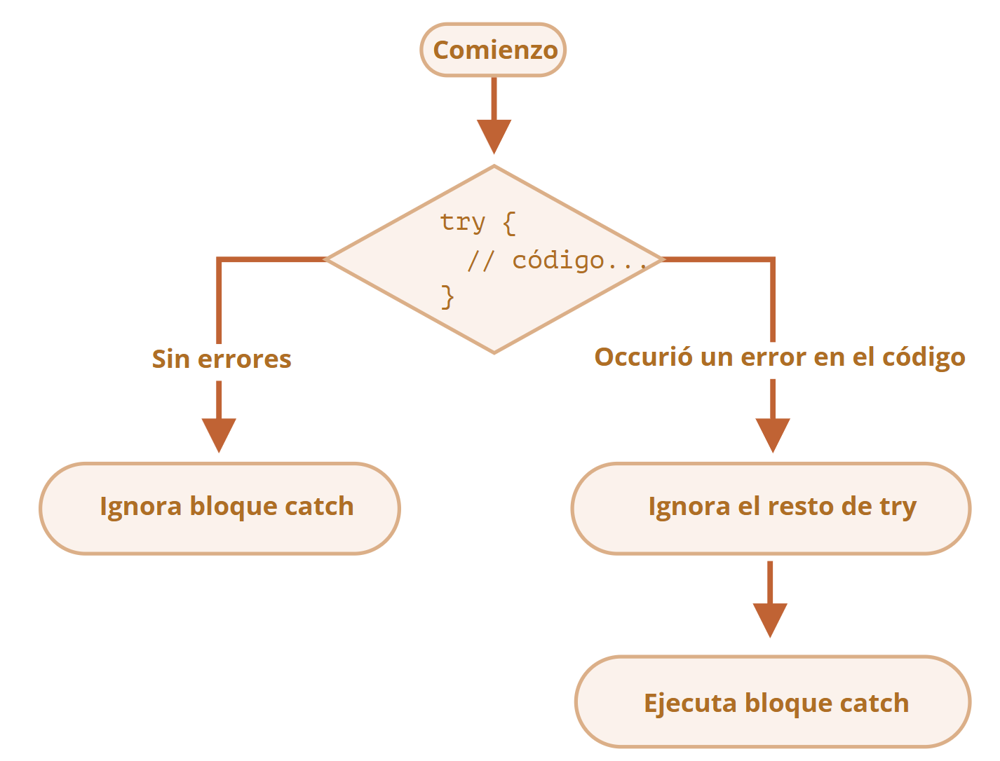

# 8. ¿Qué hacen async y await por nosotros?

Una de las mayores **ventajas** de trabajar en JavaScript cuando comparamos con versiones anteriores son los procesos `async` y `await`.

### HISTORIA DE LOS PROCESOS `async` - `await`.

Javascript es un programa **sincrónico y monohilo por naturaleza**. Esto significa que las tareas se procesan en el **orden** en el que fueron escritas.

* Si una función tomaba **demasiado tiempo** en completarse, **bloqueaba la ejecución de otras funciones** hasta que esta función no se hubiera terminado.
* Este comportamiento, en un entorno como un **navegador o un servidor con Node.js** no es buena idea, ya que
  * puede generar tiempos de espera largos
  * e interfaces de usuario bloqueados.

### 0. EVENT LOOP

**Para resolver** este comportamiento sincrónico, JavaScript utilizaba las **tareas asincrónicas o “temporizadores”**, a través del método `setTimeout()`, que se ejecuta **en segundo plano y no afecta a la resolución de las demás tareas**.\


<figure><figcaption></figcaption></figure>

Un **event loop** o bucle de eventos es un mecanismo que **permite la ejecución asíncrona de tareas** manteniendo la capacidad de respuesta del programa. Opera constantemente, monitoreando la cola de tareas y la pila de llamadas para **determinar cuándo y cómo ejecutar el código pendiente**.

\


**EJEMPLO: una solicitud de red – TAREA LENTA, necesita 2 segundos:**

```js
console.log("Primero");

setTimeout(() => {
  console.log("Segundo");  
}, 2000); // Se ejecutará después de 2 segundos

console.log("Tercero");


Esto imprime:
// Primero
// Tercero
// Segundo (imprimiría esto después de los 2 segundos 
//           que tarda esta tarea en ejecutarse)
```

* El `setTimeout()` ha hecho que esta tarea asincrónica **no bloquee el resto de tareas**, que se han ejecutado antes sin problema.\


Este tipo de proceso o **Event Loop**, pues, suponía un paso en la dirección correcta. En este punto, **se desarrolló la faceta asíncrona de JavaScript**: entraron a formar parte progresivamente:

* [x] las funciones **callback**
* [x] las **promesas**
* [x] y finalmente, las funciones **`async`** - **`await`**

\


### 1. FUNCIONES _CALLBACK_ Y EL LLAMADO "_CALLBACK HELL_"

* Las funciones callback **son funciones que se pasan como argumento de otras funciones** para que sean ejecutadas en algún momento dentro de la ejecución de la función principal.
* Constituyeron **la primera forma de manejar asincronismo** en Javascript.\


**EJEMPLO de función&#x20;**_**callback**_**:**

```js
 function tareaAsincrona(callback) {
  // Simula una tarea que tarda un tiempo en completarse
  setTimeout(function() {
    const resultado = "La tarea asíncrona ha finalizado";
    callback(resultado); //Llama a la func.callback con el rdo.
  }, 2000); // Espera 2 segundos
}

function miCallback(resultado) {
  console.log(resultado); // Imprime el rdo. de la tarea asíncrona
}

tareaAsincrona(miCallback); // Llama a la función tareaAsincrona, 
							//pasando miCallback como callback
console.log("La ejecución continúa..."); // Se imprime ANTES 
									//	de ejecutarse el callback
```

* En este código asíncrono, donde cada operación **depende del resultado de la anterior, generaba una estructura en forma de pirámide**. Por ejemplo, no podías realizar la tarea de “hacer llamadas a la API”, **hasta que no hubieras realizado las tareas que están por encima de ella.**
* Tenías que **codificar cada posible proceso que piensas que pudiera ocurrir** para asegurarte de que no ocurriera demasiado temprano o en un orden que no interese. **Debías tener muy claro la secuencia específica, y codificar eso**.

\


Llegó lo que se hizo famoso como **callback hell** o infierno de callbacks, lo cual no hizo sino añadir **más hándicaps** a las _**callback**_:

* **Callback hell (infierno de callbacks):** Los numerosos anidamientos de _**callbacks**_ hicieron que el código pudiera volverse **muy difícil de leer y mantener**.
* **Dificultad para depurar:** En situaciones complejas, **puede ser complicado rastrear el flujo de ejecución**, era todo **un reto** el discernir qué debía ocurrir en cada momento, cuando se utilizan muchos callbacks.
* **Pérdida de contexto:** El contexto `this` dentro de un callback puede **no ser el esperado**.

\
\


#### ¿Y CÓMO SOLUCIONÓ JAVASCRIPT ESTE GRAN PROBLEMA?


<div align="left"><figure><figcaption></figcaption></figure></div>

Precisamente con las **promises** o **promesas** que acabamos de explicar en el capítulo anterior.

\


### 2. PROMESAS

Las promesas **resolvieron** algunos asuntos como:

* La dificultad para **manejar errores**
* **El lío del código anidado**

Todo ello gracias a que las **promesas** constituyen operaciones asíncronas que podían manejar:

* Proceso de **tareas con éxito** -a través del método `then()`
* **Manejo de errores** a través del método `catch()` .\


<figure><figcaption></figcaption></figure>

No añadimos ejemplos de las **promesas**, ya que han quedado explicadas en el capítulo anterior.

\
\


### 3. FUNCIONES `async` - `await`

A partir de **septiembre de 2017** (especificación ECMAScript2017), se incorporaron a JavaScript **las palabras clave** de `async` y `await` que constituyen **la forma más sencilla y moderna de manejar código asincrónico**:

* `async` : convierte una función normal en una asíncrona y **devuelve una promesa**.
* `await` : se usa dentro de las funciones `async` para **pausar una ejecución hasta que la Promise se resuelve**.\


**SINTAXIS BÁSICA:**

```js
async function miFuncion() {
  let resultado = await promesa;
  // Aquí continúa la ejecución después de que promesa se haya resuelto
  return resultado;
}
```

Proporcionan:

* **Mayor legibilidad**: tiene aspecto de código síncrono, lo que facilita su lectura y comprensión
* **Manejo de errores** de forma similar a como se haría con código **síncrono**
* **Sintaxis más limpia**: **elimina la necesidad de anidar** `then()` y `catch()` al trabajar con promesas haciendo código más limpio y conciso.\


<figure><figcaption></figcaption></figure>


**EJEMPLO `async`- `await`:**

(Evitamos incluir los `reject` para mostrar más claramente el propósito de la explicación de `async`-`await`)

```js
const login = () => {
  return new Promise((resolve, reject) => {
    setTimeout(() => {
      resolve('User logged in...');
    }, 4000);
  });
}

const updateAccount = () => {
  return new Promise ((resolve, reject) => {
    setTimeout(() => {
      resolve('Updating last login...');
    }, 2000);
  });
}

async function loginActivities() {
  const returnedLogin = await login ();
  console.log(returnedLogin);

  const returnedUpdateAccount = await updateAccount();
  console.log(returnedUpdateAccount);
}

loginActivities();  // retorna 'Updating last login...'
```

* Simplemente hemos declarado una lista de **cuándo queremos que cada uno de estos procesos ocurran y el orden** en el que queremos que ocurran.\


**¿Cómo funciona este proceso?**

**1**. En el primer `await`, al anteponer esta palabra clave justo ahí, se **suspenderá la ejecución de** `async` hasta que la función de `login()` , es decir, **esta promesa no termine** su ejecución. Y solo después, ejecutará `async`, es decir ejecutará `console.log(returnedLogin)`. En un mundo real devolvería las **licencias del usuario, su nombre y ese tipo de cosas en lugar de un string**.

**2.** Como vemos, JavaScript **nos permite** tener una funcion **`async` con multiples sentencias `await`**. Cada `await` pausa la ejecución de la función asíncrona hasta que la promesa a la que se aplica **se resuelva o se rechace**, devolviendo el valor de la promesa resuelta. **No hay límite en la cantidad de sentencias** `await` que puedan usar dentro de una función `async`.

**3.** Al poner los dos `await` _**en este orden**_, estamos **estableciendo la secuencia** que necesitamos que ocurra. - No tendría sentido que `updateAccount()` occurriera antes que `login()` porque necesitamos los datos del `login()` para poder actualizar la cuenta, que es lo que hace la función `updateAccount()`: de hecho nos daría error. - `async`/`await`nos permite, pues, **encadenar multiples operaciones** asíncronas de forma secuencial. **Nosotros dictamos el orden.**

**4.** Por tanto, el **tiempo total de esta ejecucion** de la función asíncrona `loginActivities()` será la **suma** de las dos promesas, o sea, **6 segundos.**

\


**Se ha conseguido:**

* **Mayor capacidad de respuesta: el usuario sigue funcionando sin interrupciones** mientras las demás operaciones de más larga duración terminan de completarse.
* **Optimización del rendimiento: evita que el programa se bloquee esperando resultados**, lo que a su vez mejora la experiencia de usuario

\


#### Pero.....

<div align="center"><figure><figcaption></figcaption></figure></div>

#### &#x20;¿Y si queremos que los todos los procesos se ejecuten a la vez y no en secuencia?

#### &#x20; 1) USO DE "CIERRES" O "CLOSURES" con `async` - `await`

Los **cierres** o clausuras ("closures") en Javascript son **una herramienta poderosa** que, combinada con las funciones asíncronas, permite **mantener el estado y acceder a variables externas** en operaciones **asíncronas**.

`Async`- `await` no altera la funcionalidad de los cierres, pero **puede afectar la forma en que se accede a ellos en código asíncrono**.

"_Un cierre se produce cuando una función "recuerda" su ámbito léxico, es decir, las variables que estaban disponibles en el momento de su creación, incluso si esa función se ejecuta fuera de ese ámbito. En otras palabras, **una función interna** puede **acceder a variables de su función contenedora (externa)** incluso después de que la función externa haya terminado de ejecutarse._ [Para ampliar esta información, haz click aquí](https://developer.mozilla.org/en-US/docs/Web/JavaScript/Guide/Closures)

Explicado de una forma sencilla, el cierre es una función **que puede ser anidada (colocada dentro de una variable), y luego puede ser pasada como argumentos de otras funciones**.\


\


#### Y.....

<div align="center"><figure><figcaption></figcaption></figure></div>

\
¿QUÉ SIGNIFICA “MANTENER EL ESTADO DE UNA FUNCIÓN”?\


* En cierres o clausuras, “mantener el estado” significa que una función puede **acceder a variables que estén declaradas en un ámbito superior (es decir, fuera de la función misma).**
  * Estas variables **“existen” en la memoria** incluso **después** de que la función que las creó **ha terminado de ejecutarse**,
  * y pueden ser **accedidas por otras funciones que estén dentro del mismo ámbito o que tengan acceso a ellas a través de referencias.**
* Es decir, en el contexto de `async` - `await`, los cierres pueden ser utilizados para **mantener el estado de las variables dentro de las funciones asíncronas**, permitiendo que las funciones `await` accedan a ellas.

\
**VENTAJAS:**\


* Legibilidad
* Gestión del Código\


**EJEMPLO 1 - `async` - `await` con cierres:**

```js
const login = () => {
  return new Promise((resolve, reject) => {
    setTimeout(() => {
      resolve('User logged in...');
    }, 4000);
  });
}

const updateAccount = () => {
  return new Promise((resolve, reject) => {
    setTimeout(() => {
      resolve('Updating last login...');
    }, 2000);
  });
}
// cómo colocamos los cierres:
async function loginActivities(login, updateAccount) {
  const returnedLogin = await login;
  console.log(returnedLogin);

  const returnedUpdateAccount = await updateAccount;
  console.log(returnedUpdateAccount);
}

loginActivities(login(), updateAccount());

// imprime (a la vez) :
//		User logged in...
//		Updating last login...
 
```

1. El total que se tardará son **4 segundos** (no 6 como en el ejemplo anterior sin los cierres). Después de esos 4 segundos, **las dos funciones imprimirían a la vez.**
2. Los **nombres de los argumentos no tienen por qué ser los de las funciones**, pero lo hacemos porque son más descriptivos así. MOSTREMOS ESTE PUNTO CON EL SIGUIENTE EJEMPLO:

\


**EJEMPLO 2 - `async` - `await` con cierres, MODIFICANDO NOMBRES DE LOS PARÁMETROS:**

\
Para que no nos lleve a pensar que está funcionando porque son los argumentos tienen los mismos nombres que las promesas, pondremos cualquier letra en los argumentos de la función async:

<figure><figcaption></figcaption></figure>

Imprimiría **exactamente igual** que el ejemplo anterior. Solo se han cambiado nombres.

\


**EJEMPLO 3 - `async` - `await` con cierres, CAMBIANDO EL ORDEN DE LAS PROMESAS:**


<figure><figcaption></figcaption></figure>

* Aunque no tenga ningún sentido práctico, pero para mostrar cómo funcionaría, hemos cambiado el orden de los dos `await`
* El **total** de segundos seguirían siendo **exactamente igual** que el ejemplo anterior: 4 segundos.
* _**Sin embargo:**_
  * A los **2 segundos** imprimiría la función **`updateAccount()`**
  * **Transcurridos los siguientes 2 segundos**, se imprimiría **`login()` .** El tiempo estaba corriendo también para esta función `login()` más larga de 4 segundos.

\


#### 2) `async` - `await` EN COMUNICACIONES API: BLOQUE `try{}`- `catch()`

* [x] Capturaremos **2 URLs** (endpoints APIs) utilizando el async y await.
* [x] Utilizaremos el **bloque `try` - `catch`**
* [x] Veremos cómo usar las funciones **`then()`con `catch()`**, pero trabajando con **múltiples promesas**. Combinándolos con `await` implementaremos una forma diferente de manejar los errores.\


#### A) Explicando bloque `try - catch`

`try`…`catch` - se utiliza para _**capturar excepciones**_ que pueden ocurrir durante la ejecución de código en JavaScript. - nos permite **gestionar errores que ocurren durante la ejecución**, sin interrumpir el flujo general del programa _(gestionándolo de forma controlada)_.

<figure><figcaption></figcaption></figure>


La sintaxis básica de `try...catch` es la siguiente:

```js
try {
    // Código que puede generar un error
} catch (error) {
    // Código que se ejecuta si ocurre un error
} 
```

\


FUNCIONA así:

1. Primero, se ejecuta el código en `try {...}`.
2. Si no hubo errores, se ignora `catch (err)`: la ejecución llega al final de `try` y continúa, omitiendo `catch`.
3. Si se produce un error, la ejecución de `try` se detiene y el control fluye al comienzo de `catch (err)`. La variable `err` (podemos usar cualquier nombre para ella) contendrá un **objeto de error con detalles sobre lo que sucedió.**

\


**EJEMPLO A : todo funcionando bien**

```js
async function queryApis() {
  try {
    const postsPromise = fetch('https://jsonplaceholder.typicode.com/todos/1') ;
    const posts = await postsPromise.then(res => res.json());
    console.log(posts);

    const reposPromise = fetch(' https://fakestoreapi.com/products/1');
    const r repos epos = await reposPromise.then(res => res.json());
    console.log(repos);

  } catch(err) {
  }
}
queryApis();   


```

\
1.- El orden de los dos \`await\` está determinado \*\*por el orden de nuestro código\*\*. Deberíamos recibir los datos de \*jasonplaceholder\* y LUEGO (\*\*y solo luego, por eso el \`await\`\*\*) \*\*sale y contacta con la otra promesa\*\* de \*fakestoreapi\* y devuelve los datos de ésta última.

2.- Lo bueno de esto es que **da igual cuántas veces ejecutemos esto**. Incluso aunque la API de _jasonplaceholder_ funcione **muy despacio** (durante unos minutos por ejemplo) y la de _fakestoreapi_ va **muy rápido**, siempre nos va a **devolver los datos en el mismo orden que lo hemos escrito** o codificado, ya que lo hemos envuelto todo en este proceso `async` y luego aplicamos `await` a cada una de las promesas.

3.- Esto lo convierte **en algo muy potente**, cuando trabajamos con datos **y no sabemos cuándo vamos a recibir los datos de la API,** o de una conexión de base de datos.\


* Imaginemos una situación en la que **todo este proceso gire en torno a que la primera promesa**: por ejemplo si estamos autenticando con _fakestoreapi_ y estamos enviando nuestras credenciales a _fakestoreapi_ y **resulta que cada una de las otras llamadas de API requiere esas credenciales**. **En esta situación es absolutamente necesario este tipo de proceso**, ya que no podríamos hacer las siguientes llamadas de API si la primera no ha podido ejecutarse,
* Esto es parte de la razón por la que utilizando esas herramientas de **`async`-`await` se han convertido tan famosas en la comunidad de JavaScript**, ya que gracias a ellas, tenemos **el control** de esto.

\


Una vez más, si ejecuto esto unas cuantas veces seguidas, **siempre** : 1º. - Obendremos **primero** nuestros datos de _jasonplaceholder_.\
2º. - Y en **segundo** lugar los de _fakestoreapi_ , que es lo que podemos necesitar en un momento dado.

\


#### B) Los bloques `try()` - `catch()` en comunicaciones API.

Como ya hemos mencionado, si en el ejemplo anterior funcionara todo perfectamente, ejecutaría el bloque `try{}`, el bloque de `catch()`lo ignoraría por completo.

* En el caso (frecuente) de que falle una API, es muy importante poder configurar un proceso para que suceda exactamente lo que queremos.
* Esto puede ser simplemente que **al conectarse un usuario a una aplicación** (que haga el "login") **le avisemos de que hay un problema.**
  * Por ej. _**queremos generar las fotos de Instagram**_ de alguien que se encuentran dentro de la página de su perfil: si hay algún problema con Instagram o alguna **demora con sus APIs**, estaría bien poner en algún lado del programa algo para que diga "**error al contactar a Instagram**", o "**por favor, inténtelo de nuevo en otro momento**", o algo similar.

\


Imaginemos que **hay un error**, y **falta la letra "s"** en la primera promesa, la de _jasonplaceholder_\


**EJEMPLO B - falta la letra "s" en el "https" de la PRIMERA promesa:**

```js
async function queryApis() {
  try {
    const postsPromise = fetch('http://jsonplaceholder.typicode.com/todos/1') ;
    const posts = await postsPromise.then(res => res.json());
    console.log(posts);

    const reposPromise = fetch(' https://fakestoreapi.com/products/1');
    const r repos epos = await reposPromise.then(res => res.json());
    console.log(repos);

  } catch(err) {
  }
}
queryApis();   //typeError: Failed to fetch

```

* En este caso **¡se detiene el proceso entero!.** No ha podido terminar el primero y se para todo aquí.
* Imprime el error: **typeError: Failed to fetch**\


**EJEMPLO C - falta la letra "s" en el "https" de la SEGUNDA promesa:**

```js
async function queryApis() {
  try {
    const postsPromise = fetch('https://jsonplaceholder.typicode.com/todos/1') ;
    const posts = await postsPromise.then(res => res.json());
    console.log(posts);

    const reposPromise = fetch(' http://fakestoreapi.com/products/1');
    const r repos epos = await reposPromise.then(res => res.json());
    console.log(repos);

  } catch(err) {
  }
}
queryApis();   
// datos de la primera promesa
// typeError: Failed to fetch  (correspondiente a la segunda promesa)

```

* Retorna **los datos del primer bloque de `try{}`**
* Y también retorna _**typeError: Failed to fetch.**_ Pero **no da ninguna información** respecto **a cuál de las promesas ha fallado exactamente** . Aquí obviamente lo sabríamos por descarate, pero si tuvieramos muchas promesas, no sabríamos cuál falla.

\


**EJEMPLO D - ENVOLVIENDO PROMESAS con los bloques `try` - `catch` ,**\
**falta la letra "s" en el&#x20;**_**https**_**&#x20;de la primera promesa**

1.- Envolveremos cada promesa con un bloque **`try` - `catch` de forma individual** 2.- Añadiremos **la descripción** precisamente para proporcionar **información para la identificación del fallo**.

```js
async function queryApis() {
  try {
    const postsPromise = fetch('http://jsonplaceholder.typicode.com/todos/1') ;
    const posts = await postsPromise.then(res => res.json());
    console.log(posts);


  } catch(err) {
    console.log(err);
    console.log('There was an error with the jsonplaceholder API');
  }

  try {
    const reposPromise = fetch(' https://fakestoreapi.com/products/1');
    const r repos epos = await reposPromise.then(res => res.json());
    console.log(repos);

  } catch(err) {
    console.log(err);
    console.log('There was an error with fakestoreapi API');
  }
}

queryApis();
// 'There was an error with the jsonplaceholder API'

```

* Obtendríamos los **datos de la segunda promesa**.
* Y obtendríamos información sobre la **razón de nuestro error de la primera promesa**.\


<figure><figcaption></figcaption></figure>

**¿CUÁNDO ENVOLVER LAS PROMESAS CON BLOQUES `try{}` - `catch()` DE FORMA INDIVIDUAL**\
**Y CUÁNDO PONER TODAS LAS PROMESAS EN UN SOLO BLOQUE `try{}` - `catch()`?**

\


Para diferenciar cuándo envolver todas las promesas en un solo **`try` - `catch`** o un bloque de este tipo individualmente para cada promesa, podemos tener diferentes situaciones:

1.  Si necesitamos **que se detenga el proceso entero** al incurrir en algún error, y que no siga ejecutando las demás funciones.

    * Por ejemplo **si las promesas están conectadas**, como sería el caso de **una autentificación para la segunda promesa** (aquí _fakestoreapi_).

    Sería una situación donde **no querríamos envolverlas individualmente**, ya que **no debería iniciarse ningún otro proceso sin tener credenciales de usuario**.
2. Pero el tipo de situación de los ejemplos mencionados, donde **estamos contactando con dos APIs diferentes**, entonces si una falla, es posible que, de todas formas, **quisiéramos contactar con la que no falla**, y en este caso, **necesitaríamos envolverlas** con el bloque **`try`- `catch` de forma individual.**
