# 1.  ¿Qué tipo de bucles hay en JS?

Una de las formas más comunes de utilizar LOOPS en JS es en colecciones de datos.
 

## 1) Bucle &ensp;<font color ="green"><font face="Consolas"><font size = 6>for</font>:


El bucle <font color ="green">**for**</font> es el más clásico, y constituye  **uno de los más antiguos y versátile**s en JavaScript. Es ideal cuando necesitas un control preciso **sobre el índice en cada iteración** o necesitas **manipular la secuencia** de iteración.

#### SINTAXIS
```JavaScript
for (inicialización; condición; actualización) { // código a ejecutar }
```
#### EJEMPLO:  Imprimimos los días de la semana

```JavaScript
var diasDeLaSemana = [**strong text**
    "lunes",
    "martes",
    "miercoles",
    "jueves",
    "viernes",
    "sábado",
    "domingo"
];
    
for (diaSemana = 0; diaSemana < diasDeLaSemana.length; diaSemana++) {
    console.log(diasDeLaSemana[diaSemana]);
}
```
NECESITAMOS:
1.  una <font color ="green">**variable iteradora**</font>. Aquí es  `diaSemana` será utilizada a lo largo del bucle y recorrerá cada elemento del array  `diasDeLaSemana`. Pero ojo! esta **variable iteradora** no representa un valor, sino un **índice**!
2.  declarar <font color ="green">**una condición**</font>, es decir lo que queremos que se cumpla en el bucle. El bucle se parará cuando está condición ya no se cumpla. En nuestro caso, la condición es que sea menor que menor que 7.
	- **Ojo!** ponemos **`< 7` (o sea, hasta 6 inclusive**) en lugar de `<=7` porque recordemos que los **índices comienzan en 0** (no en 1). Por lo tanto siempre va a restar 1 del número total de los elementos del array. 
	- Otra opción es poner un **-1 al final**, y funcionaría: **sería cuestión de gustos** en cuánto a qué te parece más fácil de leer.

```JavaScript
for (diaSemana = 0; diaSemana <= (diasDeLaSemana.length -1); diaSemana++) {
    console.log(diasDeLaSemana[diaSemana]);
}
```
3. un tipo de <font color ="green">**incrementador**</font>:  **var++**, que aumentará en 1, cada vez que haga el bucle.

 
#### VENTAJAS

•	**Control total sobre el índice**: Pueds acceder y manipular el índice en cada iteración.
•	**Flexibilidad**: Permite saltar o repetir elementos modificando el índice según sea necesario.
•	**Compatibilidad amplia**: Funciona en todas las versiones de JavaScript y es ideal para estructuras de datos complejas como matrices bidimensionales.


#### LIMITACIONES
•	**Propenso a errores**: Es fácil olvidar incrementar el índice o establecer incorrectamente las condiciones del bucle.
•	**Código más verboso**: Requiere más líneas de código en comparación con otras 


## 2) Bucle &ensp;<font color ="green"><font face="Consolas"><font size = 6>for - in</font>:

El bucle <font color ="green">**for-in**</font> es más moderno que el anterior y tiene un lectura más sencilla y moderna para recorrer arrays. Generalmente se utiliza más que el bucle <font color ="green">**for**</font>

-	**Sin condiciones**
-	**Sin incrementadores**
-	El bucle <font color ="green">**for-in**</font>  interpreta que **debe iterar tantas veces como elementos** estén contenidos en la colección


#### SINTAXIS

```JavaScript
for (variable in objecto)
  declaración
```

**CONVENCIÓN SINTÁCTICA**:  Para el nombre de la variable iteradora, usamos el nombre de la lista pero en singular.  Aquí pondremos un nombre de array algo más largo (`diasDeLaSemana` ) para que se vea rápidamente la diferencia entre los dos.


### a) Bucle &ensp;<font color ="green"><font face="Consolas"><font size = 5>for - in</font></font> </font> &ensp;  en arrays:
#### EJEMPLO:  Imprimimos los días de la semana**


```JavaScript
var diasDeLaSemana = [
    "lunes",
    "martes",
    "miercoles",
    "jueves",
    "viernes",
    "sábado",
    "domingo"
];
    
for (diaSemana in diasDeLaSemana) {
    console.log(diasDeLaSemana[diaSemana]);
}
```

Como vemos la sintaxis es más sencilla y corta que la anterior.

### b) Bucle &ensp;<font color ="green"><font face="Consolas"><font size = 5>for - in</font></font> </font> &ensp;  en objetos:
Esto muy común cuando llamamos a una API, es decir, salimos a otro servidor(por wjemtplo Twitter) y extraemos tweets. Éstos son con frecuencia enviados en formato objeto, es decir con una estructura de pares clave:valor.
Si queremos mostrar esos datos en una página, la forma de hacerlo es iterando sobre esos datos, ese objeto.  Y una de las formas más comunes de hacerlo es mediante este bucle  <font color ="green">**for - in**</font>.

#### EJEMPLO:  Imprimimos características de un coche


```JavaScript
const coche = {
  marca: "Toyota",
  modelo: "Auris",
  año: 2013,
  color: "Rojo"
};

for (let propiedad in coche) {
  console.log("La propiedad " + propiedad + " tiene el valor: " + coche[propiedad]);
}

/* Imprime:
La propiedad marca tiene el valor: Toyota
La propiedad modelo tiene el valor: Auris
La propiedad año tiene el valor: 2013
La propiedad color tiene el valor: Rojo
*/
```
NOTAS:
1. `propiedad`es el **elemento iterador**, que representa a la **clave** del par clave:valor de cada objeto.
2. Precisamente como se trata de un objeto, para extraer el `valor`de objeto necesitaremos utilizar la sintaxis adecuada, que son los **corchetes [ ].**  
**No funcionaría** si utilizáramos la ***dot notation*** o anotación con puntos para objetos (nos devolvería **`underfined`**).  Ciertamente éste último sistema de notación es considerado **una buena práctica**, pero en ciertos casos, como en éste, donde la misma **variable iteradora corresponde** también **a la clave** del par clave:valor del objeto, necesitamos ser **más específicos** y utilizar **la sintaxis de corchetes [ ].**


## 3) Bucle &ensp;<font color ="green"><font face="Consolas"><font size = 6>forEach()</font>:


El método <font color ="green">**forEach()**</font>    es un método específico para arrays que ejecuta una función proporcionada una vez por cada elemento del array.

#### SINTAXIS

```javascript
array.forEach(function() {
    // código
});
```

NECESITAMOS:
-	**Elemento iterador**: nombre de la variable que representa cada elemento a iterar.
-	**Colección**: sobre la que se van a iterrar los elementos
-	**Instrucciones a ejecutar**.  La función dentro de una función se llama función callback. Técnicamente no es una función normal, ya que esto sucede automáticamente.

#### EJEMPLO:  Imprimimos los días de la semana
```JavaScript
var diasDeLaSemana = [
    "lunes",
    "martes",
    "miercoles",
    "jueves",
    "viernes",
    "sábado",
    "domingo"
];
    
diasDeLaSemana.forEach(function(diaSemana){
    console.log(diaSemana);
})
```


#### VENTAJAS

•	Es relativamente nuevo; **el más moderno, funcional y sencillo** en Javascript.
•	**Sintaxis concisa:** Más fácil de leer y escribir, especialmente con funciones flecha.
• **Evita errores de índice**: No necesitas preocuparte por manejar el índice manualmente.
•	**Ideal para operaciones en cada elemento**: Perfecto para aplicar una operación a cada elemento.
#### LIMITACIONES
•	**No permite break o continue**: No puedes interrumpir o saltar iteraciones dentro del bucle.
•	**Solo para arrays:** No funciona directamente con otros iterables como cadenas o conjuntos.
•	**Asincronía limitada:** forEach no es ideal para manejar funciones asíncronas con async/await, ya que no esperará a que cada operación termine.


## 4) Bucle &ensp;<font color ="green"><font face="Consolas"><font size = 6>  while</font>:

 

#### SINTAXIS


```javascript
while (condition) {
  // código
  // llamado "cuerpo del bucle"
}
```
Mientras la condición `condition` sea verdadera, el `código` del cuerpo del bucle será ejecutado.

NECESITAMOS
- una variable iteradora  y la declaramos **FUERA del ámbito de BUCLE.** Esto puede tener sus puntos negativos **en caso de que no quieras que se tenga acceso a esta variable exterior**  más tarde.
- para evitar **UN BUCLE INFINITO**, necesitamos **el incrementador** a fin de que haga cambiar el valor de la variable iterativa. Añadimos este elemento nualmente dentro del código a ejecutar, dentro de las llaves{}.

 
#### EJEMPLO:  Imprimimos los días de la semana
```JavaScript
var diasDeLaSemana = [
    "lunes",
    "martes",
    "miercoles",
    "jueves",
    "viernes",
    "sábado",
    "domingo"
];
   
let diaSemana = 0; 
while (diaSemana < diasDeLaSemana.length) {
  console.log(diasDeLaSemana[diaSemana]);
  diaSemana++;
}

```


## 5) Bucle &ensp;<font color ="green"><font face="Consolas"><font size = 6>  do - while</font>:

 
#### SINTAXIS


```javascript
do
  statement
while (condition);
```
Mientras la condición `condition` sea verdadera, el `código` del cuerpo del bucle será ejecutado.


#### EJEMPLO:  Imprimimos los días de la semana
```JavaScript
var diasDeLaSemana = [
    "lunes",
    "martes",
    "miercoles",
    "jueves",
    "viernes",
    "sábado",
    "domingo"
];
   
let diaSemana = 0; 
do {
    console.log(diasDeLaSemana[diaSemana]); diaSemana++;
} while (diaSemana < diasDeLaSemana.length)
```
Como vemos, bucle <font color ="green"><font size = 5><font face="Conolas">**do - while**</font></font>  </font>  tiene una sintaxis similar al bucle <font color ="green"><font size = 5><font face="Conolas">**while**</font></font>  </font> , pero casi al revés, ya que seguiría el concepto de "**haz esto mientras se cumple esta condición**", y precisamente esta condición se pone a lo último, o sea, que **la controla al final.**


**VENTAJAS**: 
- El hecho de que **garantice que al menos va a recorrer el bucle una vez, proporciona información**. 
- Permite definir l**a lógica del bucle antes de evaluar la condición**, lo que puede ser **más conveniente en ciertos escenarios**.

	 **EJEMPLO DE APLICACIÓN**: 
	 Típíco en **juegos**, cuando queremos que siempre haga el proceso al menos una vez. Por ej. un **jugador que juega y te aseguras de que lo haga al menos una vez,** y si sigue ganando, puede comprobarlo en esa condición `while` y puede seguir iterando.


**LIMITACIONES**: 
 -	**Puede devolver  `undefined`**
 	 Si ponemos que variable iteradora `diaSemana` es **10**, nos devolvería  **`undefined`**  ; sin embargo con el bucle  <font color ="green"><font size = 5><font face="Conolas">**while**</font></font>  </font> **no imprimiría nada**. El bucle  <font color ="green"><font size = 5><font face="Conolas">**do - while**</font></font>  </font>siempre **va a ejecutar el programa al menos UNA VEZ** (el otro no haría nada porque la condición está puesta al principio, y no se cumple si ponemos diaSemana = 10).
 -	  **Riesgo de bucles infinitos:**     
		 Si la condición del  **`while`  nunca se vuelve falsa, el bucle se ejecutará indefinidamente,** lo que puede causar problemas en la aplicación. Es crucial **asegurarse de que la condición eventualmente se evalúe como falsa** para evitar este problema.
 -  **Menos común que otros bucles:**
        En comparación con los bucles  **`for`**  y  **`while`**, el  **`do...while`**  se usa **con menos frecuencia**, ya que a menudo se puede lograr la misma lógica con los otros tipos de bucles.
    
-   **Puede ser más difícil de entender:**
        Para algunos desarrolladores, la estructura del  **`do...while`**  **puede resultar menos intuitiva que otros bucles**, especialmente si no están familiarizados con su ejecución garantizada una vez.


--------------------------


# 2 ¿Cuáles son las diferencias entre const, let y var?

## 1. Variable &ensp;<font color ="green"><font face="Consolas"><font size = 6>  var</font>
- Durante muchos años, en JavaScript **sólo existía** la  variable **`var`**.  
- Cuando creamos un variable con **`var`**, estamos creando una **variable GLOBAL**, lo que significa que puede entrar en conflicto con otras variables, **contaminar la variable global**. 
	- El poder averiguar qué está pasando exactamente en el programa para dar error, pues p**uede llevar muchísimo tiempo solventar** este problema de nombrado.
	- Por tanto, **necesitamos controlar dónde están nuestras variables declaradas** y dónde tenemos acceso a ellas, pero con **`var`**   esto es algo muy difícil de hacer.
	- Aunque te lo puedes encontrar o pueden existir situaciones donde puede ser útil, **hoy en día no tiene demasiado sentido utilizar** **`var`** en nuestro código.
- tolera **redeclaraciones**:
 ```JavaScript
var user =  "Pete";
var user =  "John";
console.log(user); // John
 ```
	

EJEMPLO DEL ALCANDE DE **`var`**;

```JavaScript
var mensajeGlobal = "Hola, soy global!";

function mostrarMensaje() {
  console.log(mensajeGlobal); // Accede a la variable global
}

mostrarMensaje(); // Imprime "Hola, soy global!"
console.log(mensajeGlobal); // Imprime "Hola, soy global!"

if (true) {
  var dentroDeBloque = "Dentro de un bloque";
}

console.log(dentroDeBloque); // Imprime "Dentro de un bloque", porque var ignora el bloque
```


## 2. Variable &ensp;<font color ="green"><font face="Consolas"><font size = 6>  let</font>

- **`let`** vino hace unos años, y se convirtió en una **mejor** manera de definir variables, ya que **no contaminaba el espacio de nombramiento global**.
- **`let`** permite reasignar el valor de la variable.
- Como consecuencia,  era mucho más específico, estaba **más limitado**; si se creaba dentro de una función o se añadía a ella, **sólo estaría disponible en esa función:** no habría otros momentos en los que estuviera disponible. 
- **`let`** limita el alcance de las variables al bloque donde se definen, evitando efectos secundarios no deseados en otros bloques de código.
- **`let`** no permite redeclarar la misma variable en el mismo ámbito, lo que ayuda a evitar errores.
- El alcance de bloque de  **`let`** hace que el código sea más fácil de entender y mantener.
- **No tolera redeclaraciones**:
```JavaScript
let user;
let user;  // Identifier 'user' has already been declared
```

 EJEMPLO DE **`let`** vs. **`var`**;

```JavaScript
var a = 5;
var b = 10;

if (a === 5) {
  let a = 4; // El alcance es dentro del bloque if
  var b = 1; // El alcance es global

  console.log(a);  // 4
  console.log(b);  // 1
} 

console.log(a); // 5 - sigue igual, let- cambia solo bloque if
console.log(b); // 1 - ha cambiado: var- alcance global
```


## 3. Variable &ensp;<font color ="green"><font face="Consolas"><font size = 6>  const</font>
- La  variable **`const`** es **la más nueva**, y es una abreviación de "**constante**". 
- Su valor **no puede ser reasignado después de su inicialización**.
- Se ha convertido en **una de las más populares** a la hora de declarar variables. Se puede ver en los desarrolladores que **es la preferida por encima de las otras opciones** .
- En la **mayoría de aplicaciones** se ven sobre todo la **variable `const`  y la  variable `let`**. 
- Por norma general en los programas modernos (especialmente en ***React*, *Angular*** o plataformas del estilo) se utiliza **la  variable **`const`**.**

EJEMPLO DE **`const`**:

```JavaScript
const objeto = {  
nombre: "Ejemplo",  
valor: 10 };  
  
objeto.valor = 20; 
// Esto es válido, se puede modificar la propiedad de un objeto const. 

objeto = { nombre: "Nuevo", valor: 30 }; 
// Esto daría error, no se puede reasignar la constante objeto.
```

<br>

EJEMPLO DE **`const`** VS. **`let`**:
<br>

**1) `const` : esta variable no se puede cambiar**^(*1)^

```JavaScript
const casa  =  "Benidorm";  
console.log(casa);
  
casa = "Marbella";
console.log(casa);       

// Devuelve un error:
//           "TypeError: Assignment to constant variable. 
```

^(*1)^**OJO!!**  Si estamos utilizando la plataforma web **CODEPEN**, **no nos va a mostrar el error**, por ello en este caso deberíamos utilizar otras opciones, **como la consola del navegador.**
<br>

**2)`let` : la variable se ha podido cambiar**
```JavaScript
let casa  =  "Benidorm";  
console.log(casa);   //devuelve: "Benidorm"
  
casa = "Marbella";
console.log(casa);  //devuelve:"Marbella"     
```


## <font color ="green"><font face="Consolas"><big>  Buenas Prácticas</font></big>
-  **La variable `const` debería ser nuestra mejor opción por defecto**. 
- Si es demasiado específica, usaríamos **`let`**. 
- Sin embargo, es difícil que veamos **`var`** en las aplicaciones modernas. No es que no pueda **haber casos en los que necesitemos una variable global**, en los que sería la ocasión para utiliar **`var`**, pero de normal no va a ser así.
<br>


EN RESUMEN:


| Variable | Propósito |
| --- | --- |
| **`var`** | sólo situaciones donde necesitas un alcance de función específico (o para funciones de práctica y aprendizaje de codificación.Evitar el uso de  **`var`** debido a sus problemas de ámbito y *hoisting*|
| **`let`**  | para variables que puedan ser reasignadas |
| **`const`** | Spara declarar variables que no van a cambiar su valor a lo largo del programa |


---


# 3 ¿Qué es una función de flecha?

<div align="center">
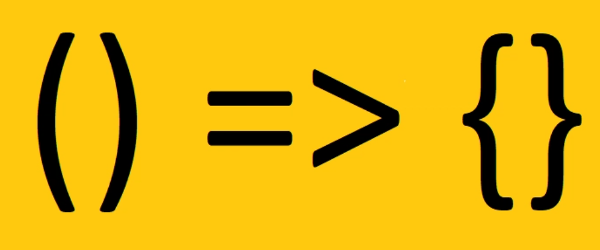
</div>

<br>

Una **función flecha** (o ***arrow function***) es una  forma concisa de definir funciones anónimas, introducida en ES6 (EcmaScript **2015**). 

Las funciones flecha **son de las funciones más cruciales para aprender en Javascript** ya que están por todos los lados. Su **sintaxis** es completamente **diferente** a cualquier otra declaración de variable.


## Ejemplos FUNCIÓN DECLARADA vs FUNCIÓN FLECHA


0.  **SIN PARÁMETROS**

```JavaScript

// a) sin parámetros, función declarada 
function hello1() {
    return 'Hello!';
}
console.log('sin parámetros, función declarada ' + hola1());


// b) sin parámetros, función FLECHA
const hello2 = () => {
    return 'Hello!';
}
console.log('sin parámetros, función FLECHA ' + hola2());


// c) sin parámetros, función FLECHA EN UNA SOLA LÍNEA
const hello3 = () => 'Hello!';
console.log('sin parámetros, funcíon FLECHA EN UNA SOLA LÍNEA  ' + hello3());
```

<br>

1.  **CON 1 PARÁMETRO**


```JavaScript

// a) un parámetro, función declarada
function hello4(x){
    return 'un parámetro, función declarada ' + 'Hello, ' + x;
}
console.log(hello4('milburn'));


// b) un parámetro, función FLECHA
const hello5 = x => {
   return  'un parámetro, función FLECHA ' + 'Hello, ' + x;
}
console.log(hello5('milburn'));

// c) un parámetro, función FECHA EN UNA SOLA LÍNEA 
const hello6 = x => 'Hello, ' + x;
console.log('un parámetro, función FECHA EN UNA SOLA LÍNEA ' + hello6('milburn'));
```

<br>

2. **CON 2 PARÁMETROS:**
```JavaScript
// a) dos parámetros, función declarada
function hello7(x,y){
    return 'Hello, ' + x + ' ' + y; 
    
}
console.log('dos parámetros, función declarada ' + hello7('milburn', 'gomes'));


// b) dos parámetros, función FLECHA
const hello8 = (x,y) =>{
    return 'dos parámetros, función FLECHA ' + 'Hello, ' + x + ' ' + y;
}
console.log(hello8('milburn', 'gomes'));


// c) dos parámetros, función FLECHA EN UNA SOLA LÍNEA
const hello9 = (x,y) =>  "Hello, " + x + " " + y;
console.log('dos parámetros, función FLECHA EN UNA SOLA LÍNEA ' + hello9('milburn', 'gomes'));
```
<br>

### DOS CARACTERÍSTICAS PRINCIPALES:  SU SINTAXIS Y SU MANEJO DEL <big>`this`</big>:

## 1) Sintaxis concisa
  

**COMPAREMOS** LA SINTAXIS de los 3 tipos de función diferentes:
<br>

i.a ) **Expresión de Función Anónima**
<div align="center">
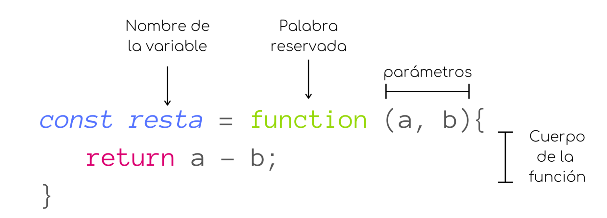
</div>

<br>
<br>

i.b ) **Expresión de Función Nombrada**
<div align="center">
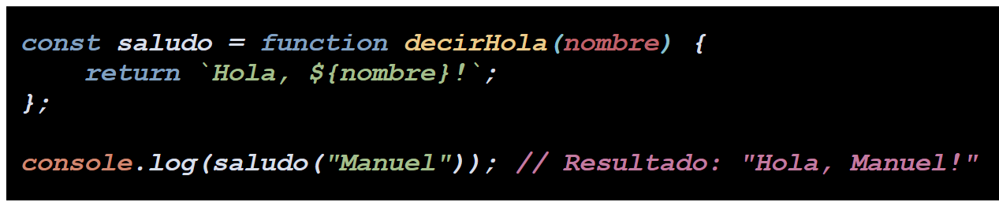
</div>


(El nombre  `decirHola`  es útil para identificar la función en los errores, pero no se usa para llamar a la función.)

<br>
<br>
<br>
<br>


ii ) **Declaración de función tradicional o regular**

<div align="center">
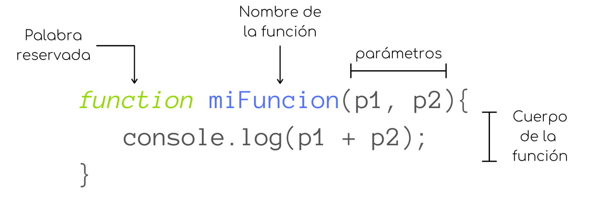
</div>
<br>
<br>
<br>


iii ) **Función flecha**:

<div align="center">
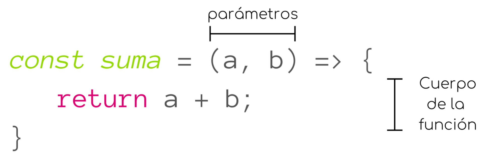
</div>
<br>
<br>

En realidad, **si comparamos una función regular con una flecha**, en lugar de tener que escribir "function" cada vez que queremos declarar una función, eliminar esa palabra y utilizar <big><strong> => </strong></big>  justo delante de las llaves <big><strong> { } </strong></big>   para para declarar una función de flecha. 


## 2) Particular manejo de `this`

La palabra clave **`this`** tiene un comportamiento diferente en las **funciones flecha**.  A diferencia de las funciones tradicionales, las funciones flecha **no tienen su propio  `this`**, sino que heredan el  **`this`**  del contexto donde se definieron .  El valor de  **`this`**  dentro de una función flecha es el mismo que **el de su entorno léxico (el contexto donde fue definida).**

#### a) EJEMPLO - **`this`**  en DECLARACIÓN DE FUNCIÓN:

- En el  **contexto de llamada**,  **`this`**  en una **función regular** se determina **en el momento de la llamada**, **según cómo se invoque la función.**
 
- Si una **función regular se llama directamente** o se pasa como **callback sin un contexto** específico, **`this`** dentro de esa función se referirá al **objeto global**

- De hecho, el principal problema al acceder a  **`this`**  dentro de una declaración de función en JavaScript es que  **su valor depende del contexto de llamada de la función, no de dónde se declara**.  Esto puede llevar a **comportamientos inesperados si la función se pasa como callback o se usa en diferentes contextos,** ya que  **`this`**  podría referirse a algo distinto a lo que se esperaba.

En el siguiente caso, no podríamos acceder al ,  **`this`**  de la función `MiObjeto()` que necesitamos:

```JavaScript
function MiObjeto() {
  this.valor = 10;
  this.obtenerValor = function() {
    console.log(this.valor); // this se refiere a MiObjeto
  };
}

const obj = new MiObjeto();
obj.obtenerValor(); // Salida: 10

const miFuncion = obj.obtenerValor;
miFuncion(); // Salida: undefined!!!!

```
<br>
<br>

#### b) EJEMPLO - **`this`**  EN FUNCIÓN FLECHA:

El problema anterior quedaría resuelto con una función flecha de la siguiente manera:

```JavaScript
this.valor = 20;
this.obtenerValorFlecha = () => {
  console.log(this.valor); // this se refiere al objeto que la contiene
};

obj.obtenerValorFlecha(); // Salida: 10
```

<BR>

## 3) EN RESUMEN

##### 1. VENTAJAS DE LAS FUNCIONES FLECHA
- **Contexto Léxico:** A diferencia de las funciones regulares, las funciones flecha **no tienen su propio enlace a  `this`.** En cambio,  `this`  dentro de una función flecha se refiere al contexto léxico, es decir, al **valor de  `this`  en el ámbito donde la función flecha fue definida. Esto evita errores comunes** relacionados con el contexto de  `this`  al usar funciones de **callback** dentro de **métodos de objetos o en otros contextos donde  `this`  podría cambiar dinámicamente.**


    
-   **Uso recomendado:** Son útiles cuando se quiere mantener el  `this`  del contexto envolvente, como en **callbacks** o **métodos de objetos** donde no se requiere que  **`this`  apunte al objeto que llama a la función.**


    
-   **Mayor concisión:** Son ideales para funciones **cortas** y funciones que se pasan como argumentos a otras funciones.

<br>
    

##### 2. LIMITACIONES DE LAS FUNCIONES FLECHA

- **No pueden usarse como constructores** (no se pueden llamar con **`new`**).
- **No tienen su propio objeto `arguments`** con la lista de argumentos pasados a la función, ya que solo acceden a los argumentos del ámbito léxico que las rodea.
- Su **`this`** se determina en el momento de la creación de la función, y se **hereda del contexto léxico circundante, en lugar de ser definido dinámicamente.**
<br><br>

---


# 4 ¿Qué es la deconstrucción de variables?
En JavaScript, **deconstrucción** (o *destructuring*) y **desestructuración** (o *destructuring*) son términos que se refieren a la misma característica del lenguaje, introducida en ECMAScript 6 (**ES6**). Ambos términos se utilizan indistintamente para describir la **sintaxis que permite intercambiar valores de variables de manera más concisa.**

<br>
<br>


<table>
<caption>&nbsp;&nbsp;&nbsp;&nbsp;&nbsp;&nbsp;&nbsp;&nbsp;&nbsp;&nbsp;&nbsp;&nbsp;&nbsp;&nbsp;&nbsp;&nbsp;&nbsp;&nbsp;&nbsp;&nbsp;&nbsp;&nbsp;&nbsp;&nbsp;&nbsp;&nbsp;&nbsp;&nbsp;&nbsp;&nbsp;&nbsp;&nbsp;&nbsp;&nbsp;&nbsp;&nbsp;&nbsp;&nbsp;&nbsp;&nbsp;&nbsp;&nbsp;&nbsp;&nbsp;¿QUÉ HACEMOS AL <strong>DECONSTRUIR?</strong></caption>
    <tbody>
        <tr>
            <td rowspan=3 align="center">&nbsp;&nbsp;&nbsp;&nbsp;&nbsp;&nbsp;&nbsp;&nbsp;&nbsp;Extraer&nbsp;&nbsp;&nbsp;&nbsp;&nbsp;&nbsp;&nbsp;&nbsp;&nbsp;&nbsp;&nbsp;&nbsp;&nbsp;&nbsp;&nbsp;&nbsp;&nbsp;</td>
            <td rowspan=2 align="center"><h4>valores de arrays</h4></td>
         </tr>      
               <td rowspan=3 align="center">&nbsp;&nbsp;&nbsp;&nbsp;&nbsp;&nbsp;&nbsp;&nbsp;&nbsp;&nbsp;para asignarlos a variables&nbsp;&nbsp;&nbsp;&nbsp;&nbsp;&nbsp;&nbsp;&nbsp;&nbsp;</td>   
          <tr>
            <td align="center"><h4>propiedades de objetos</h4></td>
        </tr>
    </tbody>
</table>


<br>
<br>

  


**VENTAJAS**:


-  el código **más legible**
-  **evita** la necesidad de **acceder repetidamente** a los elementos de la estructura original.


-   **Código más limpio y legible:** Evita la necesidad de **acceder a las propiedades del objeto usando la notación de punto** (`variable.atributo`).
-   **Extracción selectiva:** Permite extraer **solo las propiedades necesarias**, ignorando las demás.
-   **Asignación múltiple:** Se pueden asignar **múltiples variables en una sola línea**.
<br>

**NOTA**:
- La destructuración **no cambia la variable en sí misma.** Crea nuevas variables yi asigna valores extraidos de la estructura de datos original. **La variable original queda intacta**.

###   1. INTERCAMBIO DE VALORES DE VARIABLE:
Un ejemplo básico para el intercambio de turnos en un juego sería hacer uso de la desestructuración **para intercambiar los valores de las variables que representan los jugadores actuales**.

```JavaScript
let jugador1 = "X";
let jugador2 = "O";

// Intercambio de turnos usando desestructuración
[jugador1, jugador2] = [jugador2, jugador1];

console.log(jugador1); // Output: O
console.log(jugador2); // Output: X
```

 En este ejemplo, la línea  `[jugador1, jugador2] = [jugador2, jugador1];` realiza la magia: 

&nbsp; 1. **Se crea un array** con los valores actuales de  `jugador2`  y  `jugador1`. 
&nbsp; 2. Luego, la desestructuración **asigna el primer valor** (**anteriormente el de  `jugador2`**) a  **`jugador1`**  y el segundo valor (anteriormente el de  `jugador1`) a  `jugador2`, logrando así el intercambio.

**NOTA**: 
Nos evita tener la tediosa tarea de uno, por uno, cambiar de cada uno de los jugadores `jugadorx.nombre`


Una de los procesos más comunes que te encuentras cuando estás implementando, por ejemplo procesos de tipo "***quicksort***" u "ordenamiento rápido" (*algoritmo de ordenación que funciona bajo el principio de "divide y vencerás"*) u otros algoritmos más avanzados, es **la capacidad de intercambiar los valores de las variables.** **Sin la deconstruccion de variables**, sería este procedimiento se convertiría en todo **un reto**! En las v**ersiones modernas de JavaScript** podemos hacer esto de manera **más eficiente en una sola línea de código.**


<br>


### 2. DECONSTRUCCIÓN DE ARRAYS:

La desestructuración de arrays o arreglos permite extraer elementos específicos de un arreglo y asignarlos a variables, **utilizando la posición de los elementos dentro del arreglo.** Aquí **las dos comas extras (,) sustituyen** cada una de ellas a **un elemento del array siguiendo el orden**:

#### Arrays - EJEMPLO 1


```JavaScript
const numeros = [1, 2, 3, 4, 5];// Desestructuración de un arreglo
const [primero, segundo, , , quinto] = numeros;

console.log(primero); // Output: 1
console.log(segundo); // Output: 2
console.log(quinto);  // Output: 5
```
<br>

En esencia, la **desconstrucción** facilita la extracción de datos de estructuras complejas como **arreglos y objetos** y su asignación a variables separadas, y poder hacer por ejemplo **comparaciones, reordenaciones, etc.** En lugar de acceder mediante índices, atributo por atributo, podemos acceder simultáneamente a todos estas propiedades o valores.

Hubiera sido **mucho más largo y tedioso** el hacer algo como:

```JavaScript
const numeros = [1, 2, 3, 4, 5];

const itemPrimero = numeros[0]; 
console.log(itemPrimero);       // Output: 1

const itemSegundo = numeros[1];
console.log(itemSegundo);       // Output: 2

const itemQuinto = numeros[4];
console.log(itemQuinto);        // Output: 5

```
más la demás codificación para utilizar esas variables, etc.
<br>


### 3. DECONSTRUCCIÓN DE OBJETOS:

La desestructuración de objetos permite extraer **propiedades específicas de un objeto y asignarlas a variables con nombres iguales a las propiedades** o con nombres distintos usando un alias.
####  Objetos - EJEMPLO 1:


```JavaScript
const persona = {  nombre: 'Sammy',  edad: 45,  ciudad: 'Madrid'};// Desestructuración con nombres de variables iguales a las propiedades
const { nombre, edad, ciudad } = persona; 

console.log(nombre); // Output: Sammy
console.log(edad);   // Output: 30
console.log(ciudad); // Output: Madrid

// Desestructuración con alias
const { nombre: nombrePersona, edad: edadPersona } = persona;
console.log(nombrePersona); // Output: Sammy
console.log(edadPersona);   // Output: 45
```
####   Objetos - EJEMPLO 2:


```JavaScript
const jugador = {
  nombre: "Messi",
  posicion: "Delantero",
  dorsal: 10
};

// Desestructuración del objeto jugador
const { nombre, posicion, dorsal } = jugador;

console.log(nombre);   // Imprime: Messi
console.log(posicion); // Imprime: Delantero
console.log(dorsal);   // Imprime: 10
```
<br>


**Los nombres de los argumentos, deben coincidir exactamente con los nombres de las claves del objeto.** 
En general, si ponemos otros nombres a los argumentos sí funcionaría, **pero no en deconstrucción**. En este último ejemplo, para que  `nombre`, `posición`y `dorsal`    se mapeen a los atributos de la variable `jugador` **las claves que pasamos, deben  tener exactamente el mismo nombre que las claves de la variable** a la que mapean . 


<br>
<br>

### 4. DESESTRUCTURACIÓN CON PARÁMETROS DE FUNCIONES:
La desestructuración también se puede utilizar **al pasar argumentos a funciones.**


####  Parámetros de funciones - EJEMPLO 1:

```JavaScript
function mostrarInfo({ nombre, edad }) {
  console.log(`Nombre: ${nombre}, Edad: ${edad}`);
}

const persona2 = { nombre: 'Ana', edad: 25 };
mostrarInfo(persona2);   // Output: Nombre: Ana, Edad: 25
```
<br>

####  Parámetros de funciones - EJEMPLO 2:
```JavaScript
function mostrarNumeros([primero, segundo]) {
    console.log(`
    Primer número: ${primero}, 
    Segundo número: ${segundo}
    `);}
    mostrarNumeros([10, 20]); // Output: Primer número: 10, Segundo número: 20
```

**NOTA**: Debemos llamar a la función siempre teniendo en cuenta **el tipo de datos que contiene**. En el Ejemplo 2, vemos que la función  `mostrarNumeros()` contiene **un parámetro conteniendo un array:** `[primero, segundo]`, y por tanto, cuando la invoquemos debemos utilizar **la misma sintaxis con corchetes [].**
<br>
###  5. VALORES POR DEFECTO:


Muchas veces **no conocemos los valores que obtendremos, sea como resultado de una petición API** o  datos de formularios o de cualquier otra fuente con los que tratemos con **objetos**.  A menudo sólo tenemos trozos de lo que necesitamos.

Por ello, necesitaremos poner unos **valores por defecto** para esos objetos.

#### SINTAXIS:

#####  EJEMPLO:  Imprimimos los días de la semana
La **sintaxis** muy parecida a cómo utilizamos los argumentos por defecto en los tipos de valores de variable normales **cuando simplemente pasas un único elemento como argumento**. Pero ahora debemos integrar eso en un objeto.

La desestructuración permite establecer valores por defecto para las variables, **en el eventual caso de que la propiedad o elemento del array  no exista.**

##### EJEMPLOS:


a) EL VALOR QUE PASAMOS AL DECONSTRUIR **ES UTILIZADO**

```JavaScript
const usuario = { nombre: 'Sammy' };
const { nombre, edad = 45 } = usuario;

console.log(nombre); // Output: Sammy
console.log(edad);   // Output: 45
```
b) EL VALOR QUE PASAMOS AL DECONSTRUIR **ES IGNORADO**

```JavaScript
const usuario = { nombre: 'Sammy', edad: 10};
const { nombre, edad = 45 } = usuario;

console.log(nombre); // Output: Sammy
console.log(edad);   // Output: 10
```
a) En este caso **la variable `usuario` NO CONTIENE** el par clave:valor correspondiente a la clave de `edad`, por lo que al deconstruir, podemos añadir el nombre de la edad a la variable y por tanto nuestro nuevo dato **es utilizado por defecto**.
b) En este caso **la variable `usuario` YA CONTIENE** el valor de edad, con lo que  **ignora por completo la clave que pasamos al deconstruir**, ya que **sólo lo utilizará realmente en caso de no existir en la variable**.

<br>

###  6. APLICACIONES
Aplicaciones que nos encontramos a diario en la que utilizamos la deconstrucción de arrays y objetos en JavaScript es **al conectarse con una API externa**. 
Esta devuelve típicamente **estructuras tipo array y objetos** (con todo tipo de claves y valores diferentes). 

**En versiones antiguas de JavaScript** tenías que 
- **crear** algún tipo de función que sacara cada uno de esos valores, 
- **iterar** sobre las claves,
-  **almacerlas** en variables, y 
- **pasarlas en la función** que estés creando. 

Pero en **versiones modernas de JavaScript**, lo que realmente se puede utilizar es la **deconstrucción** del el objeto.

Una vez hemos identificado el **nombre del objeto u array** a deconstruir, nos **facilita enormemente la extracción de estos datos específicos de estructuras complejas**, así como su asignación a variables individuales, que de otro modo sería tan tedioso trabajar con los tipos de datos que una API devuelve.
<br>
<br>


# 5 ¿Qué hace el operador de extensión en JS?


**El operador de extensión** (también llamado operador de propagación) o **Spread Operator** es una herramienta muy potente de las plataformas más populares de JavaScript. Básicamente, **toma los elementos de un iterable** (arrays, cadenas, u objetos) **y los "desempaqueta" individualmente**.

**FIN**: Su objetoto es facilitar **la manipulación y combinación de datos de manera concisa**.
**SINTAXIS**: 3 puntos seguidos (...) de algún tipo de palabra.


## 1. CONVERTIR CADENAS EN  ARRAYS


```JavaScript
let cadena = "Mundo";
let array = [...cadena];
console.log(array); // ["M", "u", "n", "d", "o"]
```
## 2. COMBINAR  ARRAYS

a) Comparemos poniendo el **operador de extensión**:
```JavaScript
let numbers = [1,2,3,4];
let newNumbers = [8,9];

numbers.push(...newNumbers);
console.log(numbers); //imprime [ 1, 2, 3, 4, 5, 8, 9 ]
```
Recordemos que **el método``` push()``` cambia la variable original.**

b) **Si no pusiéramos la extensión ...** entonces lo añadiría como **un único** elemento, un **array (anidado**):

```JavaScript
let numbers = [1,2,3,4];
let newNumbers = [8,9];

numbers.push(newNumbers);
console.log(numbers); //imprime [ 1, 2, 3, 4, [ 8, 9 ] ]
```


precisamente por cómo JavaScript interpreta los arrays:  **un conjunto de “cualquier tipo de datos”.**  La solución, pues es utilizar el operador de extensión.


## 3. COPIAR ARRAYS

Cuando trabajas con arrays basados en **React**, **Angular** y otras plataformas de JavaScript, se sobreentiende que **no tienes que hacer cambios en una estructura de datos ya creada**. Es una **convención común**. Una variable declarada con **const** nos da precisamente esa seguridad, ya que nos daría error si más tarde en el programa intentamos cambiar la estructura de datos de esta variable.
Otra situación que puede pasar, es que **añadamos un string** a algo en este array que contiene números, y luego **otra parte del programa considera que solo había números enteros** (porque en principio era así), y ejecuta un proceso sobre esa estructura:  **nos daría error**.

**UNA BUENA PRÁCTICA**  
Lo más **limpio y seguro** es hacer una **copia** de esa variable original, y luego usar **let** para hacer nuestras modificaciones. 
De esta forma **evitamos crear los menos efectos secundarios posibles**

Debido a que **el método `push()`, como ya hemos dicho, cambia la variable original**, si hacemos la siguiente asignación con la intención de realizar una copia, seguiríamos con problema:

```JavaScript
const numbers = [1,2,3,4];
const updatedNumbers = numbers;

updatedNumbers.push(5);

console.log(numbers); //imprime  [ 1, 2, 3, 4, 5 ]
console.log(updatedNumbers);//imprime  [ 1, 2, 3, 4, 5 ]
```
Vemos que **cambia las dos variables.**  Aquí **no está pasando una copia, sino una referencia**, lo que significa que si haces una modificación en **updatedNumbers**, también lo haces en **numbers**, **como consecuencia MODIFICANDO TAMBIÉN LA VARIABLE FUENTE.** Tenemos dos soluciones a esto:

### a) Forma tradicional: añadir </big>`slice()`</big> a la variable original

El método  `slice()`  en JavaScript se utiliza para extraer una porción de una array. Cuando se llama **sin argumentos** toma todos los elementos del array, o sea, **crea una copia de todos los elementos del array original** superficial (shallow copy) del array original. 
- **Una copia superficial** o shallow copy crea un nuevo objeto, pero los elementos internos (si son objetos o arrays) **son referenciados desde el objeto original**. 
- **Una copia profunda** (deep copy), por otro lado, crea un nuevo objeto y copia recursivamente todos los elementos, incluyendo los objetos y arrays anidados, para que no compartan referencias con el objeto original.


```JavaScript
const numbers = [1,2,3,4];
const updatedNumbers = numbers;

updatedNumbers.push(5);

console.log(numbers); //imprime  [ 1, 2, 3, 4, 5 ]
console.log(updatedNumbers);//imprime  [ 1, 2, 3, 4, 5 ]
```


### b) Forma moderna: operador de extensión

#### SINTAXIS:
<big>`[…variableOriginal];` </big>
<br>
#### EJEMPLO:


```JavaScript
const numbers = [1,2,3,4];
const updatedNumbers = [...numbers];

updatedNumbers.push(5);

console.log(numbers);  //imprime [ 1, 2, 3, 4 ]
console.log(updatedNumbers); //imprime [ 1, 2, 3, 4, 5 ]
```
<br>

###  ¿ Forma a)-tradicional  o  Forma b)-moderna ?


Se ven  **los dos tipos** de comportamientos en las aplicaciones reales, ya que los desarrolladores han aplicado ambos durante muchos años: el método **`slice()`** ha estado siempre **muy extendido**. 

Pero en los últimos años, y si miramos en las aplicaciones creadas en **Angular**, o **View**, se aprecia **cada vez con más frecuencia la predominancia del operador de extensión**.  

Ambos funcionan de igual manera, pero quizá la **tendencia es a usar más el último.** No obstante es importante **conocer los dos y tener ambas posibilidades**.

-----


**NOTA**: el tipo de copia que se crea en estos casos es una **copia superficial**, en comparación con una **copia profunda**:

- una **copia superficial** (*shallow copy*) crea un nuevo objeto, pero los elementos internos (si son objetos o arrays) **son referenciados desde el objeto original**. 

- una **copia profunda** (*deep copy*), por otro lado, crea un nuevo objeto y **copia recursivamente todos los elementos**, es decir, **incluyendo los objetos y arrays anidados**, para que no compartan referencias con el objeto original.


## 4.  PASAR ARGUMENTOS A FUNCIONES 

Esto es algo **muy común**. Para explicarlo, tomaremos de la  de la biblioteca el objeto **Math** (disponible en todo JavaScript), y utilizaremos **el método`max()`**, este método: 
- se utiliza para encontrar **el valor más grande de una lista de números**
- **si** se proporciona un argumento que **no es un número**,  `Math.max()`  **devuelve  `NaN`**  (Not a Number)

<br>

#### EJEMPLO 1 - cómo funcióna `Math.max`:

```Javascript
console.log(Math.max (1,5,1,10,2,3));  // devuelve 10 
``` 
Aquí estamos pasando una lista, como si fueran 6 argumentos.
</p>
<br>

#### EJEMPLO 2 - pasando argumento como función:


```Javascript
const numbers = [1,5,1,10,2,3];
console.log(Math.max (numbers));  // NaN
```

Aquí la cosa es diferente: en este caso, interpreta que sólo estamos pasando **1 argumento**, cuyo tipo de dato es **un array, no un número**. Por esto el output de **NaN.**

Para arreglar esto, solo tenemos que añadir la **sintaxis (es decir, los tres puntos …) del operador de propagación** y así poder implementar la **deconstrucción del array**:

<br>


#### EJEMPLO 3 - operador de extensión

```Javascript
const numbers = [1,5,1,10,2,3];
console.log(Math.max (...numbers));  // 10
```

Finalmente conseguimos hacerlo:  lo convierte en un conjunto de argumentos de función, que en este caso son **números.**

Este proceso **es muy típico en las plataformas modernas de JavaScript.**
<br>


##  5. COMBINACIÓN DE PROPIEDADES DE VARIOS OBJETOS EN UNO NUEVO

Utilizando la **deconstrucción de objetos**, vamos a extraer los valores dentro del objeto de la variable, y los tenemos de dos tipos:

- Valores que son **fijos**: necesitamos que siempre estén ahí
-  Otros valores **opcionales** que **pueden estar o no**, y tampoco conocemos el número de ello.


 <br>


A) EXTRAYENDO LOS ELEMENTOS FIJOS:

```Javascript
const {abridor,cerrador} = {
    abridor: 'Verlander',
    cerrador: 'Giles',
    relevo_1: 'Morton',
    relevo_2: 'Gregerson'
}

console.log(abridor); // "Verlander"
console.log(cerrador); // "Giles"
```

Para **los fijos**: ponemos **las claves** como parte del nombre de la variable.
<br>

B) EXTRAYENDO LOS ELEMENTOS OPCIONALES O VARIABLES:

Añadiremos un elemento más com parte del nombre de la variable (tipo objeto), haciendo uso del **operador de extensión** o *spread operator*:
```Javascript
const {abridor,cerrador, ...relevos} = {
    abridor: 'Verlander',
    cerrador: 'Giles',
    relevo_1: 'Morton',
    relevo_2: 'Gregerson'
}

console.log(abridor); // "Verlander"
console.log(cerrador); // "Giles"
console.log(relevos); // { relevo_1: 'Morton', relevo_2: 'Gregerson' }
```
**A traves de la sintaxis <big>`...elemento`**</big>,  haremos mapear este elemento **al resto de los elementos** que contiene la variable y nos **imprime un objeto con los pares la clave-valor del resto de los elementos**.

Como hemos visto en el punto nº 4, ésta es la forma que trabaja **la deconstrucción**:  
- si pasamos un valor tal como `abridor`, lo busca en la variable (que es un objeto) y encuentra la clave, la mapea e imprime su valor. 
-  **Los tres puntos `...` crea un grupo abierto con un número de elementos indeterminado**, que mapeará al resto de elementos en cuanto creamos un variable para ello.

Es una de las formas más comunes de hacer la deconstrucción de objetos utilizado por muchas plataformas como ***React*** cuando no sabemos cuántos argumentos habrá y necesitamos extraer todo lo que haya, con el fin de  **guardarlo en una variable que podemos utilizar más tarde**.


**El operador de extensión ... debe colocarse al final de los demás elementos del objeto**.  Generaríamos un error si tratamos de hacer `const {abridor, ...relevos, cerrador}....`. Este error, diría algo así como `// SyntaxError: Rest element must be last element`.

-----

# 6 ¿Qué es la programación orientada a objetos?
## 1. INTRODUCCIÓN

- **Durante años**, las versiones antiguas de **JavaScript no incluían** los componentes de programación orientada a objetos, como **clases e instanciación**, lo cual estuvo bien durante un tiempo. 
- Sin embargo, las versiones más modernas de JavaScript sí han implementado **clases**.
- En **programación orientada a objetos (POO) en JavaScript,**  se organiza el código alrededor de **objetos**, los cuales son **instancias de clases**.

**OBJETOS**:  contienen:
	- datos (**propiedades**)
	- funciones (**métodos**) que operan sobre estos datos


JavaScript, aunque basado en **prototipos**, permite un estilo de programación orientado a objetos mediante el uso de **clases** (introducidas en ES6) y **objetos**


Comencemos con **una analogía**. Crear un **plano de una casa**:


<div style="display: flex;">  
  
   
</div>


- cuantas plantas tiene
- tabiques, para cada dormitorio
- ubicaciones de puertas
- ubicación de las ventanas
- donde van los enchufes de luz...

Nos hacemos una idea.  **Esto NO es una casa**. Es la **estructura**.

Esta **estructura** la podemos asociar con lo que en Javascript corresponde a una **clase**.

**UNA CLASE:**

- **Una clase** es simplemente una lista de definiciones que indican exactamente cómo debería comportarse.
-  **Una clase** numerará **atributos** para **describir** lo que se supone que debe hacer la clase y su **comportamiento**. 


#### EJEMPLO: Imaginemos la clase `Usuario`:
- CLASE: Cada vez que **un nuevo usuario** accede al sitio y se registra, el programa **revisará la clase `Usuario` y verá esa esa estructura**. Es lo mismo que decir que "es importante ver **cómo debería comportarse ese usuario**", para pasar luego al siguiente paso. 
- INSTANCIACIÓN: Es un término complejo. Significa que tomamos ese plano y **creamos con él un objeto real**.

En nuestro ejemplo:
- tenemos una **clase `Usuario`** 
- con un **nombre** de usuario 
- y algunas **funciones**, 
	- indicar **qué queremos que haga** el usuario después de iniciar sesión, 
	-  **qué página** queremos ver 
	- **qué tipo de atributos** queremos que estén disponibles para el usuario, **como obtener su apellido o algo similar**, que su aplicación necesita. (**datos**)


Entonces, recapitulando, lo que hará el programa será:
1.  **examinar** el plano 
2.  **crear e instanciar un objeto con él**, el cual será el objeto con el que trabajarán. Este es el momento en el que deja de ser un simple plano para convertirse **en algo terminado**, en ese **objeto real**.  Hemos creado un "ejemplar" de algo, basado en la estructura anterior. 
3.  Luego puedo **hacer otro objeto** con otro nombre y **basarlo en la misma plantilla** o estructura. Serían dos objetos distintos que tienen una misma estructura.


### CLASES:  término "CONSTRUCTOR"

**Durante muchos años** JavasScript **no tenía** técnicas de OOP ( object-oriented programming ) o de **programación orientada a objetos**.  Había que crear procedimientos alternativos para conseguir lo que se necesitaba, y una de ellas era la utilización **funciones a modo de clases.** 

**Un constructor**  es una función especial  (**palabra clave reservada para las clases**) que:
- se utiliza para **crear e inicializar objetos**.
- se encarga de **definir las propiedades iniciales de un objeto** al momento de su creación.  Estas **propiedades**:
	-  Son **variables** que se definen dentro de la función constructora **para almacenar datos sobre el objeto**.
	- Se **acceden y modifican utilizando la palabra clave  `this`  seguida del nombre de la propiedad.**
- **Un constructor se invoca con** la palabra clave  **`new`**. 

#### SINTAXIS BÁSICA DEL CONTRUCTOR

<div align="center">
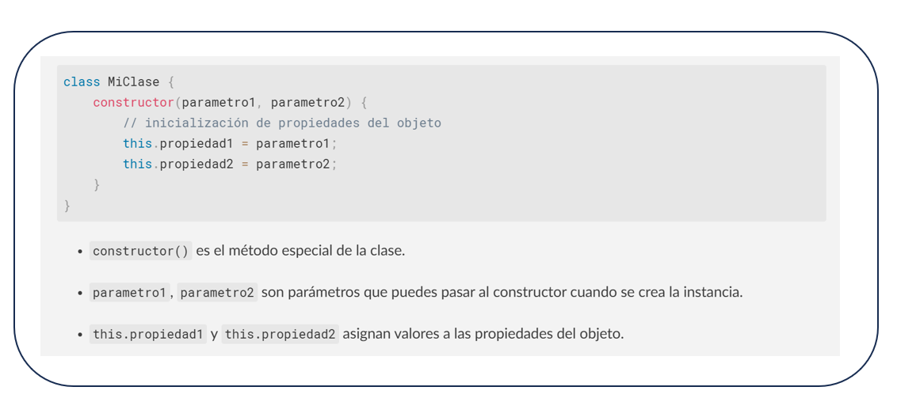
</div>

#### ALGUNOS CONCEPTOS CLAVE DEL CONSTRUCTOR


- Cada vez que creemos, el nombre de **constructor** es una **palabra clave reservada para las clases**,  específicamente utilizada dentro de ellas. 
- No siempre están en todas las clases, pero muy habitualmente sí
- Tareas: fijar valores, llamar a otras funciones, etc.
- **El constructor define el método que se ejecuta al crear una nueva instancia de la clase**. 
 - Una **clase** en sí **no ejecuta nada** (son como hemos dicho un conjunto de reglas y pautas para la ejecución)
 -  Es **la instancia**, la que **ejecuta todos los procesos** que queramos cada vez que **creemos un nuevo objeto** (lo haremos con la palabra clave **`new`** ).
 - Haremos uso de la  **deconstrucción** (anteriormente explicada), y pasaremos un nombre, o sea, `name`, **como objeto**.  
<br>
#### EJEMPLO DE CLASE E INSTANCIA:
<div align="center">
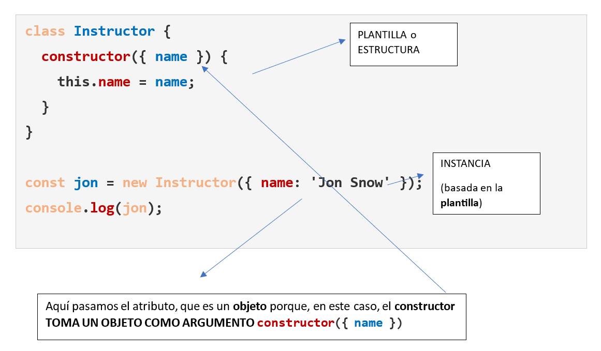
</div>

-	El hecho de crear una **instancia** nos dirige automáticamente **al `constructor`.**
-	En **`constructor ({ name })`**, aquí   **`name`**  mapeará a lo que se pasará cuando creemos un nuevo Instructor: **`new Instructor`**). Y queremos hacer algo con este **`name`**.  
-	Lo añadimos a la clase para que forme parte de ella, y la forma de que esto funcione es a través de la palabra clave **`this`**. 
-	Accediendo a **`name`** mediante **`this.name` estamos añadiendo el atributo `name`** a **`this.name`**.
-	Los colores aquí muestran perfectamente que son cosas diferentes:
	-	 los dos <font color = blue> **`name` en color azul** </font>hacen referencia al **mismo elemento dentro del objeto**, pero el siguiente  **<font color = darkred>  `name` en color rojo**</font> en `this.name` hace referencia **a una instancia de la clase `Instructor`,** precisamente la instancia que hemos creado asignándola a la variable `jon`.  En esta instancia en específico, le decimos que **almacene cualquier `name`** (`this.name = name`) **que sea pasado como parámetro con este objeto.**


Cuando quiera que el **constructor** tome un **objeto** como argumento, entonces **al instanciar también tenemos que poner un objeto como argumento!!**


La variable `jon` se llama **instancia de la clase Instructor**.  En cuanto al tipo de dato, es **un objeto**. De hecho si hacemos:

```Javascript
console.log(jon); 
// imprime: Object { name: "Jon Snow"}
```

 Y precisamente por ello, podemos acceder al atributo **`name`**  mediante la nomenclatura con punto o **dot notation** de los objetos:
<div align="center">
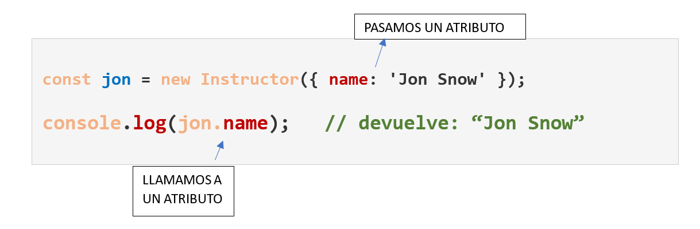
</div>
#### OTRO EJEMPLO:

```Javascript
class Coche {
    constructor(marca, modelo, año) {
        this.marca = marca;
        this.modelo = modelo;
        this.año = año;
    }
}

const miCoche = new Coche('Toyota', 'Corolla', 2020);
console.log(miCoche);
```
En este ejemplo:

-   La **clase**  `Coche`  tiene un **constructor** que toma **tres parámetros**:  `marca`,  `modelo`  y  `año`.
-   Cuando se crea la **instancia**  `miCoche`, se pasan los **valores**  `'Toyota'`,  `'Corolla'`  y  `2020`  **al constructor**.
-   El **constructor asigna estos valores a las propiedades del objeto**, usando  `this.marca`,  `this.modelo`  y  `this.año`.


 ## 2. MÉTODOS DE INSTANCIA


- Durante mucho tiempo en JS se ha venido creando **funciones tradicionales en vez de los métodos de instancia**, que son métodos que operan de forma específica sobre la **“instancia” de una clase**. 

- Sin embargo, lo más común en los últimos años es :
	-  poder **acceder y modificar los atributos de la instancia en la que se están invocando**, 
	-  poder **llamar a otros métodos dentro de la instancia**.

**Los métodos dentro de una clase** son funciones que están **asociadas a esa clase** y se utilizan para **definir el comportamiento** de los objetos creados a partir de ella. 
- Se **definen dentro del cuerpo de la clase,** 
- Con **la misma sintaxis que las funciones, pero sin la palabra clave** **_function_**  para métodos públicos. 
- Los métodos pueden **acceder a las propiedades de la instancia** actual utilizando **`this`**.

 ### EJEMPLO 1 - Métodos de Instancia
<div align="center">
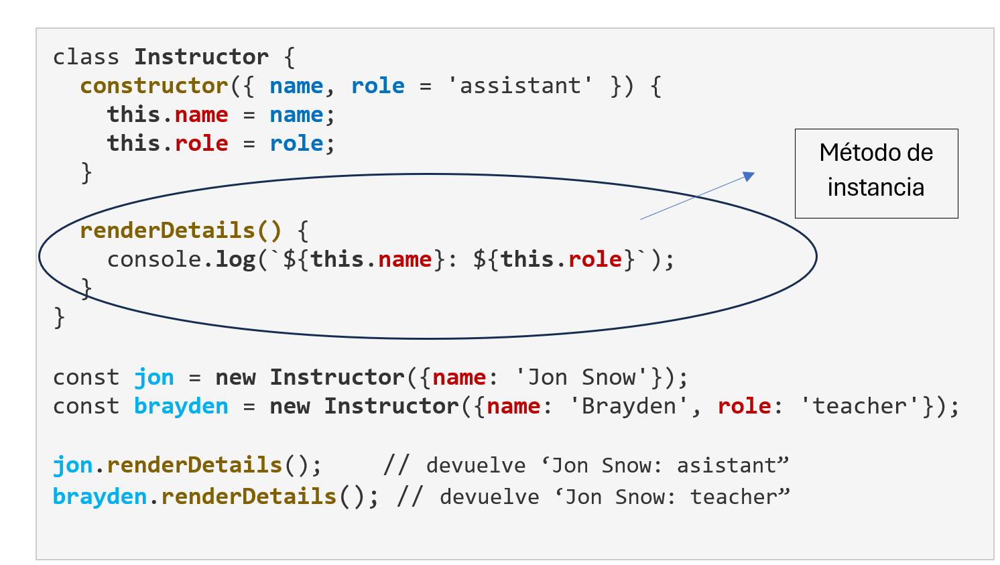
</div>

- En el **`console.log`** del método de la instancia **`renderDetails()`**  necesitamos poner el **`this`** en **`this.name`**  para poder acceder al valor de **`name`** del argumento.
- Cuando instanciamos y pasamos los valores entre llaves `new Instructor({name: "Jon Snow"}`; nos dirige **al contructor.**
- En la **instancia de método`renderDetails()` no tenemos acceso este argumento**: sólo lo tiene el constructor, así que la única manera de acceder es añadir la palabra clave **`this`**  **a los atributos** creados dentro de los constructores.


**OJO!!** No debemos olvidar que PRIMERO debemos INSTANCIAR LA CLASE para convertir la variable a OBJETO. **Nunca podríamos llamar al método de la instancia sin instanciar la clase primero**. De hecho, nos daría **error**.
<br>

 ### EJEMPLO 2 - Métodos de Instancia

```Javascript
class Coche {
    constructor(marca, modelo, año = 2019) {
        this.marca = marca;
        this.modelo = modelo;
        this.año = año;
    }
}

const miCoche = new Coche('Toyota', 'Corolla', 2020);
console.log(miCoche);  // Coche { marca: 'Toyota', modelo: 'Corolla', 'año': 2020 }
```
-   La clase  `Coche`  tiene un constructor que toma tres parámetros:  `marca`,  `modelo`  y  `año`.
-   Cuando se crea la instancia  `miCoche`, se pasan los valores  `'Toyota'`,  `'Corolla'`  y  `2020`  al constructor.
-   El constructor asigna estos valores a las propiedades del objeto, usando  `this.marca`,  `this.modelo`  y  `this.año`.
- **Ignora** la propiedad año que el constructor contiene **por defecto**. Ésta, `'año': 2019` , solo hubiera salido si al pasar los parámentros en la instancia **no hubiera incluido el valor para `'año'`**, es decir que con:
	 `const miCoche = new Coche('Toyota', 'Corolla');`
		**imprimiría**    `//Coche { marca: 'Toyota', modelo: 'Corolla', 'año': 2019 }`
		<br>
		
## 3. MÉTODOS ESTÁTICOS

- En JavaScript, los métodos estáticos son aquellos que pertenecen **a la clase en sí misma, no a instancias individuales de la clase.** 
- Esto significa que **se pueden invocar directamente desde la clase,** **sin** necesidad de **crear un objeto** de esa clase. 


#### SINTAXIS
```JavaScript
class MiClase {
  static miMetodoEstatico() {
    console.log("Este es un método estático.");
  }
}
```
**Acceso al método estático**:  
```JavaScript
miClase.miMetodoEstatico();
```

<br>

#### EJEMPLO 1:   Creamos un producto genérico para una empresa


```JavaScript
    class Producto {
      constructor(nombre, precio) {
        this.nombre = nombre;
        this.precio = precio;
      }

      static crearProductoPredeterminado() {
        return new Producto("Producto Genérico", 0);
      }
    }

    const productoPredeterminado = Producto.crearProductoPredeterminado();
    console.log(productoPredeterminado); 
    
    // Devuelve: Producto { nombre: 'Producto Genérico', precio: 0 }
```
- Como vemos, ha podido acceder tanto al `nombre` como al `precio`, ya que los métodos estáticos **pueden acceder y manipular propiedades estáticas de la clase.**
-  Se acceden a ellos **a través del nombre de la clase** (aquí `Producto`).
<br>

#### EJEMPLO 2:   Cliente entra y dice "Hola" (método de instancia)  se despide y dice "Adiós" (método estático)
```JavaScript
class Cliente {
  static despedirse() {
    return "Adiós";
  }

  entrar() {
    return "Hola";
  }
}

console.log(Cliente.despedirse());  // (1) Método estático (no requiere instancia): 'Adiós'
Cliente.entrar();                   // (2) Uncaught TypeError: Cliente.entrar is not a function

const cliente1 = new Cliente();     // (3) Creamos una instancia

cliente1.despedirse();              // (4) Uncaught TypeError: cliente1.despedirse is not a function
console.log(cliente1.entrar());     // (5) Método no estático (requiere instancia): 'Hola'
```

(1) Como vemos, el método **estático**  `despedirse()` se ejecuta sin problemas accediendo a él con el **nombre de la clase** delante.<br>
(2) El método `entrar()` no es estático - **Necesita un instancia** para acceder a él. Nos da error.<br>
(3) Creamos la instancia.<br>
(4) El método `despedirse()` es **estático**, la forma de acceder a él es a través de la **clase**, **no de una instancia**.<br>
(5) El método `entrar()` no es estático, ya hemos **creado la instancia y esta vez no nos da error**.

<br>


#### CUÁNDO UTILIZAR LOS MÉTODOS ESTÁTICOS


El método estático es útil cuando :
- se necesita crear instancias de una clase con cierta lógica de inicialización o **configuración específica** 
- **se prefiere evitar el uso de  `new`**  por simplicidad o por otras razones de diseño. Es decir, pueden usarse **para crear instancias de la clase de forma personalizada**.  

- **cuando no necesitemos acceder a propiedades de instancia**: tiene que ver más **con la estructura** y menos con la instancia. Si un método no necesita acceder a datos específicos de un objeto, es **más eficiente** declararlo como estático. 
- cuando necesitemos **funciones de utilidad:**
	-  a) **funciones auxiliares** (***helper modules***). Los métodos "helper" o auxiliares son funciones diseñadas para realizar tareas **específicas y reutilizables, simplificando el código y mejorando la legibilidad**. Estos métodos a menudo se encapsulan en un módulo o clase para **su fácil acceso y mantenimiento**.
	
	- b) propósito general que **no están ligadas a un objeto en particular**, por ejemplo:
		- como métodos para **manipular arrays**
		-  realizar **cálculos matemáticos**. 
		
-  **Funciones de fábrica**.-   función que **devuelve un objeto** nuevo cada vez que se llama:
	-  cuando un **método estático** se utiliza para ello,  **para crear objetos**, y se convierte en una **función fábrica**
	
	- **no requieren el uso de  `new`,** lo que permite **crear objetos de manera más flexible**.

	


Ojo! Cuando estemos creando una aplicación y estemos pensand en utilizar un método estático, primero deberíamos preguntarnos en profundidad:

<div align="center">

</div>
<br>

Ya que hay una línea muy fina entre:

<div align="center">
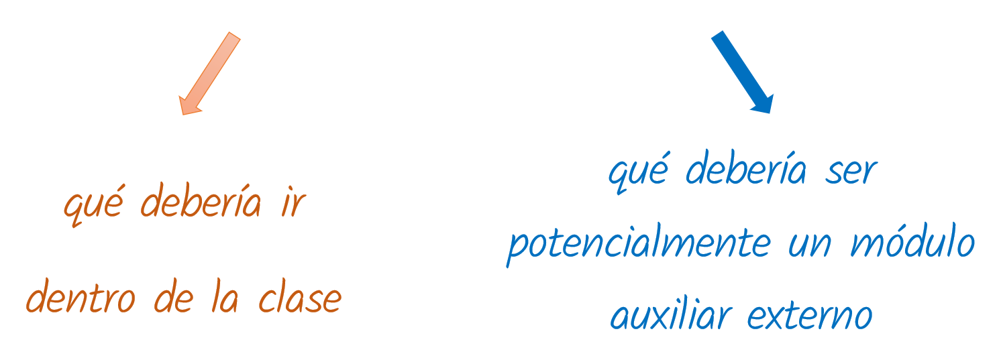
</div>
<br>

En la **programación orientada a objetos**,  existe el llamado algo llamado:
<div align="center">

</div>

El **Principio de Responsabilidad Única** (PRU) en JavaScript  significa que **cada clase**  (función, etc.) debería **tener solo una tarea o responsabilidad** claramente definida, y **no intentar abarcar múltiples tareas** no relacionadas.

    

    
    
    
# 7. ¿Qué es una promesa en JS?

Para entender el concepto de **Promesa** o **Promise** en líneas generales, una de las formas más comunes de trabajar con **Promises** o **Promesas* es cuando te comunicas con **APIs**.  

Por ejemplo me conecto a una **API de *Twitter***, para poder obtener todas las **publicaciones**. Así que llamo a una **URL (un endpoint**) y las recibo.
-	¿qué pasaría en mi aplicación **si Twitter se cae**? Si un usuario va a la página, pero solo podría ver algo que es parte de la memoria intermedia (bufer) como unos puntos suspensivas "………………… " o algo así:   Sería **una experiencia no agradable para cualquier usuario**.

Lo que una **promesa** nos permite es llamar a ***Twitter***, mostrar nuestra página, 
o	y **cuando las publicaciones finalmente lleguen de la API, que las muestre**.

- Una **promesa** hace realmente una tarea que **no queremos que ocurra en tiempo real**; podemos desarrollar cualquier funcionalidad nueva en la que sea conveniente **que no se procese inmediatamente**, como una consulta a una base de datos o API externa.

Esto es algo que tiene muy positivo JavaScript: **su capacidad para trabajar de forma asíncrona.** Esto significa que puedes hacer tareas como ésta de llamar servicios externos y usar APIs, y poder tomar y en realidad, **elegir  qué elementos** de tu página o en tu aplicación **se cargarán directamente, y cuáles pueden tardar más tiempo**.

- Efectivamente, algo muy a favor de **Javascript** es que **trabaja directamente con la experiencia del usuario**. No sería deseable que el usuario se quede esperando durante un tiempo hasta que finalmente los datos se carguen.

- **La naturaleza de JavaScript es la comunicación con servicios externos**, como bases de datos, **APIs backend** ( l*as ***APIs backend*** se ejecutan en el servidor y gestionan la aplicación y la interacción con la base de datos; en esencia, son el motor que impulsa la funcionalidad visible en el frontend* ) o cualquier otro servicio fuera de la aplicación, como las diferentes plataformas de JavaScript como ***React, Angular y Vue***; JavaScript **recibe los datos como resultado de esta comunicación con dichos servicios externos.**
- La utilización de heramientas como las **promesas** son el pilar central de podamos confiar en que el proceso se desarrollará tan fluidamente como sea posible.

CONVENCIÓN COMÚN:	
Los argumentos de la función `Promise()` son `resolve` y `reject`.  Antes era `success` y  `failure`, pero ahora lo más extendido son los primeros.

Una **promesa** o bien:
- funciona y **resuelve** ese código. Por ejemplo, algún tipo de respuesta con éxito -si nos comunicamos con una API, nos devolverá los datos de esa API y podremos manejarlos; o
- no funciona y por lo tanto devuelve algún tipo de **error**. 


### Proceso de codificación de las promesas
- En general, con las **funciones, clases**, etc **no dedicamos** mucho **tiempo** pensando en las **eventualidades** negativas de que ocurriera **errores**
- Sin embargo una **promesae** te obliga a crear un sistema entero dividido prácticamente **50/50** :
	-	**50%** del tiempo lo dedicamos a codificar sobre situaciones en las que el proceso **se resuelve con éxito**
	-	y el otro **50%** lo pasamos creando los tipos de proceso que ocurrirán **si se produce un error.**

<br>### 

####  SINTAXIS básica de una promesa.
```JavaScript
const promesa = new Promise((resolve, reject) => {  
// Aquí se realiza la operación asíncrona :
// Si la operación es exitosa, se llama a resolve(valor) 
// Si ocurre un error, se llama a reject(error)  
});
```
#### BUENA PRÁCTICA:

Una buena práctica es añadir la palabra **Promise** **al nombre de la variable**, para identificar el propósito en futuros accesos al programa. Al ser así de **descriptivo**, facilitará cualquier interpretación y/o modificación del mismo: por ejemplos **`postsPromise = fetch( "https:// aaa.bbbbbbb.com/posts")`**  si tratamos de obtener las publicaciones o "***posts***" de una página web (p.ej. *Twitter*).


### Proceso básico promesa


<div align="center">
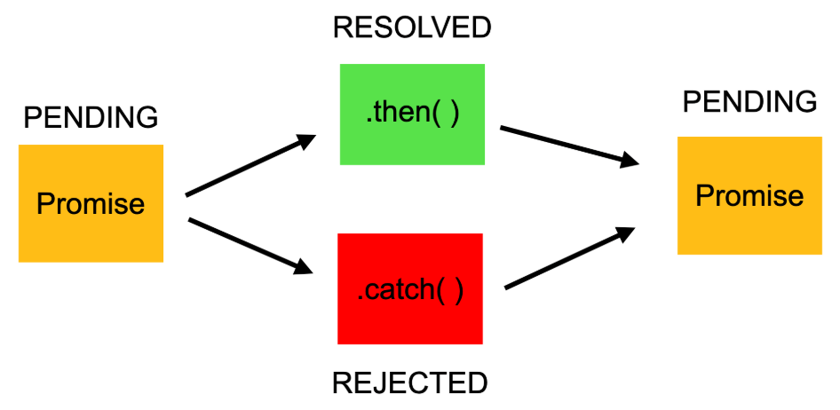
</div>
<br>

Explicación:

-   **`new Promise((resolve, reject) => { ... })`:**
    
    Crea una **nueva instancia de promesa**. El constructor `new`toma una función con dos parámetros:  `resolve`  y  `reject`.
    
-   **`resolve(valor)`:**
    
    -   Esta función se usa para indicar que la operación asíncrona ha terminado **con éxito.**
    -   `valor`  **es el resultado de la operación, que se pasará al siguiente bloque  `then()`**  en la cadena de promesas.
    -   Si  `valor`  es otra promesa, se "aplanará" (pondrá en una sola capa todas las promesas anidadas) y su resultado se usará como el resultado de esta promesa.
    -
	    - **`then()`:**  se usa para **encadenar funciones a una promesa, permitiendo manejar el resultado exitoso** de una operación asíncrona. Cuando la promesa se resuelve, la función  `then()`  se ejecuta con el valor de la promesa, y **si devuelve otra promesa, el encadenamiento continúa con esa nueva promesa**.
    
-   **`reject(error)`:**
    
    -   Esta función se usa para indicar que la operación asíncrona **ha fallado.**
    -   **`error`**  es una **descripción del error**, que puede ser cualquier tipo de valor, aunque **se recomienda usar un objeto  `Error`  para facilitar la depuración**,  [según Stack Overflow en español](https://es.stackoverflow.com/questions/64265/qu%C3%A9-es-una-promesa-en-javascript).
    -   El error se pasará al bloque  `catch()`  o al siguiente  `then()`  con un segundo argumento (el manejador de rechazo) en la cadena de promesas.
	    - El método  **`catch()`** se usa para **manejar errores o casos de rechazo en una promesa**. Se ejecuta cuando la promesa asociada es rechazada, permitiendo ejecutar código específico para **manejar el error**, **como mostrar un mensaje o realizar alguna acción correctiva.**


<br>

### Secuencia del proceso de creación de una promesa con un ejemplo:


```JavaScript
let sleepyGreeting = new Promise((resolve, reject) => {
  setTimeout(() => {
    resolve('Hello....')                // ponemos ….porque es “sleepy” 
  }, 2000);			     // 2 seg (2000milseg). Después de ese tiempo retorna el Hello.

  setTimeout(() => {
    reject(Error('Too sleepy...'))   //Error()con mayúscula, ya que es un módulo de JS
  }, 2000);
});

sleepyGreeting
  .then(data => {
    console.log(data);
  })
  .catch(err => {
    console.error(err);
  });
  ```
1.	Creamos una **variable** que llamamos `sleepyGreeting`,

2.	**Asignamos a la variable** la creación de una **nueva promesa** new Promise().

3.	**Promise()**, toma **como argumento una función**. Como primer argumento (aquí no ponemos los opcionales) toma **una función**, por ello se llama  **callback**. 

4.	**Esta función callback** (que en este caso sera función flecha) **tiene dos argumentos**:`resolve` y `reject`, mencionada convención común, mencionada,  especialmente para utilizar los métodos correspondientes de `resolve()` y `reject()`.
5.	 Creamos **dos métodos de `setTimeout()`**,  con el fin de poner **temporizadores**.  Generalmente, **cuando trabajas con promesas**, una de las regla es que tu expectativa es que aquello que quieres obtener, **no lo obtengas de forma inmediata**. **Puede tardar bien milisegundos o unos segundos.**    Este temporizador nos permite manipularlo e incluso **imitar lo que obtendríamos si llamamos a una API** o algo parecido.   Esta función toma dos argumentos:  <br>
			-	*una función* a ejecutar  **`resolve(valor)`** y **`reject(mensaje)`**
			-	*retraso*: **el tiempo de espera en milisegundos** (2 Segundos en este caso)
			

6.	Finalmente, **llamamos a la función.** Por CONVENCIÓN COMÚN, utilizamos la sintaxis de:


	 - [x] **Varias líneas**

	 - [x] **Indentación** antes de poner los métodos **`then()` y `catch()`**     
<br>

### Llamada a la función: métodos <big>`then()` </big>y  <big>`catch()` :

1. `data` es convención común para referirse a los datos recibidos; para el almacenamiento de los datos.  
Significa que cuando llamamos a la función (`sleepyGreeting()`) y obtengamos la respuesta:
	**"entonces, haz esto, esto y esto"  (lo que ponga despues del `then()`** .
	
	En nuestro caso sería nuestro string <font color=green>**“Hello……”.**</font>. En otros ejemplos, correspondería a las **peticiones de publicación JSON, o tweets, o lo que quiera que haga cuando estemos llamando.**
	<br>

2.  **`catch(err => { console.error(err); })`**  es un método que se utiliza para manejar errores asíncronos, específicamente en el contexto de promesas.   En otras palabras, es una forma de **asegurar que si una operación asíncrona falla, el error se capture y se muestre en la consola**, permitiendo a los desarrolladores responder adecuadamente. Analicemos cada parte:
		
	-   **`.catch()`:**
    
	    Este es el método que se usa para **capturar errores**. Se aplica a una **promesa** y se ejecuta **cuando la promesa es rechazada (reject)**, es decir, cuando ocurre un error durante la operación asíncrona.
    
	-   **`err => { ... }`:**
    
	    Esta es una **función flecha** (arrow function) que actúa como el **manejador de errores.**
    
    -   **`err`:** Es el parámetro de la función, que **representa el objeto de error** que se ha producido. Este objeto contiene **información sobre el error, como su tipo y mensaje**.
    -   **`{ console.error(err); }`:**  Dentro de la función,  **`console.error(err)`**  se utiliza para **registrar el error en la consola del navegador** o del entorno donde se ejecuta el código. Esto ayuda a los desarrolladores a **identificar y depurar problemas.**
    


## Método <big>`fetch()`</big> para  solicitudes de red 

El método  `fetch()`  :
- comienza el proceso de **capturar un recurso de un servidor**. 
- se utiliza para realizar solicitudes de red y obtener recursos de forma **asíncrona**, **como datos JSON, archivos, imágenes, etc.** 
- esta forma moderna y flexible de **realizar peticiones HTTP y** obtener respuestas del servidor tiene una **sintaxis limpia y fácil de usar.**


#### SINTAXIS:

- Acepta **dos parámetros:**
	1.  **La URL a la que enviar la petición** (este es un parámetro obligatorio).
	2.  **Las opciones a configurar en la petición.** Aquí se puede configurar el método de solicitud aquí (este es un **parámetro opcional**).

-  **`fetch()`  devuelve una promesa** que se resuelve al objeto  `Response`, el cual contiene información sobre la respuesta, como el estado, encabezados y el cuerpo de la respuesta. Es decir, representa la respuesta a la solicitud realizada.  Y dado que se trata de una **promesa**, necesitamos agregar los métodos  **`.then()`  y  `.catch()`.**
<br>

#### CONVENCIÓN COMÚN:  

* La respuesta con los datos se suele representar, por convención común, sobre todo con dos denominaciones:
	-  `response` 
	-  `data`
	
```js
fetch('<Tu URL>', {})
  .then(response => {
    // Manejamos la respuesta de la petición aqui
  })
  .catch(error => {
    // Si hay un error en la petición, lo manejamos aqui 
  })
```

- 	Si la solicitud devuelve un error, se ejecutará **el método  `catch()`**:  éste  se puede omitir en Fetch API.  
**Se usa solo** cuando `fetch()` no puede realizar una solicitud a la API, como por ejemplo **si no hay conexión de red o no se encuentra la URL**.

- Se pueden utilizar métodos como **`json()`,  `text()`,** etc., para extraer los datos de **la respuesta en diferentes formato**.


####    EJEMPLOS

1. Conviertiendo datos a **json** y listando todos los recursos de estos datos json.

```js
const postsPromise = fetch('https://jsonplaceholder.typicode.com/posts')

postsPromise
  .then(data => data.json())     
  .then(data => console.log(data));   // este "data" ya está convertido a json
```
Y esta impresión será algo similar a esto:
<br>


<div align="center">
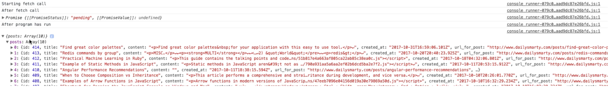
</div>

<br>
<br>


No se visualiza bien, pero como son datos **JSON**, y vemos un objeto, un **array** llamado   ** `posts` ** conteniendo muchos datos, lógicamente en forma de pares  clave:valor. Vemos muchas claves repetidas como: `title`, `content`, `created_at` , con sus respectivos valores.


2. Trabajando con los datos **json** : con bucle `forEach()`
```js

const postsPromise_2 = fetch('https://jsonplaceholder.typicode.com/posts')

postsPromise_2
  .then(data => data.json())
  .then(data => {             
      data.posts.forEach((item) => {    //(1*)
         console.log(item.title);       //(2*)
      });
   })
  .catch(error => {
    // Manejar errores en la solicitud
    console.error('Error:', error);
   });
```

  
(1*) Iteramos sobre el objeto que nos interesa, que es  `posts`, con el bucle `forEach()` (que está tomando como argumento una función flecha).

(2*)  En esa iteración solo nos interesa uno de las claves: `title`, así que extraerá todos valores para cada una de estas claves `title`repetidas. Se visualizaría algo así:
<br>


<div align="center">
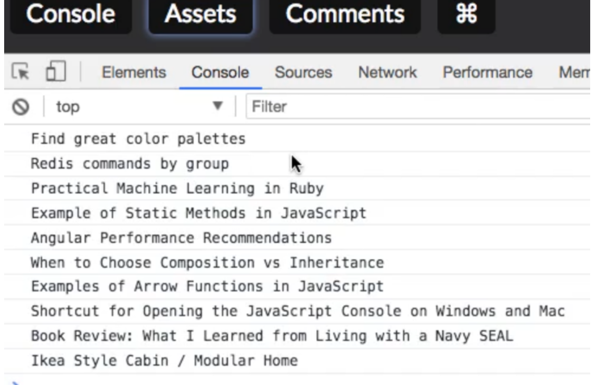
</div>

<br>
<br>

En este caso no ha dado error, por eso no ha tenido que ejecutar el `catch()`, pero hay muchas veces que puede hacerlo. Por ejemplo, muy típico es no tener en cuenta la "s" final de la url `https:  //.......` ; o bien una API con *https* o *http* que esté utilizando un **sistema completamente seguro**.

Y efectivamente, si intentas capturar (utilizar el `fetch()` , este tipo de URL o  **endpoint API** y no es seguro, hay mucha probabilidad de que estés trayendo diversos **elementos a tu propia aplicación que no son seguros**. Por ello, **JavaScript lo bloqueará** y nos imprimera este **error**  al ejecutar la función `catch()` .


<br>


<div align="center">
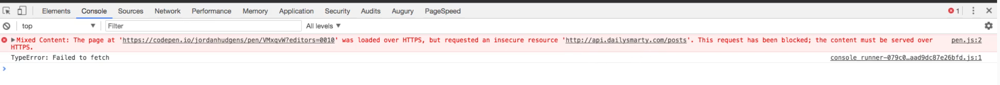
</div>

<br>


## Agrupar  promesas


En JavaScript, cuando tenemos **promesas** 	que son muy **parecidas**, las podemos agrupar y gestionar **para tratarlas igual**. Se pueden utilizar dos métodos:   `Promise.all()`, y  `Promise.allSettled()` . Esto se ve mucho en **páginas web** y **aplicaciones de móvil**.


### 1.  El método <big>`Promise.all()`</big>

#### SINTAXIS

  ```js
Promise.all(iterable)
  ```  
<br>

#### PROCESO

- Es un método que toma como **entrada un iterable de promesas** que toma  y **devuelve una sola promesa**. 
- Esta promesa se cumple **cuando se cumplen todas las promesas** de esa entrada (incluso cuando se pase un iterable vacío).
- Se **rechazará  en el momento en el que se rechace cualquiera de las promesas** del iterable de entrada,  **devolviendo** la razón de este **primer rechazo**.


<br>

#### EJEMPLO


```js
const promesa1 = new Promise((resolve) => setTimeout(() => resolve(1), 100));
const promesa2 = new Promise((resolve) => setTimeout(() => resolve(2), 200));
const promesa3 = new Promise((resolve) => setTimeout(() => resolve(3), 300));

Promise.all([promesa1, promesa2, promesa3])  
	.then((resultados) => { 
		console.log(resultados); // [1, 2, 3]
	})  
	.catch((error) => {
	    console.error(error);
	});
```

- En este ejemplo,  `Promise.all()`  espera a que **las tres** promesas **se resuelvan**. 

- Una vez que todas se resuelven, el método  **`then()`  se ejecuta**, **pasando un array con los resultados de cada promesa** en el mismo orden en que fueron pasadas a  `Promise.all()`. 

- **Si alguna** de las promesas **se rechazara, el  `catch()`  se ejecutaría,** mostrando el error.

<br>


### 2.   El método <big>`Promise.allSettled()`</big>


#### SINTAXIS

  ```js
Promise.allSettled(iterable)
  ```  
  
<br>

#### PROCESO


- Esta es una alternativa para trabajar con promesas agrupadas.

- Se comporta de manera similar a  `Promise.all()`, pero a diferencia de este, **no se detiene ante el primer rechazo**. 

- En vez de ello, **espera a**  que **todas** las promesas del array se resuelvan o rechacen, **devolviendo un array de objetos que indican el estado de cada promesa (resuelta o rechazada)** y su valor o razón de rechazo.
<br>
#### EJEMPLO


```js
const promesa1 = new Promise((resolve) => setTimeout(() => resolve(1), 100));
const promesa2 = new Promise((_, reject) => setTimeout(() => reject(new Error('Error')), 200));
const promesa3 = new Promise((resolve) => setTimeout(() => resolve(3), 300));


Promise.allSettled([promesa1, promesa2, promesa3])
  .then((resultados) => {
      console.log(resultados);
    /*
    [
      { status: 'fulfilled', value: 1 },
      { status: 'rejected', reason: Error: Error },
      { status: 'fulfilled', value: 3 }
    ]
    */  });
```

- En este ejemplo,  `Promise.allSettled()`  devuelve un array con los resultados de cada promesa, **incluso aunque una de ellas se haya rechazado.** 

- Esto permite **gestionar de forma más flexible** los casos en los que algunas promesas pueden fallar **sin detener el proceso completo**.


# 8. ¿Qué hacen async y await por nosotros?


Una de las mayores **ventajas** de trabajar en JavaScript cuando comparamos con versiones anteriores son los procesos `async` y `await`. 

## HISTORIA DE LOS PROCESOS `async` y `await`.

Javascript es un programa **sincrónico y monohilo por naturaleza**. Esto significa que las tareas se procesan en el **orden** en el que fueron escritas.

- Si una función tomaba **demasiado tiempo** en completarse, **bloqueaba la ejecución de otras funciones** hasta que esta función no se hubiera terminado.
- Este comportamiento, en un entorno como un **navegador o un servidor con Node.js** no es buena idea, ya que
	- puede generar tiempos de espera largos
	- e interfaces de usuario bloqueados.

### 	0. EVENT LOOP
**Para resolver** este comportamiento sincrónico, JavaScript utilizaba las **tareas asincrónicas o “temporizadores”**, a través del método `setTimeout()`, que se ejecuta **en segundo plano y no afecta a la resolución de las demás tareas**.


<br>


<div align="center">
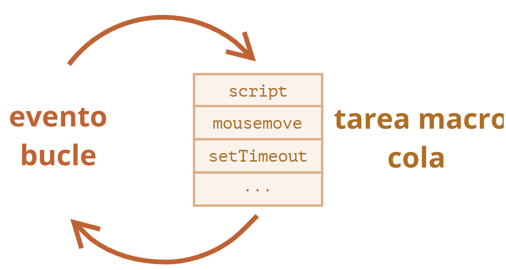
</div>

<br>

Un **event loop** o bucle de eventos es un  mecanismo que **permite la ejecución asíncrona de tareas** manteniendo la capacidad de respuesta del programa. Opera constantemente, monitoreando la cola de tareas y la pila de llamadas para **determinar cuándo y cómo ejecutar el código pendiente**.


#### EJEMPLO: una solicitud de red – TAREA LENTA, necesita 2 segundos:
```js
console.log("Primero");

setTimeout(() => {
  console.log("Segundo");  
}, 2000);				// Se ejecutará después de 2 segundos

console.log("Tercero");


Esto imprime:
// Primero
// Tercero
// Segundo (imprimiría esto después de los 2 segundos que tarda  
//           esta tarea en ejecutarse)
```
- El `setTimeout()` ha hecho que esta tarea asincrónica **no bloquee el resto de tareas**, que se han ejecutado antes sin problema.
<br>

Este tipo de proceso o **Event Loop**, pues era un paso en la dirección correcta. En este punto, **se desarrolló la faceta asíncrona de JavaScript**: entraron a formar parte progresivamente:

 - [x] las funciones **callback** 
 - [x]  las **promesas** 
 - [x]  y finalmente, las funciones <big>**`async`**</big> y  <big> **`await`**</big>

<br>

### 	1. Funciones *callback* y el llamado "*callback hell*"

- Las funciones callback **son funciones que se pasan como argumento de otras funciones** para que sean ejecutadas en algún momento dentro de la ejecución de la función principal.
- Constituyeron **la primera forma de manejar asincronismo** en Javascript.
<br>


#### EJEMPLO de función *callback*:
```js
 function tareaAsincrona(callback) {
  // Simula una tarea que tarda un tiempo en completarse
  setTimeout(function() {
    const resultado = "La tarea asíncrona ha finalizado";
    callback(resultado); // Llama a la función callback con el resultado
  }, 2000); // Espera 2 segundos
}

function miCallback(resultado) {
  console.log(resultado); // Imprime el resultado de la tarea asíncrona
}

tareaAsincrona(miCallback); // Llama a la función tareaAsincrona, pasando miCallback como callback
console.log("La ejecución continúa..."); //  Este mensaje se imprime ANTES de que se ejecute el callback
```
<br>

- En este código asíncrono, donde cada operación **depende del resultado de la anterior, generaba una estructura en forma de pirámide**. Por ejemplo, no podías realizar la tarea de “hacer llamadas a la API”, **hasta que no hubieras realizado las tareas que están por encima de ella.** 
- Tenías que **codificar cada posible proceso que piensas que pudiera ocurrir** para asegurarte de que no ocurriera demasiado temprano o en un orden que no interese. **Debías tener muy claro la secuencia específica, y codificar eso**.


Llegó lo que se hizo famoso como **callback hell** o infierno de callbacks, no hizo sino añadir más hándicaps a las callback: 

-   **Callback hell (infierno de callbacks):** Los numerosos anidamientos de ***callbacks*** hicieron que el código pudiera volverse **difícil de leer y mantener**.
-   **Dificultad para depurar:** En situaciones complejas, **puede ser complicado rastrear el flujo de ejecución**, era todo un reto el discernir qué debía ocurrir en cada momento, cuando se utilizan muchos callbacks.
-   **Pérdida de contexto:** El contexto  `this`  dentro de un callback puede no ser el esperado.

<br>
 
¿Y cómo solucionó esto JavaScript?  Con las **promises** o **promesas**.

<br>

### 	2. Promesas


Las promesas **resolvieron** algunos asuntos como:
-	La dificultad para **manejar errores**
-	**El lío del código anidado**

Todo ello gracias a que las **promesas**  constituyen operaciones asíncronas que podían manejar:
-	Proceso de **tareas con éxito** -a través de la método.then()
-	**Manejo de errores** a través del método catch()

<br>

<div align="center">
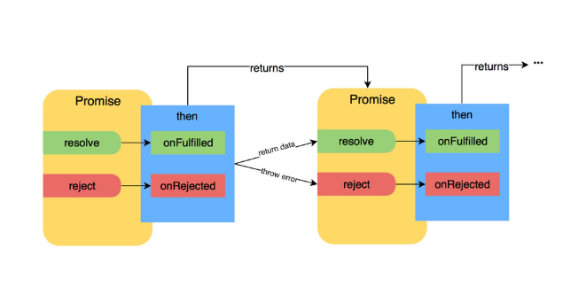
</div>

<br>
No ponemos ejemplos porque queda explicado en un punto anterior.
<br>

### 	3. Funciones <big>`async`</big> y <big>`await`</big>


A partir de **septiembre de 2017** (especificación ECMAScript2017), se incorporaron a JavaScript **las palabras clave** de `async` y `await` que constituyen **la forma más sencilla y moderna de manejar código asincrónico**:

- `async` convierte una función normal en una asíncrona y devuelve una Promise.
- `await` se usa dentro de las funciones `async` para **pausar una ejecución hasta que la Promise se resuelve**
<br>
#### SINTAXIS BÁSICA:
```js
async function miFuncion() {
  let resultado = await promesa;
  // Aquí continúa la ejecución después de que promesa se haya resuelto
  return resultado;
}
```
Proporcionan:
-	**Mayor legibilidad**: tiene aspecto de código síncrono, lo que facilita su lectura y comprensión
-	**Manejo de errores** de forma similar a como se haría con código **síncrono**
-	**Sintaxis más limpia**: elimina la necesidad de anidar `then()` y `catch()` al trabajar con promesas haciendo código más limpio y conciseo.


<br>

<div align="center">
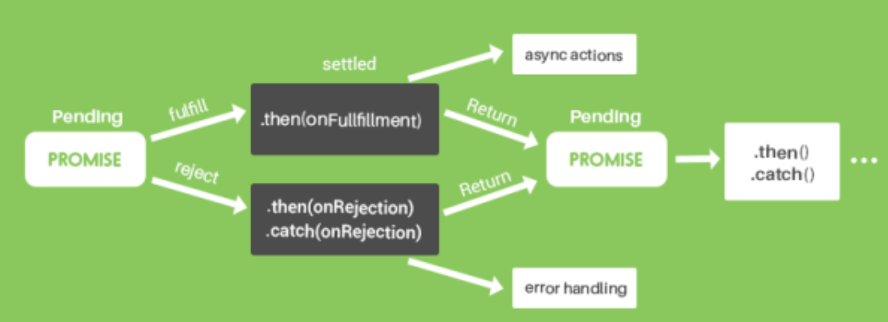
</div>

<br>

#### EJEMPLO:

(Evitamos incluir los `reject`  para mostrar más claramente el propósito de la explicación de `async`/`await`)
```js
const login = () => {
  return new Promise((resolve, reject) => {
    setTimeout(() => {
      resolve('User logged in...');
    }, 2000);
  });
}

const updateAccount = () => {
  return new Promise ((resolve, reject) => {
    setTimeout(() => {
      resolve('Updating last login...');
    }, 2000);
  });
}

async function loginActivities() {
  const returnedLogin = await login ();
  console.log(returnedLogin);

  const returnedUpdateAccount = await updateAccount();
  console.log(returnedUpdateAccount);
}

loginActivities();  // retorna 'Updating last login...'
```

- Simplemente hemos declarado una lista de **cuándo queremos que cada uno de estos procesos ocurran y el orden** en el que queremos que ocurran.


**1**. En el primer `await`, al anteponer esta palabra clave justo ahí,  se **suspenderá la ejecución de** async hasta que la función de login()  , es decir, la **Promise no termine** su ejecución.  Después, ejecutará async, es decir harán cun console.log de la variable returnedLogin. En un mundo real devolvería las licencias del usuario, su nombre y ese tipo de cosas en lugar de un string.

**2.** Como vemos, JS nos permite tener una funcion async con **multiples sentencias** `await`. Cada aw`await`ait  pausa la ejecución de la función asíncrona hasta que la promesa a la que se aplica se resuelva o se rechace, devolviendo el valor de la promesa resulta. **No hay límite en la cantidad de sentencias** await  que puedan usar dentro de una funció async.

**3.** Aquí, al poner los dos await  en este ORDEN, estamos **estableciendo la secuencia que necesitamos** que ocurra. No tendría sentido que updateAccount() occurriera antes que login(), porque necesitamos los datos del login()  para poder actualizar la cuenta, que es lo que hace updateAccount().De hecho nos daría error. async/await nos permite **encadenar multiples operaciones** asíncronas de forma secuencial. **Nosotros dictamos el orden.**


**En otros lenguajes esto ya se hacía por defecto**, pero con JavaScript y su naturaleza síncrona, el orden en el que funcionan son llamada y devolución, especialmente las funciones asíncronas que resuelven tareas que toman unos segundos o incluso más tiempo.  Este tipo de procesos en realidad se vuelven un poco enrevesados. Esa toda la razón por la que es necesario tener este tipo de función async y await.

<br>

**<big>Se ha conseguido:**</big>

-	**Mayor capacidad de respuesta: el usuario sigue funcionando sin interrupciones** mientras las demás operaciones de más larga duración terminan de completarse.

-	**Optimización del rendimiento: evita que el programa se bloquee esperando resultados**, lo que a su vez mejora la experiencia de usuario


HASTA AQUÍ

<font face="Consolas">Este texto está en Consolas.</font>


There are two types of synchronization and they can complement each other: 
<font color ="blue">some <strong>*blue*</strong> text</font>.


`<span style="color: blue;">Este texto será azul</span>` o `<span style="color: #0000FF;">Este texto será azul (código hexadecimal)</span>`.

## Open a file

You can open a file from **Google Drive**, **Dropbox** or **GitHub** by opening the **Synchronize** sub-menu and clicking **Open from**. Once opened in the workspace, any modification in the file will be automatically synced.

## Save a file


<font color ="red" >texto resaltado</font>
can save any file of the workspace to **Google Drive**, **Dropbox** or **GitHub** by opening the **Synchronize** sub-menu and clicking **Save on**. Even if a file in the workspace is already synced, you can save it to another location. StackEdit can sync one file with multiple locations and accounts.

## Synchronize a file

Once your file is linked to a synchronized location, StackEdit will periodically synchronize it by downloading/uploading any modification. A merge will be performed if necessary and conflicts will be resolved.

If you just have modified your file and you want to force syncing, click the **Synchronize now** button in the navigation bar.

> **Note:** The **Synchronize now** button is disabled if you have no file to synchronize.

## Manage file synchronization

Since one file can be synced with multiple locations, you can list and manage synchronized locations by clicking **File synchronization** in the **Synchronize** sub-menu. This allows you to list and remove synchronized locations that are linked to your file.


# Publication

Publishing in StackEdit makes it simple for you to publish online your files. Once you're happy with a file, you can publish it to different hosting platforms like **Blogger**, **Dropbox**, **Gist**, **GitHub**, **Google Drive**, **WordPress** and **Zendesk**. With [Handlebars templates](http://handlebarsjs.com/), you have full control over what you export.

> Before starting to publish, you must link an account in the **Publish** sub-menu.

## Publish a File

You can publish your file by opening the **Publish** sub-menu and by clicking **Publish to**. For some locations, you can choose between the following formats:

- Markdown: publish the Markdown text on a website that can interpret it (**GitHub** for instance),
- HTML: publish the file converted to HTML via a Handlebars template (on a blog for example).

## Update a publication

After publishing, StackEdit keeps your file linked to that publication which makes it easy for you to re-publish it. Once you have modified your file and you want to update your publication, click on the **Publish now** button in the navigation bar.

> **Note:** The **Publish now** button is disabled if your file has not been published yet.

## Manage file publication

Since one file can be published to multiple locations, you can list and manage publish locations by clicking **File publication** in the **Publish** sub-menu. This allows you to list and remove publication locations that are linked to your file.


# Markdown extensions

StackEdit extends the standard Markdown syntax by adding extra **Markdown extensions**, providing you with some nice features.

> **ProTip:** You can disable any **Markdown extension** in the **File properties** dialog.


## SmartyPants

SmartyPants converts ASCII punctuation characters into "smart" typographic punctuation HTML entities. For example:

|                |ASCII                          |HTML                         |
|----------------|-------------------------------|-----------------------------|
|Single backticks|`'Isn't this fun?'`            |'Isn't this fun?'            |
|Quotes          |`"Isn't this fun?"`            |"Isn't this fun?"            |
|Dashes          |`-- is en-dash, --- is em-dash`|-- is en-dash, --- is em-dash|


## KaTeX

You can render LaTeX mathematical expressions using [KaTeX](https://khan.github.io/KaTeX/):

The *Gamma function* satisfying $\Gamma(n) = (n-1)!\quad\forall n\in\mathbb N$ is via the Euler integral

$$
\Gamma(z) = \int_0^\infty t^{z-1}e^{-t}dt\,.
$$

> You can find more information about **LaTeX** mathematical expressions [here](http://meta.math.stackexchange.com/questions/5020/mathjax-basic-tutorial-and-quick-reference).


## UML diagrams

You can render UML diagrams using [Mermaid](https://mermaidjs.github.io/). For example, this will produce a sequence diagram:

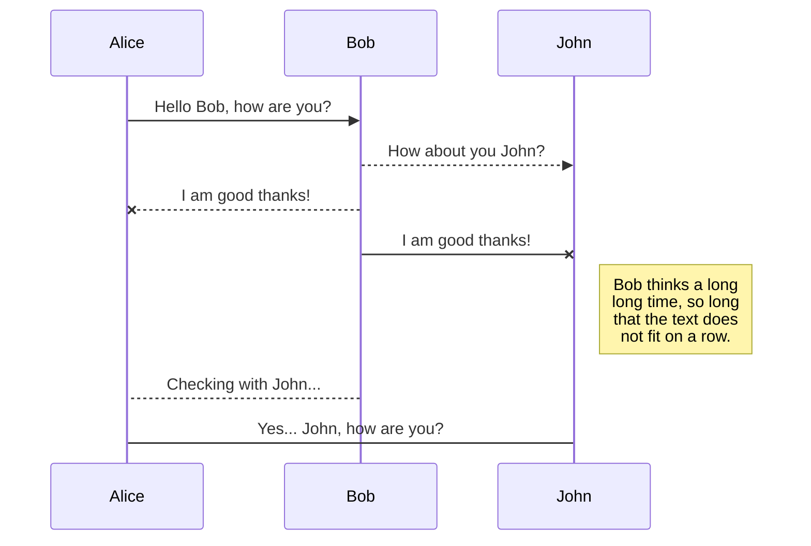

And this will produce a flow chart:

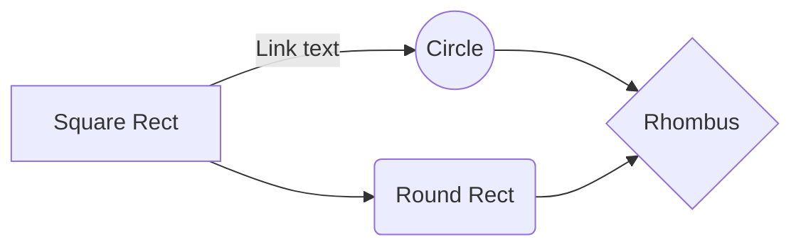
<!--stackedit_data:
eyJoaXN0b3J5IjpbNzM5MTI5ODEwLC01NTE1NzMxOTIsLTMyMj
c4MDA4OSwtMTc5MjE4NzgxLC04NDc2OTAyMTksMTM5NDEwMDM5
NiwxNzc5Njc0NjQyLDkxNDIxMTkxMywxNTA4MDAzNDYyLDI0NT
A1MzEzNCw1NDg4MzAxNTYsLTc3NTIyNDEzMSwtMjAxNTE1MTMw
MiwtNzUxMjc0MjEyLDE3MTEyOTIwNTUsMTYzNTE0NTEwMiwtMT
QwNjExNDQyLDgwOTMyMjI3NCw1NTkzMDE5ODQsMTExNDg5MzE3
Nl19
-->