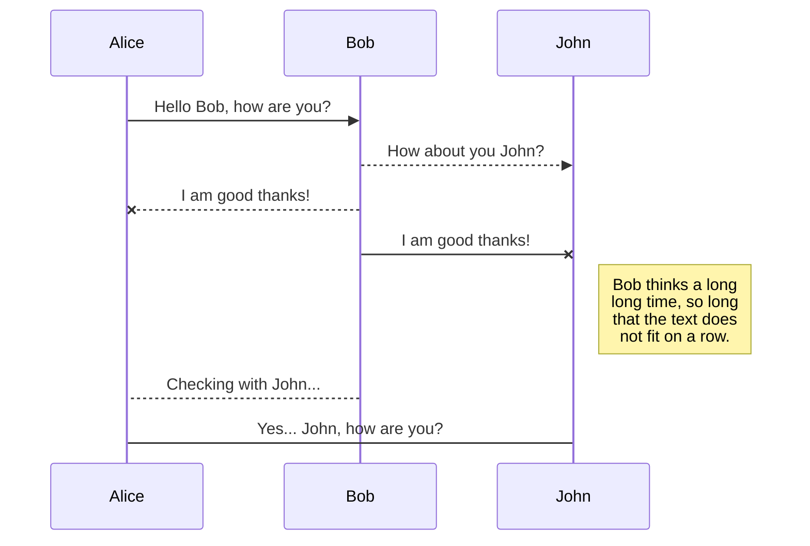
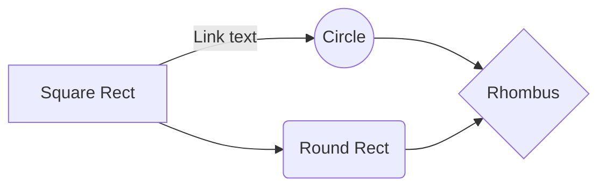

# 1.  ¿Qué tipo de bucles hay en JS?

Una de las formas más comunes de utilizar LOOPS en JS es en colecciones de datos.
 

## 1) Bucle &ensp;<font color ="green"><font face="Consolas"><font size = 6>for</font>:


El bucle <font color ="green">**for**</font> es el más clásico, y constituye  **uno de los más antiguos y versátile**s en JavaScript. Es ideal cuando necesitas un control preciso **sobre el índice en cada iteración** o necesitas **manipular la secuencia** de iteración.

#### SINTAXIS
```JavaScript
for (inicialización; condición; actualización) { // código a ejecutar }
```
#### EJEMPLO:  Imprimimos los días de la semana

```JavaScript
var diasDeLaSemana = [**strong text**
    "lunes",
    "martes",
    "miercoles",
    "jueves",
    "viernes",
    "sábado",
    "domingo"
];
    
for (diaSemana = 0; diaSemana < diasDeLaSemana.length; diaSemana++) {
    console.log(diasDeLaSemana[diaSemana]);
}
```
NECESITAMOS:
1.  una <font color ="green">**variable iteradora**</font>. Aquí es  `diaSemana` será utilizada a lo largo del bucle y recorrerá cada elemento del array  `diasDeLaSemana`. Pero ojo! esta **variable iteradora** no representa un valor, sino un **índice**!
2.  declarar <font color ="green">**una condición**</font>, es decir lo que queremos que se cumpla en el bucle. El bucle se parará cuando está condición ya no se cumpla. En nuestro caso, la condición es que sea menor que menor que 7.
	- **Ojo!** ponemos **`< 7` (o sea, hasta 6 inclusive**) en lugar de `<=7` porque recordemos que los **índices comienzan en 0** (no en 1). Por lo tanto siempre va a restar 1 del número total de los elementos del array. 
	- Otra opción es poner un **-1 al final**, y funcionaría: **sería cuestión de gustos** en cuánto a qué te parece más fácil de leer.

```JavaScript
for (diaSemana = 0; diaSemana <= (diasDeLaSemana.length -1); diaSemana++) {
    console.log(diasDeLaSemana[diaSemana]);
}
```
3. un tipo de <font color ="green">**incrementador**</font>:  **var++**, que aumentará en 1, cada vez que haga el bucle.

 
#### VENTAJAS

•	**Control total sobre el índice**: Pueds acceder y manipular el índice en cada iteración.
•	**Flexibilidad**: Permite saltar o repetir elementos modificando el índice según sea necesario.
•	**Compatibilidad amplia**: Funciona en todas las versiones de JavaScript y es ideal para estructuras de datos complejas como matrices bidimensionales.


#### LIMITACIONES
•	**Propenso a errores**: Es fácil olvidar incrementar el índice o establecer incorrectamente las condiciones del bucle.
•	**Código más verboso**: Requiere más líneas de código en comparación con otras 


## 2) Bucle &ensp;<font color ="green"><font face="Consolas"><font size = 6>for - in</font>:

El bucle <font color ="green">**for-in**</font> es más moderno que el anterior y tiene un lectura más sencilla y moderna para recorrer arrays. Generalmente se utiliza más que el bucle <font color ="green">**for**</font>

-	**Sin condiciones**
-	**Sin incrementadores**
-	El bucle <font color ="green">**for-in**</font>  interpreta que **debe iterar tantas veces como elementos** estén contenidos en la colección


#### SINTAXIS

```JavaScript
for (variable in objecto)
  declaración
```

**CONVENCIÓN SINTÁCTICA**:  Para el nombre de la variable iteradora, usamos el nombre de la lista pero en singular.  Aquí pondremos un nombre de array algo más largo (`diasDeLaSemana` ) para que se vea rápidamente la diferencia entre los dos.


### a) Bucle &ensp;<font color ="green"><font face="Consolas"><font size = 5>for - in</font></font> </font> &ensp;  en arrays:
#### EJEMPLO:  Imprimimos los días de la semana**


```JavaScript
var diasDeLaSemana = [
    "lunes",
    "martes",
    "miercoles",
    "jueves",
    "viernes",
    "sábado",
    "domingo"
];
    
for (diaSemana in diasDeLaSemana) {
    console.log(diasDeLaSemana[diaSemana]);
}
```

Como vemos la sintaxis es más sencilla y corta que la anterior.

### b) Bucle &ensp;<font color ="green"><font face="Consolas"><font size = 5>for - in</font></font> </font> &ensp;  en objetos:
Esto muy común cuando llamamos a una API, es decir, salimos a otro servidor(por wjemtplo Twitter) y extraemos tweets. Éstos son con frecuencia enviados en formato objeto, es decir con una estructura de pares clave:valor.
Si queremos mostrar esos datos en una página, la forma de hacerlo es iterando sobre esos datos, ese objeto.  Y una de las formas más comunes de hacerlo es mediante este bucle  <font color ="green">**for - in**</font>.

#### EJEMPLO:  Imprimimos características de un coche


```JavaScript
const coche = {
  marca: "Toyota",
  modelo: "Auris",
  año: 2013,
  color: "Rojo"
};

for (let propiedad in coche) {
  console.log("La propiedad " + propiedad + " tiene el valor: " + coche[propiedad]);
}

/* Imprime:
La propiedad marca tiene el valor: Toyota
La propiedad modelo tiene el valor: Auris
La propiedad año tiene el valor: 2013
La propiedad color tiene el valor: Rojo
*/
```
NOTAS:
1. `propiedad`es el **elemento iterador**, que representa a la **clave** del par clave:valor de cada objeto.
2. Precisamente como se trata de un objeto, para extraer el `valor`de objeto necesitaremos utilizar la sintaxis adecuada, que son los **corchetes [ ].**  
**No funcionaría** si utilizáramos la ***dot notation*** o anotación con puntos para objetos (nos devolvería **`underfined`**).  Ciertamente éste último sistema de notación es considerado **una buena práctica**, pero en ciertos casos, como en éste, donde la misma **variable iteradora corresponde** también **a la clave** del par clave:valor del objeto, necesitamos ser **más específicos** y utilizar **la sintaxis de corchetes [ ].**


## 3) Bucle &ensp;<font color ="green"><font face="Consolas"><font size = 6>forEach()</font>:


El método <font color ="green">**forEach()**</font>    es un método específico para arrays que ejecuta una función proporcionada una vez por cada elemento del array.

#### SINTAXIS

```javascript
array.forEach(function() {
    // código
});
```

NECESITAMOS:
-	**Elemento iterador**: nombre de la variable que representa cada elemento a iterar.
-	**Colección**: sobre la que se van a iterrar los elementos
-	**Instrucciones a ejecutar**.  La función dentro de una función se llama función callback. Técnicamente no es una función normal, ya que esto sucede automáticamente.

#### EJEMPLO:  Imprimimos los días de la semana
```JavaScript
var diasDeLaSemana = [
    "lunes",
    "martes",
    "miercoles",
    "jueves",
    "viernes",
    "sábado",
    "domingo"
];
    
diasDeLaSemana.forEach(function(diaSemana){
    console.log(diaSemana);
})
```


#### VENTAJAS

•	Es relativamente nuevo; **el más moderno, funcional y sencillo** en Javascript.
•	**Sintaxis concisa:** Más fácil de leer y escribir, especialmente con funciones flecha.
• **Evita errores de índice**: No necesitas preocuparte por manejar el índice manualmente.
•	**Ideal para operaciones en cada elemento**: Perfecto para aplicar una operación a cada elemento.
#### LIMITACIONES
•	**No permite break o continue**: No puedes interrumpir o saltar iteraciones dentro del bucle.
•	**Solo para arrays:** No funciona directamente con otros iterables como cadenas o conjuntos.
•	**Asincronía limitada:** forEach no es ideal para manejar funciones asíncronas con async/await, ya que no esperará a que cada operación termine.


## 4) Bucle &ensp;<font color ="green"><font face="Consolas"><font size = 6>  while</font>:

 

#### SINTAXIS


```javascript
while (condition) {
  // código
  // llamado "cuerpo del bucle"
}
```
Mientras la condición `condition` sea verdadera, el `código` del cuerpo del bucle será ejecutado.

NECESITAMOS
- una variable iteradora  y la declaramos **FUERA del ámbito de BUCLE.** Esto puede tener sus puntos negativos **en caso de que no quieras que se tenga acceso a esta variable exterior**  más tarde.
- para evitar **UN BUCLE INFINITO**, necesitamos **el incrementador** a fin de que haga cambiar el valor de la variable iterativa. Añadimos este elemento nualmente dentro del código a ejecutar, dentro de las llaves{}.

 
#### EJEMPLO:  Imprimimos los días de la semana
```JavaScript
var diasDeLaSemana = [
    "lunes",
    "martes",
    "miercoles",
    "jueves",
    "viernes",
    "sábado",
    "domingo"
];
   
let diaSemana = 0; 
while (diaSemana < diasDeLaSemana.length) {
  console.log(diasDeLaSemana[diaSemana]);
  diaSemana++;
}

```


## 5) Bucle &ensp;<font color ="green"><font face="Consolas"><font size = 6>  do - while</font>:

 
#### SINTAXIS


```javascript
do
  statement
while (condition);
```
Mientras la condición `condition` sea verdadera, el `código` del cuerpo del bucle será ejecutado.


#### EJEMPLO:  Imprimimos los días de la semana
```JavaScript
var diasDeLaSemana = [
    "lunes",
    "martes",
    "miercoles",
    "jueves",
    "viernes",
    "sábado",
    "domingo"
];
   
let diaSemana = 0; 
do {
    console.log(diasDeLaSemana[diaSemana]); diaSemana++;
} while (diaSemana < diasDeLaSemana.length)
```
Como vemos, bucle <font color ="green"><font size = 5><font face="Conolas">**do - while**</font></font>  </font>  tiene una sintaxis similar al bucle <font color ="green"><font size = 5><font face="Conolas">**while**</font></font>  </font> , pero casi al revés, ya que seguiría el concepto de "**haz esto mientras se cumple esta condición**", y precisamente esta condición se pone a lo último, o sea, que **la controla al final.**


**VENTAJAS**: 
- El hecho de que **garantice que al menos va a recorrer el bucle una vez, proporciona información**. 
- Permite definir l**a lógica del bucle antes de evaluar la condición**, lo que puede ser **más conveniente en ciertos escenarios**.

	 **EJEMPLO DE APLICACIÓN**: 
	 Típíco en **juegos**, cuando queremos que siempre haga el proceso al menos una vez. Por ej. un **jugador que juega y te aseguras de que lo haga al menos una vez,** y si sigue ganando, puede comprobarlo en esa condición `while` y puede seguir iterando.


**LIMITACIONES**: 
 -	**Puede devolver  `undefined`**
 	 Si ponemos que variable iteradora `diaSemana` es **10**, nos devolvería  **`undefined`**  ; sin embargo con el bucle  <font color ="green"><font size = 5><font face="Conolas">**while**</font></font>  </font> **no imprimiría nada**. El bucle  <font color ="green"><font size = 5><font face="Conolas">**do - while**</font></font>  </font>siempre **va a ejecutar el programa al menos UNA VEZ** (el otro no haría nada porque la condición está puesta al principio, y no se cumple si ponemos diaSemana = 10).
 -	  **Riesgo de bucles infinitos:**     
		 Si la condición del  **`while`  nunca se vuelve falsa, el bucle se ejecutará indefinidamente,** lo que puede causar problemas en la aplicación. Es crucial **asegurarse de que la condición eventualmente se evalúe como falsa** para evitar este problema.
 -  **Menos común que otros bucles:**
        En comparación con los bucles  **`for`**  y  **`while`**, el  **`do...while`**  se usa **con menos frecuencia**, ya que a menudo se puede lograr la misma lógica con los otros tipos de bucles.
    
-   **Puede ser más difícil de entender:**
        Para algunos desarrolladores, la estructura del  **`do...while`**  **puede resultar menos intuitiva que otros bucles**, especialmente si no están familiarizados con su ejecución garantizada una vez.


--------------------------


# 2 ¿Cuáles son las diferencias entre const, let y var?

## 1. Variable &ensp;<font color ="green"><font face="Consolas"><font size = 6>  var</font>
- Durante muchos años, en JavaScript **sólo existía** la  variable **`var`**.  
- Cuando creamos un variable con **`var`**, estamos creando una **variable GLOBAL**, lo que significa que puede entrar en conflicto con otras variables, **contaminar la variable global**. 
	- El poder averiguar qué está pasando exactamente en el programa para dar error, pues p**uede llevar muchísimo tiempo solventar** este problema de nombrado.
	- Por tanto, **necesitamos controlar dónde están nuestras variables declaradas** y dónde tenemos acceso a ellas, pero con **`var`**   esto es algo muy difícil de hacer.
	- Aunque te lo puedes encontrar o pueden existir situaciones donde puede ser útil, **hoy en día no tiene demasiado sentido utilizar** **`var`** en nuestro código.
- tolera **redeclaraciones**:
 ```JavaScript
var user =  "Pete";
var user =  "John";
console.log(user); // John
 ```
	

EJEMPLO DEL ALCANDE DE **`var`**;

```JavaScript
var mensajeGlobal = "Hola, soy global!";

function mostrarMensaje() {
  console.log(mensajeGlobal); // Accede a la variable global
}

mostrarMensaje(); // Imprime "Hola, soy global!"
console.log(mensajeGlobal); // Imprime "Hola, soy global!"

if (true) {
  var dentroDeBloque = "Dentro de un bloque";
}

console.log(dentroDeBloque); // Imprime "Dentro de un bloque", porque var ignora el bloque
```


## 2. Variable &ensp;<font color ="green"><font face="Consolas"><font size = 6>  let</font>

- **`let`** vino hace unos años, y se convirtió en una **mejor** manera de definir variables, ya que **no contaminaba el espacio de nombramiento global**.
- **`let`** permite reasignar el valor de la variable.
- Como consecuencia,  era mucho más específico, estaba **más limitado**; si se creaba dentro de una función o se añadía a ella, **sólo estaría disponible en esa función:** no habría otros momentos en los que estuviera disponible. 
- **`let`** limita el alcance de las variables al bloque donde se definen, evitando efectos secundarios no deseados en otros bloques de código.
- **`let`** no permite redeclarar la misma variable en el mismo ámbito, lo que ayuda a evitar errores.
- El alcance de bloque de  **`let`** hace que el código sea más fácil de entender y mantener.
- **No tolera redeclaraciones**:
```JavaScript
let user;
let user;  // Identifier 'user' has already been declared
```

 EJEMPLO DE **`let`** vs. **`var`**;

```JavaScript
var a = 5;
var b = 10;

if (a === 5) {
  let a = 4; // El alcance es dentro del bloque if
  var b = 1; // El alcance es global

  console.log(a);  // 4
  console.log(b);  // 1
} 

console.log(a); // 5 - sigue igual, let- cambia solo bloque if
console.log(b); // 1 - ha cambiado: var- alcance global
```


## 3. Variable &ensp;<font color ="green"><font face="Consolas"><font size = 6>  const</font>
- La  variable **`const`** es **la más nueva**, y es una abreviación de "**constante**". 
- Su valor **no puede ser reasignado después de su inicialización**.
- Se ha convertido en **una de las más populares** a la hora de declarar variables. Se puede ver en los desarrolladores que **es la preferida por encima de las otras opciones** .
- En la **mayoría de aplicaciones** se ven sobre todo la **variable `const`  y la  variable `let`**. 
- Por norma general en los programas modernos (especialmente en ***React*, *Angular*** o plataformas del estilo) se utiliza **la  variable **`const`**.**

EJEMPLO DE **`const`**:

```JavaScript
const objeto = {  
nombre: "Ejemplo",  
valor: 10 };  
  
objeto.valor = 20; 
// Esto es válido, se puede modificar la propiedad de un objeto const. 

objeto = { nombre: "Nuevo", valor: 30 }; 
// Esto daría error, no se puede reasignar la constante objeto.
```

<br>

EJEMPLO DE **`const`** VS. **`let`**:
<br>

**1) `const` : esta variable no se puede cambiar**^(*1)^

```JavaScript
const casa  =  "Benidorm";  
console.log(casa);
  
casa = "Marbella";
console.log(casa);       

// Devuelve un error:
//           "TypeError: Assignment to constant variable. 
```

^(*1)^**OJO!!**  Si estamos utilizando la plataforma web **CODEPEN**, **no nos va a mostrar el error**, por ello en este caso deberíamos utilizar otras opciones, **como la consola del navegador.**
<br>

**2)`let` : la variable se ha podido cambiar**
```JavaScript
let casa  =  "Benidorm";  
console.log(casa);   //devuelve: "Benidorm"
  
casa = "Marbella";
console.log(casa);  //devuelve:"Marbella"     
```


## <font color ="green"><font face="Consolas"><big>  Buenas Prácticas</font></big>
-  **La variable `const` debería ser nuestra mejor opción por defecto**. 
- Si es demasiado específica, usaríamos **`let`**. 
- Sin embargo, es difícil que veamos **`var`** en las aplicaciones modernas. No es que no pueda **haber casos en los que necesitemos una variable global**, en los que sería la ocasión para utiliar **`var`**, pero de normal no va a ser así.
<br>


EN RESUMEN:


| Variable | Propósito |
| --- | --- |
| **`var`** | sólo situaciones donde necesitas un alcance de función específico (o para funciones de práctica y aprendizaje de codificación.Evitar el uso de  **`var`** debido a sus problemas de ámbito y *hoisting*|
| **`let`**  | para variables que puedan ser reasignadas |
| **`const`** | Spara declarar variables que no van a cambiar su valor a lo largo del programa |


---


# 3 ¿Qué es una función de flecha?


<br>

Una **función flecha** (o ***arrow function***) es una  forma concisa de definir funciones anónimas, introducida en ES6 (EcmaScript **2015**). 

Las funciones flecha **son de las funciones más cruciales para aprender en Javascript** ya que están por todos los lados. Su **sintaxis** es completamente **diferente** a cualquier otra declaración de variable.


## Ejemplos FUNCIÓN DECLARADA vs FUNCIÓN FLECHA


0.  **SIN PARÁMETROS**

```JavaScript

// a) sin parámetros, función declarada 
function hello1() {
    return 'Hello!';
}
console.log('sin parámetros, función declarada ' + hola1());


// b) sin parámetros, función FLECHA
const hello2 = () => {
    return 'Hello!';
}
console.log('sin parámetros, función FLECHA ' + hola2());


// c) sin parámetros, función FLECHA EN UNA SOLA LÍNEA
const hello3 = () => 'Hello!';
console.log('sin parámetros, funcíon FLECHA EN UNA SOLA LÍNEA  ' + hello3());
```

<br>

1.  **CON 1 PARÁMETRO**


```JavaScript

// a) un parámetro, función declarada
function hello4(x){
    return 'un parámetro, función declarada ' + 'Hello, ' + x;
}
console.log(hello4('milburn'));


// b) un parámetro, función FLECHA
const hello5 = x => {
   return  'un parámetro, función FLECHA ' + 'Hello, ' + x;
}
console.log(hello5('milburn'));

// c) un parámetro, función FECHA EN UNA SOLA LÍNEA 
const hello6 = x => 'Hello, ' + x;
console.log('un parámetro, función FECHA EN UNA SOLA LÍNEA ' + hello6('milburn'));
```

<br>

2. **CON 2 PARÁMETROS:**
```JavaScript
// a) dos parámetros, función declarada
function hello7(x,y){
    return 'Hello, ' + x + ' ' + y; 
    
}
console.log('dos parámetros, función declarada ' + hello7('milburn', 'gomes'));


// b) dos parámetros, función FLECHA
const hello8 = (x,y) =>{
    return 'dos parámetros, función FLECHA ' + 'Hello, ' + x + ' ' + y;
}
console.log(hello8('milburn', 'gomes'));


// c) dos parámetros, función FLECHA EN UNA SOLA LÍNEA
const hello9 = (x,y) =>  "Hello, " + x + " " + y;
console.log('dos parámetros, función FLECHA EN UNA SOLA LÍNEA ' + hello9('milburn', 'gomes'));
```
<br>

### DOS CARACTERÍSTICAS PRINCIPALES:  SU SINTAXIS Y SU MANEJO DEL <big>`this`</big>:

## 1) Sintaxis concisa
  

**COMPAREMOS** LA SINTAXIS de los 3 tipos de función diferentes:
<br>

i.a) **Expresión de Función Anónima**


<br>
<br>

i.b) **Expresión de Función Nombrada**


(El nombre  `decirHola`  es útil para identificar la función en los errores, pero no se usa para llamar a la función.)

<br>
<b>
<br>
<br>


ii) **Declaración de función tradicional o regular**


<br>
<br>
<br>


iii) **Función flecha:**


<br>
<br>

En realidad, si comparamos una función regular con una flecha, en lugar de tener que escribir "function" cada vez que queremos declarar una función, eliminar esa palabra y utilizar "=>"  justo delante de las llaves {} para para declarar una función de flecha. 


## 2) Particular manejo de `this`

La palabra clave **`this`** tiene un comportamiento diferente en las **funciones flecha**.  A diferencia de las funciones tradicionales, las funciones flecha **no tienen su propio  `this`**, sino que heredan el  **`this`**  del contexto donde se definieron .  El valor de  **`this`**  dentro de una función flecha es el mismo que **el de su entorno léxico (el contexto donde fue definida).**

#### a) EJEMPLO - **`this`**  en DECLARACIÓN DE FUNCIÓN:

- En el  **contexto de llamada**,  **`this`**  en una **función regular** se determina **en el momento de la llamada**, **según cómo se invoque la función.**
 
- Si una **función regular se llama directamente** o se pasa como **callback sin un contexto** específico, **`this`** dentro de esa función se referirá al **objeto global**

- De hecho, el principal problema al acceder a  **`this`**  dentro de una declaración de función en JavaScript es que  **su valor depende del contexto de llamada de la función, no de dónde se declara**.  Esto puede llevar a **comportamientos inesperados si la función se pasa como callback o se usa en diferentes contextos,** ya que  **`this`**  podría referirse a algo distinto a lo que se esperaba.

En el siguiente caso, no podríamos acceder al ,  **`this`**  de la función `MiObjeto()` que necesitamos:

```JavaScript
function MiObjeto() {
  this.valor = 10;
  this.obtenerValor = function() {
    console.log(this.valor); // this se refiere a MiObjeto
  };
}

const obj = new MiObjeto();
obj.obtenerValor(); // Salida: 10

const miFuncion = obj.obtenerValor;
miFuncion(); // Salida: undefined!!!!

```
<br>
<br>

#### b) EJEMPLO - **`this`**  EN FUNCIÓN FLECHA:

El problema anterior quedaría resuelto con una función flecha de la siguiente manera:

```JavaScript
this.valor = 20;
this.obtenerValorFlecha = () => {
  console.log(this.valor); // this se refiere al objeto que la contiene
};

obj.obtenerValorFlecha(); // Salida: 10
```

<BR>

## 3) EN RESUMEN

##### 1. VENTAJAS DE LAS FUNCIONES FLECHA
- **Contexto Léxico:** A diferencia de las funciones regulares, las funciones flecha **no tienen su propio enlace a  `this`.** En cambio,  `this`  dentro de una función flecha se refiere al contexto léxico, es decir, al **valor de  `this`  en el ámbito donde la función flecha fue definida. Esto evita errores comunes** relacionados con el contexto de  `this`  al usar funciones de **callback** dentro de **métodos de objetos o en otros contextos donde  `this`  podría cambiar dinámicamente.**


    
-   **Uso recomendado:** Son útiles cuando se quiere mantener el  `this`  del contexto envolvente, como en **callbacks** o **métodos de objetos** donde no se requiere que  **`this`  apunte al objeto que llama a la función.**


    
-   **Mayor concisión:** Son ideales para funciones **cortas** y funciones que se pasan como argumentos a otras funciones.

<br>
    

##### 2. LIMITACIONES DE LAS FUNCIONES FLECHA

- **No pueden usarse como constructores** (no se pueden llamar con **`new`**).
- **No tienen su propio objeto `arguments`** con la lista de argumentos pasados a la función, ya que solo acceden a los argumentos del ámbito léxico que las rodea.
- Su **`this`** se determina en el momento de la creación de la función, y se **hereda del contexto léxico circundante, en lugar de ser definido dinámicamente.**
<br><br>

---


# 4 ¿Qué es la deconstrucción de variables?
En JavaScript, **deconstrucción** (o destructuring) y **desestructuración** son términos que se refieren a la misma característica del lenguaje, introducida en ECMAScript 6 (**ES6**). Ambos términos se utilizan indistintamente para describir la **sintaxis que permite extraer valores de arreglos y propiedades de objetos en variables individuales de manera más concisa.**


<table>
    <thead>
        <tr>
            <th></th>
            <th></th>
            <th></th>
        </tr>
    </thead>
    <tbody>
        <tr>
            <td rowspan=4 align="center">Extraer</td>
            <td rowspan=2 align="center">valores de arrays</td>
            <td align="center"></td>
        </tr>
        <tr>
            <td align="center"></td>
        </tr>
        <tr>
            <td rowspan=2 align="center">propiedades de objetos</td>
            <td align="center">R3 Text C</td>
               <td rowspan=4 align="center">Extraer</td>
        </tr>
        <tr>
            <td align="center">R3 Text D</td>
        </tr>
    </tbody>
</table>
En esencia, la desestructuración (o deconstrucción) facilita la extracción de datos de estructuras complejas como arreglos y objetos y su asignación a variables separadas, haciendo el código más legible y evitando la necesidad de acceder repetidamente a los elementos de la estructura original.
# 5 ¿Qué hace el operador de extensión en JS?

# 6 ¿Qué es la programación orientada a objetos?

# 7. ¿Qué es una promesa en JS?

# 8. ¿Qué hacen async y await por nosotros?


•	Es relativamente nuevo; **el 
TEXTO EN CONSOLA

<font face="Consolas">Este texto está en Consolas.</font>


IMAGEN


There are two types of synchronization and they can complement each other: 
<font color ="blue">some <strong>*blue*</strong> text</font>.


```JavaScript
var  usuario  = {
email: 'prueba@gmail.com',
nombre: 'David Casas'
}

function  saludo(){
console.log("Hola, ".concat(usuario.nombre));
}

saludo(); // devuelve: "Hola, David Casas"

```
const numbers = [1, 2, 3, 4, 5];numbers.forEach(function(number, index, array) {  console.log(`Elemento: ${number}, Índice: ${index}, Array: ${array}`);});


`<span style="color: blue;">Este texto será azul</span>` o `<span style="color: #0000FF;">Este texto será azul (código hexadecimal)</span>`.

## Open a file

You can open a file from **Google Drive**, **Dropbox** or **GitHub** by opening the **Synchronize** sub-menu and clicking **Open from**. Once opened in the workspace, any modification in the file will be automatically synced.

## Save a file


<font color ="red" >texto resaltado</font>
can save any file of the workspace to **Google Drive**, **Dropbox** or **GitHub** by opening the **Synchronize** sub-menu and clicking **Save on**. Even if a file in the workspace is already synced, you can save it to another location. StackEdit can sync one file with multiple locations and accounts.

## Synchronize a file

Once your file is linked to a synchronized location, StackEdit will periodically synchronize it by downloading/uploading any modification. A merge will be performed if necessary and conflicts will be resolved.

If you just have modified your file and you want to force syncing, click the **Synchronize now** button in the navigation bar.

> **Note:** The **Synchronize now** button is disabled if you have no file to synchronize.

## Manage file synchronization

Since one file can be synced with multiple locations, you can list and manage synchronized locations by clicking **File synchronization** in the **Synchronize** sub-menu. This allows you to list and remove synchronized locations that are linked to your file.


# Publication

Publishing in StackEdit makes it simple for you to publish online your files. Once you're happy with a file, you can publish it to different hosting platforms like **Blogger**, **Dropbox**, **Gist**, **GitHub**, **Google Drive**, **WordPress** and **Zendesk**. With [Handlebars templates](http://handlebarsjs.com/), you have full control over what you export.

> Before starting to publish, you must link an account in the **Publish** sub-menu.

## Publish a File

You can publish your file by opening the **Publish** sub-menu and by clicking **Publish to**. For some locations, you can choose between the following formats:

- Markdown: publish the Markdown text on a website that can interpret it (**GitHub** for instance),
- HTML: publish the file converted to HTML via a Handlebars template (on a blog for example).

## Update a publication

After publishing, StackEdit keeps your file linked to that publication which makes it easy for you to re-publish it. Once you have modified your file and you want to update your publication, click on the **Publish now** button in the navigation bar.

> **Note:** The **Publish now** button is disabled if your file has not been published yet.

## Manage file publication

Since one file can be published to multiple locations, you can list and manage publish locations by clicking **File publication** in the **Publish** sub-menu. This allows you to list and remove publication locations that are linked to your file.


# Markdown extensions

StackEdit extends the standard Markdown syntax by adding extra **Markdown extensions**, providing you with some nice features.

> **ProTip:** You can disable any **Markdown extension** in the **File properties** dialog.


## SmartyPants

SmartyPants converts ASCII punctuation characters into "smart" typographic punctuation HTML entities. For example:

|                |ASCII                          |HTML                         |
|----------------|-------------------------------|-----------------------------|
|Single backticks|`'Isn't this fun?'`            |'Isn't this fun?'            |
|Quotes          |`"Isn't this fun?"`            |"Isn't this fun?"            |
|Dashes          |`-- is en-dash, --- is em-dash`|-- is en-dash, --- is em-dash|


## KaTeX

You can render LaTeX mathematical expressions using [KaTeX](https://khan.github.io/KaTeX/):

The *Gamma function* satisfying $\Gamma(n) = (n-1)!\quad\forall n\in\mathbb N$ is via the Euler integral

$$
\Gamma(z) = \int_0^\infty t^{z-1}e^{-t}dt\,.
$$

> You can find more information about **LaTeX** mathematical expressions [here](http://meta.math.stackexchange.com/questions/5020/mathjax-basic-tutorial-and-quick-reference).


## UML diagrams

You can render UML diagrams using [Mermaid](https://mermaidjs.github.io/). For example, this will produce a sequence diagram:



And this will produce a flow chart:


<!--stackedit_data:
eyJoaXN0b3J5IjpbLTg4OTg1NzQ0Nyw3NTg5ODgzOSwxOTMwOD
gzNjIsLTIyMTc4ODk3OCwtMTI1OTAxNzY5OSwtNzQyMDEzNDU3
LDMyMjM4NTY3MywtMTE2MzMwOTc2NSwxMjQwNzM2MTI5LC0xMj
A1MDM5NTE0LDExNjQ3NjMyOTgsMTQyMzU3NjY0NywtMTg2MzEx
NjQ0MiwxMzk3MzkyNDc0LDM2NDc2Njk3NiwxMjQ2MTQ3NDExLD
IwMDY3NjQ1MDcsLTExMzc2MDI4NjAsLTEyMzY1NjE1NDgsLTE3
MTg0NTI5NzRdfQ==
-->