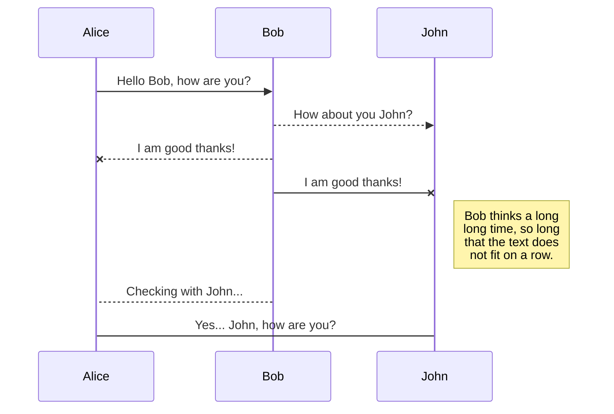
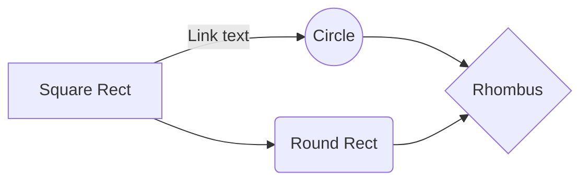

# ¿Qué tipo de bucles hay en JS?
OBJETIVO:  imprimir todos los elementos de un array , 3 formas:
Una de las formas más comunes de utilizar LOOPS en JS es en colecciones de datos.
 

## 1) Bucle <font color ="green"><font face="Consolas"><font size = 6>for</font>:


El bucle for tradicional **es uno de los más antiguos y versátiles** en JavaScript. Es ideal cuando necesitas un control preciso **sobre el índice en cada iteración** o necesitas **manipular la secuencia** de iteración.

#### SINTAXIS

`for (inicialización; condición; actualización) { // código a ejecutar }`
#### EJEMPLO:  Imprimiremos los números del 5 al 10 inclusives.**

```JavaScript
var diasDeLaSemana = [
    "lunes",
    "martes",
    "miercoles",
    "jueves",
    "viernes",
    "sábado",
    "domingo"
];
    
for (diaSemana = 0; diaSemana < diasDeLaSemana.length; diaSemana++) {
    console.log(diasDeLaSemana[diaSemana]);
}
```
NECESITAMOS:
- una <font color ="green">**variable iteradora**</font>. Aquí es  `diaSemana` será utilizada a lo largo del bucle y recorrerá cada elemento del array  `diasDeLaSemana`. Pero ojo! esta **variable iteradora** no representa un valor, sino un **índice**!
- declarar <font color ="green">**una condición**</font>, es decir lo que queremos que se cumpla en el bucle. El bucle se parará cuando está condición ya no se cumpla. En nuestro caso, la condición es que sea menor que menor que 7.
- Ojo! ponemos < 7 (o sea, hasta 6 inclusive) porque recordemos que los índices comienzan en 0, y por tanto, ya estaría contando 
- un tipo de <font color ="green">**incrementador**</font>:  **var++**, que aumentará en 1, cada vez que haga el bucle.
 
#### VENTAJAS


•	**Control total sobre el índice**: Pueds acceder y manipular el índice en cada iteración.
•	**Flexibilidad**: Permite saltar o repetir elementos modificando el índice según sea necesario.
•	**Compatibilidad amplia**: Funciona en todas las versiones de JavaScript y es ideal para estructuras de datos complejas como matrices bidimensionales.


#### LIMITACIONES
•	**Propenso a errores**: Es fácil olvidar incrementar el índice o establecer incorrectamente las condiciones del bucle.
•	**Código más verboso**: Requiere más líneas de código en comparación con otras 


2. Método forEach
forEach es un método específico para arrays que ejecuta una función proporcionada una vez por cada elemento del array.
let array = [1, 2, 3];
array.forEach(elemento => {
    console.log(elemento); // Imprime 1, luego 2, luego 3
});
Ventajas:
•	Sintaxis concisa: Más fácil de leer y escribir, especialmente con funciones flecha.
•	Evita errores de índice: No necesitas preocuparte por manejar el índice manualmente.
•	Ideal para operaciones en cada elemento: Perfecto para aplicar una operación a cada elemento.
Limitaciones:
•	No permite break o continue: No puedes interrumpir o saltar iteraciones dentro del bucle.
•	Solo para arrays: No funciona directamente con otros iterables como cadenas o conjuntos.
•	Asincronía limitada: forEach no es ideal para manejar funciones asíncronas con async/await, ya que no esperará a que cada operación termine.


El bucle <font color ="green"><strong>for</strong></font> tradicional s uno de los más antiguos y versátiles en JavaScript. Es ideal cuando necesitas un control preciso sobre el índice en cada iteración o necesitas manipular la secuencia de iteración.

let array = [1, 2, 3];
    for (let i = 0; i < array.length; i++) {
        console.log(array[i]); // Imprime 1, luego 2, luego 3

}


CÓDIGO 
```JavaScript
function  saludo() {

var  usuario  = {
email: 'prueba@gmail.com',
nombre: 'Federico Faggin'
}
console.log("Hola, ".concat(usuario.nombre));
}
  

saludo(); // "Hola, Federico Faggin"
```

TEXTO EN CONSOLA

<font face="Consolas">Este texto está en Consolas.</font>


IMAGEN


•	Control total sobre el índice: Pueds acceder y manipular el índice en cada iteración.
•	Flexibilidad: Permite saltar o repetir elementos modificando el índice según sea necesario.
•	Compatibilidad amplia: Funciona en todas las versiones de JavaScript y es ideal para estructuras de datos complejas como matrices bidimensionales.
Limitaciones:
•	Propenso a errores: Es fácil olvidar incrementar el índice o establecer incorrectamente las condiciones del bucle.
•	Código más verboso: Requiere más líneas de código en comparación con otras alternativas.


Tenemos que declarar 3 cosas:  (VARIABLE ; CONDICIÓN;  INCREMENTADOR):
A)	Una VARIABLE ITERADORA que será utilizada a lo largo del bucle:
>	var i, y lo ponemos a 0 var i = 0, que en realidad representa al índice de cada uno de los elementos (altuve = 0, Bregman = 1, etc.). 
>	OJO! la variable iteradora no representa un valor, sino un índice. 
B)	Declarar una CONDICIÓN, es decir, queremos que se tiene que cumplir durante el bucle. El bucle se parará cuando esta condición no se cumpla. 
>	i < players.length  (ver nota más abajo sobre por qué se usa el signo de > y no el de >= .
C)	Un tipo de INCREMENTADOR -  var++       i++,
>	Con cada iteración (con cada vez que pasemos por el bucle, que empieza en 0 elementos como length).
  
En la segunda iteración, la variable i será 1  i = 1 y comprobará el paso anterior ha cambiado. Para sumar uno más, usamos ++  poniendo delante la variable a incrementar. Como al final incrementamos (i++), pues irá al siguiente i = 2, hasta que llegue a 3, ya que length = 4, y se para en el momento de que es mayor.

D)	Y ahora lo que queremos que haga, dentro de llaves {} . Imprimos con console.log la variable players, pero cogiendo como índice la variable i, ya que se refiere al cada uno de los elementos  (var i = 0 representa el índice):

 


NOTA SOBRE EL SIGNO DE < respecto a ÍNDICE - LENGTH
Tenemos que tener en cuenta que length nos da el Nº DE ELEMENTOS
Sin embargo, los índices empiezan en 0, así que, si tenemos 4 elementos (length), el índice del último es 3. 
-	Por eso, hacemos que SIGA EL BUCLE MIENTRAS EL ÍNDICE SEA MENOR QUE LENGTH, por que si es igual y pusiéramos >= entonces, haría el bucle, claro, pero el último saldría undefined:

Podríamos poner >= con el truco de poner .players.length – 1:
 
Y saldría lo mismo, algunos desarrolladores lo harían así. Pero quizá más fácil de leer es la primera forma, aunque depende de gustos.


2)	Bucle  for – in :

(y Jordan dice el bucle for está bien, pero que él personalmente prefiere el for- in ya que es algo más moderno por decirlo así). PARECE MÁS SENCILLA Y MODERNA, típicamente usada más que el bucle FOR anterior. 
. y también se utiliza para datos que NO SEAN ARRAYS o colecciones.
-	Sin condiciones
-	Sin incrementadores
-	For – in interpreta que debe iterar tantas veces como elementos estén contenidos en la colección
CONVENCIÓN SINTÁCTICA: para el nombre de la variable iteradora, usamos el nombre de la lista pero en singular. Player. Imprimimos también la variable PLAYER para probar que representa el índice, y no el valor.

  
3)	 Función  forEach() 

NECESITAMOS: 
-	Elemento: nombre de la variable que representa cada elemento a iterar.
-	Colección: sobre la que se van a iterrar los elementos
-	Instrucciones a ejecutar ( LA CALLBACKFN, que técnicamente no es una función porque 


forEach(function(arg)) 
o	function() toma otra función como argumento, pero técnicamente no va a ser una función, porque esto sucede automáticamente)
 

-	Sintaxis clara y sencilla.
-	ForEach() es relativamente NUEVO, el MÁS MODERNO, FUNCIONAL Y SENCILLO en JS (primero FOR, luego FOR IN, y luego se incorporó forEach()   )
-	Al no depender de índices, reduce la posibilidad de cometer errores al acceder a elementos de la colección.
Otro ejemplo :

# ¿Cuáles son las diferencias entre const, let y var?

# ¿Qué es una función de flecha?

# ¿Qué es la deconstrucción de variables?

# ¿Qué hace el operador de extensión en JS?

# ¿Qué es la programación orientada a objetos?

# 7. ¿Qué es una promesa en JS?

# 8. ¿Qué hacen async y await por nosotros?


There are two types of synchronization and they can complement each other: 
<font color ="blue">some <strong>*blue*</strong> text</font>.


```JavaScript
var  usuario  = {
email: 'prueba@gmail.com',
nombre: 'David Casas'
}

function  saludo(){
console.log("Hola, ".concat(usuario.nombre));
}

saludo(); // devuelve: "Hola, David Casas"

```
const numbers = [1, 2, 3, 4, 5];numbers.forEach(function(number, index, array) {  console.log(`Elemento: ${number}, Índice: ${index}, Array: ${array}`);});


`<span style="color: blue;">Este texto será azul</span>` o `<span style="color: #0000FF;">Este texto será azul (código hexadecimal)</span>`.

## Open a file

You can open a file from **Google Drive**, **Dropbox** or **GitHub** by opening the **Synchronize** sub-menu and clicking **Open from**. Once opened in the workspace, any modification in the file will be automatically synced.

## Save a file


<font color ="red" >texto resaltado</font>
can save any file of the workspace to **Google Drive**, **Dropbox** or **GitHub** by opening the **Synchronize** sub-menu and clicking **Save on**. Even if a file in the workspace is already synced, you can save it to another location. StackEdit can sync one file with multiple locations and accounts.

## Synchronize a file

Once your file is linked to a synchronized location, StackEdit will periodically synchronize it by downloading/uploading any modification. A merge will be performed if necessary and conflicts will be resolved.

If you just have modified your file and you want to force syncing, click the **Synchronize now** button in the navigation bar.

> **Note:** The **Synchronize now** button is disabled if you have no file to synchronize.

## Manage file synchronization

Since one file can be synced with multiple locations, you can list and manage synchronized locations by clicking **File synchronization** in the **Synchronize** sub-menu. This allows you to list and remove synchronized locations that are linked to your file.


# Publication

Publishing in StackEdit makes it simple for you to publish online your files. Once you're happy with a file, you can publish it to different hosting platforms like **Blogger**, **Dropbox**, **Gist**, **GitHub**, **Google Drive**, **WordPress** and **Zendesk**. With [Handlebars templates](http://handlebarsjs.com/), you have full control over what you export.

> Before starting to publish, you must link an account in the **Publish** sub-menu.

## Publish a File

You can publish your file by opening the **Publish** sub-menu and by clicking **Publish to**. For some locations, you can choose between the following formats:

- Markdown: publish the Markdown text on a website that can interpret it (**GitHub** for instance),
- HTML: publish the file converted to HTML via a Handlebars template (on a blog for example).

## Update a publication

After publishing, StackEdit keeps your file linked to that publication which makes it easy for you to re-publish it. Once you have modified your file and you want to update your publication, click on the **Publish now** button in the navigation bar.

> **Note:** The **Publish now** button is disabled if your file has not been published yet.

## Manage file publication

Since one file can be published to multiple locations, you can list and manage publish locations by clicking **File publication** in the **Publish** sub-menu. This allows you to list and remove publication locations that are linked to your file.


# Markdown extensions

StackEdit extends the standard Markdown syntax by adding extra **Markdown extensions**, providing you with some nice features.

> **ProTip:** You can disable any **Markdown extension** in the **File properties** dialog.


## SmartyPants

SmartyPants converts ASCII punctuation characters into "smart" typographic punctuation HTML entities. For example:

|                |ASCII                          |HTML                         |
|----------------|-------------------------------|-----------------------------|
|Single backticks|`'Isn't this fun?'`            |'Isn't this fun?'            |
|Quotes          |`"Isn't this fun?"`            |"Isn't this fun?"            |
|Dashes          |`-- is en-dash, --- is em-dash`|-- is en-dash, --- is em-dash|


## KaTeX

You can render LaTeX mathematical expressions using [KaTeX](https://khan.github.io/KaTeX/):

The *Gamma function* satisfying $\Gamma(n) = (n-1)!\quad\forall n\in\mathbb N$ is via the Euler integral

$$
\Gamma(z) = \int_0^\infty t^{z-1}e^{-t}dt\,.
$$

> You can find more information about **LaTeX** mathematical expressions [here](http://meta.math.stackexchange.com/questions/5020/mathjax-basic-tutorial-and-quick-reference).


## UML diagrams

You can render UML diagrams using [Mermaid](https://mermaidjs.github.io/). For example, this will produce a sequence diagram:



And this will produce a flow chart:


<!--stackedit_data:
eyJoaXN0b3J5IjpbMjE0MTI1MDc1OCwxNjI5OTM4OTI5LC03OD
MxNzc3NDUsLTY5NTYwNzI4MSwtNzUwNTE2NjcsLTY3NDY1NTY1
LDg3NzAwNDc4MCwtMTk1NTQwMDEwOSwtMTUwMTEwNzUsLTE5Nz
kwNTg1NTUsMTg5MTM4NDY3MSwtOTk4MjczMDI4LDE0OTk5MDgx
NjMsLTg5MjI2MTg4NSwyNzQxOTExOTUsLTEwMjgyOTM1MjksLT
IwNzk0Nzk5MSwxNDI2MTgxNDAwLC0yMjg5MzUyNF19
-->